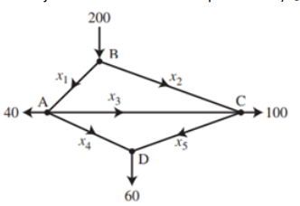
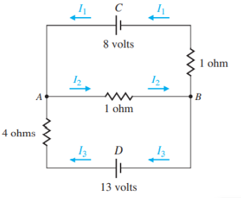

## Primer Parcial

### Operaciones con matrices

#### 1. Sea $A = \begin{pmatrix} 1 & 1 & 3 \\ 5 & 2 & 6\\ -2 & -1& -3\end{pmatrix}$, aproxime $\cos{2A}$ con una serie de Maclaurin

$$
2A = \begin{pmatrix}
    2 & 2 & 6 \\
    10 & 4 & 12 \\
    -4 & -2 & -6
\end{pmatrix} \\
$$

$$
A^2 = A\times A =
\begin{pmatrix}
2 & 2 & 6 \\
10 & 4 & 12 \\
-4& -2 &-6
\end {pmatrix} \times \begin{pmatrix}
2 & 2 & 6 \\
10 & 4 & 12 \\
-4& -2 &-6
\end {pmatrix} = \begin{pmatrix}
0&0&0&\\12&12&36\\-4&-4&-12
\end {pmatrix}
$$

$$
A^4 = A^2\times A^2 = \begin{pmatrix}
0&0&0&\\12&12&36\\-4&-4&-12
\end {pmatrix} \times \begin{pmatrix}
0&0&0&\\12&12&36\\-4&-4&-12
\end {pmatrix} = \begin{pmatrix}
0&0&0\\0&0&0&\\0&0&0&\end {pmatrix}
$$

$$
A^6 = A^4 \times A^2 = \begin{pmatrix}
0&0&0\\0&0&0&\\0&0&0&\end {pmatrix} \times \begin{pmatrix}
0&0&0&\\12&12&36\\-4&-4&-12
\end {pmatrix} = \begin{pmatrix}
0&0&0\\0&0&0\\0&0&0
\end {pmatrix}
$$

$$
cos(2A) = 1 - \frac{2A^2}{2!} + \frac{2A^4}{4!} - \frac{2A^6}{6!} = 1 - \frac{2\left(\begin{pmatrix}
0&0&0&\\12&12&36\\-4&-4&-12
\end {pmatrix}\right)}{2!} + \frac{2\left(\begin{pmatrix}
0&0&0\\0&0&0&\\0&0&0&\end {pmatrix}\right)}{4!} - \frac{2\left(\begin{pmatrix}
0&0&0\\0&0&0\\0&0&0
\end {pmatrix}\right)}{6!} \\= 1-\left(\begin{pmatrix}
0&0&0\\6&6&18\\-2&-2&-6\end{pmatrix} + \begin{pmatrix}
0&0&0\\0&0&0\\0&0&0\end {pmatrix}+ \begin{pmatrix}
0&0&0\\0&0&0\\0&0&0\end {pmatrix}\right) \\ = 1- \begin{pmatrix} 0&0&0\\6&6&18\\-2&-2&-6\end{pmatrix}
$$

#### 2. Sea $A = \begin{pmatrix} -1 & 2& 2&\\1 & x & 0\\2&3&1\end{pmatrix}$ y $B = \begin{pmatrix}3&-1&1\\0&-3&1\\-2&0&x \end{pmatrix}$. ¿Cuál es el valor de $x$ para que $Traza(A-3I_3+B^T) = 13$?

$$
I_3 =  \begin{pmatrix}1&0&0\\0&1&0\\0&0&1\end{pmatrix}
$$

$$
A-3I_3+B^T =  \begin{pmatrix} -1 & 2& 2&\\1 & x & 0\\2&3&1\end{pmatrix} -  3\begin{pmatrix}1&0&0\\0&1&0\\0&0&\end{pmatrix} +  \begin{pmatrix}3&0&-2\\-1&-3&0\\1&1&x\end{pmatrix} =  \begin{pmatrix}-1&2&0\\0&x-6&0\\3&4&x-2\end{pmatrix}
$$

$$
Traza(\begin{pmatrix}-1&2&0\\0&x-6&0\\3&4&x-2\end{pmatrix}) \rightarrow \begin{align*}
    -1+x+6+x-2 = 13\\
    2x-9=13\\
    2x=22\\
    x = 11
\end{align*}
$$

#### 3. Dada la matriz $A= \begin{pmatrix} -1&7&2\\0&-5&8 \end{pmatrix}$, determine una matrix $B$ yal que $BA = \begin{pmatrix} -3 & 9 & 0 \\ 4 & 0 & 1 \end{pmatrix}$

$$
B = (BA)A^{-1} =  \begin{pmatrix} -3 & 9 & 0 \\ 4 & 0 & 1 \end{pmatrix}
$$

#### 4. Encuentre las matrices $A$ y $B$ que resuelven el sistema $\begin{cases} 2A + B = \begin{pmatrix} 1 & -4 \\ 6 & 0 \end{pmatrix} \\ A -3B = \begin{pmatrix} -2 &  1 \\ 3 & -4 \end{pmatrix} \end{cases}$

$$
2A + B \rightarrow \begin{bmatrix}1&-4\\6&0\end{bmatrix} - 2A-6B\rightarrow\begin{bmatrix}-4&2\\6&-2\end{bmatrix}
\\ \therefore \\
-5B \rightarrow\begin{bmatrix}
    -3&-2\\12&-2
\end{bmatrix} \therefore B = \begin{bmatrix}
    \frac{3}{5} & \frac{2}{5} \\
    -\frac{12}{5} & \frac{2}{5}
\end{bmatrix}
\\ \therefore \\
A = \begin{bmatrix}
    -\frac{1}{5} & \frac{11}{5} \\
    -\frac{21}{5} & -\frac{14}{5}
\end{bmatrix}
$$

#### 5. Si $A = \begin{pmatrix} 2 & k-1 \\ 6 & 3 \end{pmatrix}$ y $P(x) = x^3 + x^2 - 15kx$. Halle el valor de $k$, tal que $A$ sea un cero de $P(x)$

### Tipos de Matrices

#### 6. Halle los valores de $a,b,c$ tal que la matriz $B = \begin{pmatrix}2&a-2b&2a+b+c\\3&5&a+b\\0&-2&7 \end{pmatrix}$ sea simétrica

$$
 B^T = \begin{pmatrix}
    2 & 3 & 0 \\
    a -2b & 5 & -2 \\
    2a+b+c & a+b & 7
 \end{pmatrix}

 \\

 \begin{align*}
    9-2b=3\\
    29+b+c=0\\
    a+b=-2
 \end{align*}

\rightarrow

 \begin{align*}
    b = -\frac{5}{3}\\
    a = -\frac{1}{3}\\
    c = \frac{7}{3}
\end{align*}

$$

#### 7. Proponga una matriz, para cada inciso, que cumpla con la propiedad que se indica

##### A. Una matriz cuadrada $N$ se dice nilpotente si existe un número natural $k$ tal que $N^k = 0$

$$
N = \begin{bmatrix}
    0 & 1 \\ 0 & 0
\end{bmatrix}
\\
K = 2 \rightarrow N^K \rightarrow N^2 = 0
$$

##### B. El producto de dos matrices triangulares inferiores diferentes es una matriz triangular inferior

$$
A = \begin{bmatrix}
    1 & 0 \\ 2 & 1
\end{bmatrix} ,
B = \begin{bmatrix}
    2 & 0 \\ 3 & 4
\end{bmatrix}
\\
AB = \begin{bmatrix}
    2 & 0\\7&4
\end{bmatrix}
$$

##### C. Dos matrices triangulares superiores diferentes que conmutan

$$
A = \begin{bmatrix}
    2 & 3\\0 &1
\end{bmatrix}.
B = \begin{bmatrix}
    1 & 4 \\ 0 & 2
\end{bmatrix}

\\
A\times B = B\times A \rightarrow \begin{bmatrix}
    2 & 3\\0 &1
\end{bmatrix} \times \begin{bmatrix}
    1 & 4 \\ 0 & 2
\end{bmatrix} = \begin{bmatrix}
    1 & 4 \\ 0 & 2
\end{bmatrix} \times \begin{bmatrix}
    2 & 3\\0 &1
\end{bmatrix} \rightarrow \begin{bmatrix}
    2&14\\0&2
\end{bmatrix} = \begin{bmatrix}
    2&-7\\0&2
\end{bmatrix}
$$

##### D. Una matriz idempotente y una matriz involutiva son aquellas tales que $A^2 = A$ y $A^2 = I$

$$
\text{
    Idempotente
} = A = \begin{bmatrix}
    1&0\\0&0
\end{bmatrix} \\
\text{
    Involutiva
} = B = \begin{bmatrix}
    0&1\\1&0
\end{bmatrix}
$$

$$
A^2 = \begin{bmatrix}
    1&0\\0&0
\end{bmatrix}\\
B^2 = \begin{bmatrix}
    1&0\\0&1
\end{bmatrix}\\
A^2 = A \\
A^2 = I
$$

### Determinantes

#### 8. Calcule el determinante de $A = \begin{bmatrix} 3&-5\\-6&10\end{bmatrix}$, $B = \begin{bmatrix}4&5&6\\0&5&-2\\0&0&-3\end{bmatrix}$, y $C = \begin{bmatrix}6&-1&-5&-8\\6&3&0&0\\-7&4&3&10\\0&5&0&0\end{bmatrix}$

$$
|A| = (10)(3)-(-6)(-5) = 30-30 = 0;
$$

$$
|B| = (-60+0+0) - (0+0+0) = -60-0 = -60
$$

$$
|C| = (-1)^{1+1}6\begin{vmatrix}3&0&0\\4&3&10\\5&0&0\end{vmatrix} + (-1)^{2+1}6\begin{vmatrix}-1&-5&-8\\4&3&10\\5&0&\end{vmatrix}+ (-1)^{3+1}(-7)\begin{vmatrix}-1&-5&-8\\3&0&0\\5&0&0\end{vmatrix} \\ = 18 \begin{vmatrix}3&10\\6&0\end{vmatrix} + (-24)\begin{vmatrix}0&0\\0&0\end{vmatrix} + 30\begin{vmatrix}0&0\\3&10\end{vmatrix} + 6\begin{vmatrix}3&10\\0&0\end{vmatrix} + 24\begin{vmatrix}-5&-8\\0&0\end{vmatrix} \\+(-30)\begin{vmatrix}-5&-8\\3&10\end{vmatrix}+7\begin{vmatrix}0&0\\0&0\end{vmatrix}+21\begin{vmatrix}-5&-8\\0&0\end{vmatrix}+(-35)\begin{vmatrix}-5&-8\\0&0\end{vmatrix} \\ = 780
$$

#### 9. Calcule el valor de $x$ para que el valor del determinante sea $-217$.

$$
A = \begin{pmatrix}
    -2 & 4 & 5 \\
    6 & 7 & -3 \\
    3 & x & 2
\end{pmatrix}
$$

$$
|A| \rightarrow -217 = -28 - 36 + 30x - (-48) - (-6x) - (105) \rightarrow 24x - 217 = -217 \rightarrow 24x = 0 \\\therefore\\ x = 0;
$$

#### 10. Calcule el determinante de las siguientes matrices usando las propiedades:

##### A. $\begin{bmatrix}4 & -2 \\ -12 & 6\end{bmatrix}$

$$
|A| = (4\times6) - (-12\times -2) = 24-24 = 0
$$

##### B. $\begin{bmatrix}7 & 9& 0\\-2&3&0\\4&5&0\end{bmatrix}$

$$
|B| = 0 \because \text{Una columna es 0}
$$

##### C. $\begin{bmatrix}2&3&-3\\-2&3&0\\4&5&0\end{bmatrix}$

$$
|C| = (2\times1\times-9) + (3\times6\times6) + (-3\times-4\times2) - (6\times1\times-3) - (2\times6\times2) - (-9\times-4\times3) = 0
$$

##### D. $\begin{bmatrix}1&0&0&0\\3&-1&0&0\\2&5&2&0\\2&1&1&4\end{bmatrix}$

$$
|D| = 1\times-1\times2\times4 = -8 \because \text{Al ser triangular inferior, es la multiplicación de su diagonal}
$$

#### 11. Sabiendo que $A$ y $B$ son matrices de tamaño $3\times3$ y que $|A| = 3$ y $|B| = -2$, calcule los siguientes determinantes

##### A. $|AB|$

$$
|AB| = |A||B| = -6
$$

##### B. $|AA^T|$

$$
|A^T| = |A| \therefore |AA^T| = |A|^2 = 9
$$

##### C. $|A^TB|$

$$
|A^T| = |A| \therefore |A^TB| = |AB| = -6
$$

##### D. $|3A^2B|$

$$
|A^n| = |A|^n \therefore |3A^2B| = 3|A^2B| = -54
$$

##### E. $|2AB^{-1}|$

$$
|B^{-1}| = |B|^{-1} \therefore |2AB^{-1}| = \frac{|2A|}{|B|} = -3
$$

##### F. $|(A^2B^{-1})^T|$

$$
\frac{9}{2}
$$

#### 12. Sean $A$ y $B$ dos matrices de tamaño $2\times2$. Si $|B| = 8$ y $|4A^2B^{-1}| = 50$, use las propiedades de los determinantes para encontrar el valor de $|A|$.

$$
|4A^2B^{-1}| = 50 \rightarrow 16|A||A||B^{-1}| = 50 \rightarrow 2|A^2| = 50 \rightarrow |A^2| = 25 \rightarrow |A| = 5
$$

### Inversa de una matriz

#### 13. Determine para que valores de $a$ las siguientes matrices son regulares:

##### $A = \begin{pmatrix}-a & a-1 & a + 1 \\ 1 + 2 +3 \\2-a & a+3 & a+7\end{pmatrix}$

$$
|A| = 28+a \therefore a = -28
$$

$$
|A| = \begin{vmatrix}
    28&-29&29\\
    1&2&3\\
    30&-25&-21
\end{vmatrix} = -4760
$$

##### $B = \begin{pmatrix}a+3 & 2a & a+3 \\ 0& 2&a\\0&0&a-4\end{pmatrix}$

$$
|B| = 2a^2 - 2a - 24 \therefore a = \begin{cases}
    a = -3\\
    a = 4
\end{cases}
$$

$$
|B_1| = \begin{vmatrix}
    0&-6&0\\0&2&-3\\0&0&-7
\end{vmatrix} = 0 = \text{No regular}
$$

$$
|B_2| = \begin{vmatrix}
    7&8&7\\
    0&2&4\\
    0&0&0
\end{vmatrix} = 0 = \text{No regular}
$$

#### 14. Determine el valor de $x$ para que la matriz $A = \begin{pmatrix}x+2 & 2 \\1 & x+1\end{pmatrix}$ sea singular.

$$
|A| = x^2+3x = \begin{cases}
    x = 0\\
    x = -3
\end{cases}
$$

$$
|A_1| = \begin{vmatrix}
    2&2\\1&1
\end{vmatrix} = 0 = \text{Singular}
$$

$$
|A_2| = \begin{vmatrix}
        -1&2\\1&-2
\end{vmatrix} = 0 = \text{Singular}
$$

#### 15. Encuentre a la adjunta de cada una de las siguientes matrices. Use a la adjunta para determinar la inversa de las matrices, si es posible.

##### $A = \begin{pmatrix}2&-3\\-1&2\end{pmatrix}$

$$
Adj(A) = A^T \times -1 \text{ En su diagonal} = \begin{bmatrix}
    2&3\\1&2
\end{bmatrix}
$$

$$
A^{-1} = \frac{1}{1}\begin{bmatrix}
    2&-3\\-1&2
\end{bmatrix} = \begin{bmatrix}
    2&-3\\-1&2
\end{bmatrix}
$$

##### $B = \begin{pmatrix}1&-3&4\\2&-5&7\\0&-1&1\end{pmatrix}$

$$
|B| = 0 \therefore \text{Es imposible sacar su inversa}
$$

##### $C = \begin{pmatrix}1&0&2\\2&-1&3\\4&1&8\end{pmatrix}$

$$
|C| = 1
$$

$$
adj(C) = \begin{bmatrix}
    -11&-4&6\\2&0&-1\\2&1&-1
\end{bmatrix}
$$

$$
C^{-1} = \frac{1}{1}\begin{bmatrix}
    -11&-4&6\\2&0&-1\\2&1&-1
\end{bmatrix}^T = \begin{bmatrix}
    -11&2&2\\-4&0&1\\6&-1&-1
\end{bmatrix}
$$

#### 16. Sabiendo que $AAB = I$ si $B = A^{-1}$, use este teorema para hallar lo que se pide:

##### A. Sea $A = \begin{pmatrix}1&1\\-1&1\end{pmatrix}$, encuentre, si es posible, a la matriz $B$.

$$
|A| = 2 \therefore A^{-1} = \frac{1}{2}\begin{bmatrix}
    1&-1\\1&1
\end{bmatrix} = \begin{bmatrix}
    \frac{1}{2} & -\frac{1}{2} \\
    \frac{1}{2} & \frac{1}{2}
\end{bmatrix} = B
$$

##### B. Muestre que la matriz $A = \begin{pmatrix}3&4\\-2&-3\end{pmatrix}$ es su propia inversa.

$$
|A| = -1
$$

$$
A^{-1} = -\frac{1}{1}\begin{pmatrix}3&-4\\2&-3\end{pmatrix} = \begin{pmatrix}3&4\\-2&-3\end{pmatrix}
$$

#### 17. Encuentre una matriz $A$, de tal manera que se cumpla la siguiente condición: $A\begin{pmatrix}2&3\\1&2\end{pmatrix} = \begin{pmatrix}\frac{3}{4} & 0 \\ 0 & \frac{3}{4}\end{pmatrix}$.

$$
B = \begin{bmatrix}
    2&3\\1&2
\end{bmatrix},
C = \begin{bmatrix}
    \frac{3}{4} & 0 \\
    0 & \frac{3}{4}
\end{bmatrix}
$$

$$
AB = C \therefore (AB)B^{-1} = A \rightarrow CB^{-1} \\
B^{-1} = \begin{bmatrix}
    2 & -3 \\ -1 & 2
\end{bmatrix} \rightarrow CB^{-1} = \begin{bmatrix}
    \frac{3}{2} & -\frac{9}{4} \\
    -\frac{3}{4} & \frac{3}{2}
\end{bmatrix}
$$

#### 18. Si $A = \begin{pmatrix} \frac{1}{3} & -\frac{1}{4} & -\frac{1}{6} \\ 0 & \frac{1}{4} & \frac{1}{2} \\ 0 & \frac{1}{4} & -\frac{1}{2}\end{pmatrix}$, halle a la matriz $B$, tal que $AB = \begin{pmatrix}2&-1&0\\4&5&-3\\1&9&7\end{pmatrix}$.

$$
B = A^{-1}(AB)
$$

$$
A^{-1} = \frac{1}{|A|} \begin{bmatrix}C_{11} &\dots& C_{13} \\ \vdots &\ddots & \vdots \\ C_{31} & \dots & C_{33} \end{bmatrix} = -12\begin{pmatrix}\frac{1}{4} & -\frac{1}{6} & -\frac{1}{12} \\ 0 & -\frac{1}{6} & - \frac{1}{6} \\ 0& -\frac{1}{12} & \frac{1}{12}\end{pmatrix} = \begin{pmatrix}3&2&1\\0&2&2\\0&1&-1\end{pmatrix}
$$

$$
B = A^{-1}(AB) = \begin{pmatrix}
    3&2&1\\0&2&2\\0&1&-1
\end{pmatrix} \begin{pmatrix}
    2&-1&0\\4&5&-3\\1&9&7
\end{pmatrix} = \begin{pmatrix}
    2&-1&0\\4&5&-3\\1&9&7
\end{pmatrix}
$$

### Reducción de matrices y sistemas de ecuaciones lineales

#### 19. Las siguientes matrices aumentadas se encuentran parcialmente reducidas. Sin hacer cálculos, argumente el tipo de solución que tienen los sistemas de ecuaciones que representan a tales matrices.

##### A. $\left(\begin{array}{rrr|r}1&2&0&4\\0&2&-1&3\\0&4&-2&6\end{array}\right)$

El sistema es consistente con soluciones infinitas, esto se debe a que sus ecuaciones son linealmente dependientes.

##### B. $\left(\begin{array}{rrrr|r}1&2&3&4&5\\2&4&6&8&9\end{array}\right)$

El sistema es consistente con soluciones infinitas, esto se debe a que sus ecuaciones son inconsistentes.

##### C. $\left(\begin{array}{rrr|r}1&2&-1&3\\0&4&1&2\\0&4&1&2\\0&0&2&5\end{array}\right)$

El sistema es consistente con soluciones infinitas, esto se debe a que sus ecuaciones son linealmente dependientes.

#### 20. Resuelva los siguientes sistemas lineales con Gauss-Jordan

##### A.

$$
\begin{align*}x-2y+3x=2\\x-3y+6z=6\\3x-7x+12z=2
\end{align*}
$$

$$
\left[
    \begin{array}{rrr|r}
    1&-2&3&2\\1&-3&6&6\\3&-7&12&2
    \end{array}
\right]

\overrightarrow{
    \begin{align*}
        R_2 \rightarrow -R_1 + R_2 \\
        R_3 \rightarrow -3R_1 + R_3
    \end{align*}
}
\\
\left[
    \begin{array}{rrr|r}
        1&-2&3&2\\0&-1&3&4\\0&-1&3&-4
    \end{array}
\right]

\overrightarrow{
    \begin{align*}
        R_2 \rightarrow -R_2
    \end{align*}
}

\\
\left[
    \begin{array}{rrr|r}
        1&-2&3&2\\0&1&-3&-4\\0&-1&3&-4
    \end{array}
\right]

\overrightarrow{
    \begin{align*}
        R_1 \rightarrow 2R_2+R_1 \\
        R_3 \rightarrow R_2 + R_3
    \end{align*}
}

\\

\left[
    \begin{array}{rrr|r}
        1&0&-3&2\\0&1&-3&-4\\ 0&0&0&-8
    \end{array}
\right]

$$

$$

\begin{align*}
    x-3z = 2\\
    y -3z = -4
\end{align*}

$$

El sistema no tiene solución.

##### B.

$$
\begin{align*}
    x+y+2z=7\\2x-2y+z=9\\3x+y-3z=-4\\-x+2y+z=-1
\end{align*}
$$

$$

\left[
    \begin{array}{rrr|r}
        1&1&2&7\\2&-2&1&9\\3&1&-3&-4\\-1&2&1&-1
    \end{array}
\right]

\overrightarrow{
    \begin{align*}
    R_2 \rightarrow -2R_1 + R_2 \\
    R_3 \rightarrow -3R_1 + R_3 \\
    R_4 \rightarrow -R_1 + R_2
    \end{align*}
}

\\

\left[
    \begin{array}{rrr|r}
        1&1&2&7\\0&-1&-3&-5\\0&-2&-9&-25\\0&3&3&-6
    \end{array}
\right]

\overrightarrow{
    \begin{align*}
        R_2 \rightarrow -\frac{1}{4}R_2
    \end{align*}
}

\\

\left[
    \begin{array}{rrr|r}
    1&1&2&7\\0&1&\frac{3}{4}&\frac{5}{4}\\0&-2&-9&-25\\0&3&3&6
    \end{array}
\right]

\overrightarrow{
    \begin{align*}
    R_1 \rightarrow -R_2 + R_4 \\
    R_3 \rightarrow 2R_2 + R_3 \\
    R_4 \rightarrow -R_2 + R_4
    \end{align*}
}

\\

\left[
    \begin{array}{rrr|r}
    1&0&\frac{5}{4}&\frac{23}{4} \\
    0&1&\frac{3}{4}&\frac{5}{4} \\
    0&0&-\frac{15}{2}&\frac{45}{2} \\
    0&0&\frac{3}{4}&\frac{9}{4}
    \end{array}
\right]

\overrightarrow{
    \begin{align*}
        R_3 \rightarrow -\frac{15}{2}R_3
    \end{align*}
}

\\

\left[
    \begin{array}{rrr|r}
    1&0&\frac{5}{4} & \frac{23}{4}\\
    0&1&\frac{3}{4}&\frac{5}{4}\\
    0&0&1&\frac{675}{8}\\
    0&0&\frac{3}{4}&\frac{9}{4}
    \end{array}
\right]

\overrightarrow{
    \begin{align*}
    R_1 \rightarrow -\frac{5}{4}R_3 + R_1\\
    R_2 \rightarrow -\frac{3}{4}R_3 + R-2\\
    R_4 \rightarrow -\frac{3}{4} + R_4
    \end{align*}
}
$$

$$
\begin{align*}
x+y+2x=7\\
2x+2y+z=9\\
3x+y-3z=-4\\
-x+2y2z=-1
\end{align*}
$$

##### C.

$$
\left[
    \begin{array}{rrrr|r}
        2&4&-4&2&-6\\
        -1&2&-6&3&7\\
        1&6&-10&5&1
    \end{array}
\right]

\overrightarrow{
    R_1 \rightarrow R_3
}
$$

$$
\left[
    \begin{array}{rrrr|r}
        1&6&-10&5&1\\
        -1&2&-6&3&7\\
        2&4&-4&2&-6
    \end{array}
\right]

\overrightarrow{
    \begin{align*}
        R_2 &\rightarrow R_2 + R_1 \\
        R_3 &\rightarrow R_3 - 2R_1
    \end{align*}
}
$$

$$
\left[
    \begin{array}{rrrr|r}
        1&0&2&-1&-5\\
        0&1&-2&1&1\\
        0&0&0&0&0&
    \end{array}
\right]
$$

$$
\begin{align*}
    a+2c-d = -5\\
    b-2c+d=1\\

    \therefore \\
    a = -2c+d+5\\
    b = 2c-d-1\\
    c \in \R\\
    d \in \R
\end{align*}
$$

$$
\begin{align*}
    2a+4b-4c+2d=-6\\-a+2b-6c+3d=7\\a+6b-10c+5d=1
\end{align*}
$$

El sistema es consistente con infinitas soluciones

#### 21. Determine el valor de $K$ para cada uno de los siguientes sistemas de ecuaciones: Solución única, infinitas o sin solución.

##### A.

$$
\begin{align*}
    -x+2y-3z&=-5\\
    2x-ky+6z&=7\\
    4x-2y+12z&=14
\end{align*}

\rightarrow A:=

\left[
    \begin{array}{rrr|r}
        -1&2&-3&-5\\
        2&-k&6&7\\
        4&-2&12&14
    \end{array}
\right]

\therefore

|A| = 72
$$

$$
\left[
    \begin{array}{rrr|r}
        -1&2&-3&-5\\
        2&-k&6&7\\
        4&-2&12&14
    \end{array}
\right]

\overrightarrow{
    \begin{align*}
        R_1 &\rightarrow -R_1
    \end{align*}
}

\left[
    \begin{array}{rrr|r}
        1&-2&3&5\\
        2&-k&6&7\\
        4&-2&12&14
    \end{array}
\right]

\overrightarrow{
    \begin{align*}
        R_2 &\rightarrow -2R_1 + R_2\\
        R_3 &\rightarrow -4R_1 + R_3
    \end{align*}
}

\left[
    \begin{array}{rrr|r}
        1&-2&3&5\\
        0&-68&0&-3\\
        0&6&0&-14
    \end{array}
\right]
$$

No tiene solución con $k = 72$

$$

$$

##### B.

$$
\begin{align*}
    -x+7y-z&=0\\
    2x-3y+5z&=0\\
    4x-6y+kz&=0
\end{align*}

\rightarrow

B:= \left[
    \begin{array}{rrr|r}
        -1&7&-2&0\\
        2&-3&5&0\\
        4&-6&k&0
    \end{array}
\right]

\therefore

|B| = -11k + 110 \therefore k = 10
$$

$$
\left[
    \begin{array}{rrr|r}
        -1&7&-2&0\\
        2&-3&5&0\\
        4&-6&10&0
    \end{array}
\right]

\overrightarrow{
    \begin{align*}
        R_1 \rightarrow -R_1
    \end{align*}
}

\left[
    \begin{array}{rrr|r}
        1&-7&3&0\\
        2&-3&6&0\\
        4&-1&10&0
    \end{array}
\right]

\overrightarrow{
    \begin{align*}
        R_2 \rightarrow -2R_1 + R_2\\
        R_3 \rightarrow -4R_1 + R_3
    \end{align*}
} \\

\left[
    \begin{array}{rrr|r}
        1&-7&2&0\\
        0&11&1&0\\
        4&-6&10&0\\
    \end{array}
\right]

\overrightarrow{
    \begin{align*}
        R_2 \rightarrow \frac{1}{11}R_2
    \end{align*}
}

\left[
    \begin{array}{rrr|r}
        1&-7&2&0\\
        0&1&\frac{1}{11}&0\\
        0&22&2&0
    \end{array}
\right]

\overrightarrow{
    \begin{align*}
        R_1 \rightarrow 7R_2 + R_1\\
        R_3 \rightarrow -22R_2 + R_3
    \end{align*}
}

\left[
    \begin{array}{rrr|r}
        1&0&\frac{29}{11}&0\\
        0&1&\frac{1}{11}&0\\
        0&0&0&0&
    \end{array}
\right]
\\
\begin{align*}

x &= -\frac{29}{11}z\\
y+&= -\frac{1}{11}z\\
z &\in \R
\end{align*}
$$

Cuenta con soluciones infinitas cuando $K=10$

##### C.

$$
\begin{align*}
    x+y+4z&=2\\
    x+2y-4z&=3\\
    x+y+(k^2-5)z&=k
\end{align*}

\rightarrow

C:=
\left[
    \begin{array}{rrr|r}
        1&1&4&2&\\
        1&2&-4&3\\
        1&1&(k^2-5)&k
    \end{array}
\right]

\therefore

|C| = k^2 - 9 \therefore k = 3
$$

$$
\left[
    \begin{array}{rrr|r}
        1&1&4&2&\\
        1&2&-4&3&\\
        1&1&4&3&
    \end{array}
\right]

\overrightarrow{
    \begin{align*}
        R_2 \rightarrow -R_1 + R_2\\
        R_3 \rightarrow -R_1 + R_3
    \end{align*}
}
\left[
    \begin{array}{rrr|r}
        1&1&4&2&\\
        0&1&-8&1&\\
        0&0&0&1
    \end{array}
\right]
$$

No tiene solución cuando $k=3$
[(1 + 1/2) −(2 + 1/4); (−3/4) (1 + 1/2)]

#### 22. Encuentre el valor de la o las incógnitas que se indican a continuación, bajo las condiciones de los sistemas dados.

##### B. halle los valores de $a$, $b$ y $c$ de modo que el sistema tenga solución trivial $(x,y,z) = (1,-1,2)$.

$$
\left[
    \begin{array}{rrr|r}
        a & -b & -6 & -3 \\
        -2 & b & 2c & -1 \\
        a & -3 & -2c & -3
    \end{array}
\right]

\rightarrow

\left[
    \begin{array}{rrr|r}
        1 & -1 & 0 & 3 \\
        0 & 1 & 2 & 1 \\
        1 & 0 & -2 & 0
    \end{array}
\right] \\

A = \begin{bmatrix}
    1 & -1 & 0  \\
    0 & 1 & 2  \\
    1 & 0 & -2
\end{bmatrix} ,
B = \begin{bmatrix}
    3 \\ 1 \\ 0
\end{bmatrix}
$$

$$
A^{-1} = \begin{bmatrix}
    \frac{1}{2} & \frac{1}{2} & \frac{1}{2} \\
    -\frac{1}{2} & \frac{1}{2} & \frac{1}{2} \\
    \frac{1}{4} & \frac{1}{4} & -\frac{1}{4}
\end{bmatrix} \\ \therefore \\

A^{-1}B = \begin{bmatrix}
    2 \\ -1 \\ 1
\end{bmatrix} \therefore a = 2, b = -1, c = 1
$$

##### C. halle los valores de $a$, $b$ y $c$ de modo que el sistema sea consistente.

#### 23. Sean los sistemas $S_1 \begin{cases}x_1+6x_2+3X_3=4\\-x_1+x_2=-3\\1x_1+x_2=5\end{cases}$ y $S_2 = \begin{cases}x_1 + 6x_2 + 3x_3=-3\\-x_1+x_2=2\\7x_2+3x_3=8\end{cases}$. Para cada uno de estos sistemas, resuelva

##### A. Un sistema de ecuaciones lineales se representa por $Ax = b$, resuelva el sistema dador con $x = A^{-1}b$

##### B. Resuelva el sistema con la Regla de Cramer.

$$
\begin{bmatrix}
    1&6&3\\-1&1&0\\2&1&0
\end{bmatrix}
\begin{bmatrix}
    4\\-3\\5
\end{bmatrix}

\\

adj(A) = \begin{bmatrix}
    0&0&-3\\3&-6&11\\-3&3&7
\end{bmatrix}^T = \begin{bmatrix}
    0&3&-3\\0&-6&3\\-3&11&7
\end{bmatrix} \begin{bmatrix}
    4\\-3\\5
\end{bmatrix} = \begin{bmatrix}
    -24\\33\\-10
\end{bmatrix}
$$

$$
\begin{bmatrix}
    1&6&3\\-1&1&0\\0&7&3
\end{bmatrix} \begin{bmatrix}
    -3\\2\\8
\end{bmatrix}

\\

adj(A) = \begin{bmatrix}
    3&3&-7\\3&3&-7\\-3&3&7
\end{bmatrix}^T = \begin{bmatrix}
    3&3&-36\\3&3&3\\-7&-7&7
\end{bmatrix} \begin{bmatrix}
    -3\\2\\8
\end{bmatrix} \begin{bmatrix}
    -27\\21\\-49
\end{bmatrix}
$$

#### 24. Resuelva los sistemas no lineales:

##### A.

$$
\begin{align*}
    x^2 + 2y^2 = 6\\
    x^2 - y^2 = 3
\end{align*}
$$

$$
\left[
    \begin{array}{rr|r}
        1&2&6\\
        1&-1&3
    \end{array}
\right]

\overrightarrow{
    \begin{align*}
        R_2 \rightarrow R_2 - R_1
    \end{align*}
}

\left[
    \begin{array}{rr|r}
        1&2&6\\
        0&-3&-3
    \end{array}
\right]

\overrightarrow{
    \begin{align*}
        R_2 \rightarrow \frac{1}{3}R_2
    \end{align*}
}

\left[
    \begin{array}{rr|r}
        1&12&6\\
        0&1&1
    \end{array}
\right]

\overrightarrow{
    \begin{align*}
        R_1 \rightarrow R_1 - 2R_2
    \end{align*}
}

\left[
    \begin{array}{rr|r}
        1&0&4\\
        0&1&1
    \end{array}
\right]

\\ \therefore \\
x = 2 \\
y = \sqrt{1}

$$

##### B.

$$
\begin{align*}
    -2^a + 2(3^b) = 1\\
    3(2^a) - 4(3^b) = 1
\end{align*}
$$

$$
\left[
    \begin{array}{rr|r}
        1&2&1\\
        3&-4&1
    \end{array}
\right]

\overrightarrow{}{
    \begin{align*}
        R_1 \rightarrow R_1 - R_1
    \end{align*}
}

\left[
    \begin{array}{rr|r}
    1&-2&-1\\
    3&-4&1
    \end{array}
\right]

\overrightarrow{
    \begin{align*}
        R_2 \rightarrow R_2 - 3R_1
    \end{align*}
}

\left[
    \begin{array}{rr|r}
    1&-2&-1\\
    0&2&4
    \end{array}
\right]

\overrightarrow{
    \begin{align*}
        R_2 \rightarrow \frac{1}{2}R_2
    \end{align*}
}

\left[
    \begin{array}{rr|r}
        1&-2&-1\\
        0&1&2
    \end{array}
\right]
\\ \therefore \\
2a = -3\\
3b = 2
$$

##### C.

$$
\begin{align*}
    \sqrt{3}\cos{\theta} + 2\sin{\theta} = \frac{5}{2} \\
    2\sqrt{3}\cos{\theta} + \sin{\theta} = \frac{7}{2}
\end{align*}
$$

$$
\left[
    \begin{array}{rr|r}
    1&2&\frac{5}{2} \\
    2&11&\frac{7}{2}
    \end{array}
\right]

\overrightarrow{
    \begin{align*}
        R_2 R_2 - 2R_1
    \end{align*}
}

\left[
    \begin{array}{rr|r}
        1&2&\frac{5}{2}\\
        0&-3&-\frac{3}{2}
    \end{array}
\right]

\overrightarrow{
    \begin{align*}
        R_2\rightarrow-\frac{1}{3}R_2
    \end{align*}
}

\left[
    \begin{array}{rr|r}
        1&2&\frac{6}{3}\\
        0&1&\frac{1}{2}
    \end{array}
\right]

\overrightarrow{
    \begin{align*}
        R_1 \rightarrow R_1 - 2R_2
    \end{align*}
}

\left[
    \begin{array}{rr|r}
        1&0&\frac{3}{2}\\
        0&1&\frac{1}{2}
    \end{array}
\right]
\\ \therefore \\
\sqrt{3}\cos{\theta} = \frac{3}{2}\\
\sin{\theta} = \frac{1}{2}
$$

### Aplicaciones

#### 25. La función $f(x) = \frac{3x}{2x^2+x-1}$, se descompone en fracciones más simples de la siguiente manera: $f(x) = \frac{A}{x+1} + \frac{B}{2x-1}$. Determine los valores de $A$ y $B$.

$$
\text{Factorizamos } 2x^2+x-1
\rightarrow (2x-1)(x+1) \\

\text{Descomponemos } f(x):
f(x) =  \frac{3x}{(2x-1)(x+1)} = \frac{A}{2x-1} + \frac{B}{x+1} \\

3x = A(x+1) + B(2x-1) \rightarrow A +2B = 3 \rightarrow A-B = 0
$$

$$
\left[
    \begin{array}{rr|r}
        1&2&3\\1&-1&0
    \end{array}
\right]

\overrightarrow{
    R_2 \rightarrow R_2 - R_1
}

\left[
    \begin{array}{rr|r}
        1&2&3\\0&-3&-3
    \end{array}
\right]

\overrightarrow{
    R_2 \rightarrow -\frac{1}{3}R_2
}

\left[
    \begin{array}{rr|r}
        1&2&3\\0&1&1
    \end{array}
\right]

\overrightarrow{
    R_1 \rightarrow R_1 - R_2
}

\left[
    \begin{array}{rr|r}
        1&0&1\\0&1&1
    \end{array}
\right]
$$

$$
A = 1\\
B = 1
$$

#### 26. Un automóvil se mueve a partir de cierta velocidad $v$ con una aceleración constante a partir de determinado punto $d$. Si se toma la distancia que avanza en tiempos de &1&,&2& y &3& segundos, las cuales son &14&, &37& y &72& metros respectivamente. Obtener la aceleración, la velocidad inicial y el punto en el que empieza.

$$
x = V_0t + \frac{1}{2}at^2 \rightarrow
\left[
    \begin{array}{rrr|r}
        1&\frac{1}{2}&1&14 \\
        2&2&1&37\\
        3&\frac{9}{2}&1&72
    \end{array}
\right]

\overrightarrow{
    \begin{align*}
        R_2 \rightarrow R_2 -2R_1 \\
        R_3 \rightarrow R_3 - 3R_1
    \end{align*}
}

\left[
    \begin{array}{rrr|r}
        1&\frac{1}{2}&1&14 \\
        0&1&-1&9\\
        0&3&-2&30
    \end{array}
\right]

\overrightarrow{
    \begin{align*}
        R_1 \rightarrow R_1 - \frac{1}{2}R_2 \\
        R_3 \rightarrow R_3 + 3R_2
    \end{align*}
} \\
\left[
    \begin{array}{rrr|r}
        1&0&\frac{3}{2}&\frac{19}{2} \\
        0&1&-1&9\\
        0&0&1&3
    \end{array}
\right]

\overrightarrow{
    \begin{align*}
        R_1 \rightarrow R_1 - \frac{3}{2}R_3 \\
        R_2 \rightarrow R_2 + R_3
    \end{align*}
}

\left[
    \begin{array}{rrr|r}
        1&0&0&5\\
        0&1&0&12\\
        0&0&1&3
    \end{array}
\right]
$$

$$
\text{Velocidad Inicial: 5} \frac{m}{s} \\
\text{Aceleración: 12} \frac{m}{s^2} \\
\text{Punto en el que empieza: 3} m
$$

#### 27. Una fábrica produce tres tipos de herramientas: $A$, $B$ y $C$. En la fábrica trabajan tres obreros durante $8$ horas diarias cada uno, y un revisor para comprobar las herramientas durante $1$ hora diaria. Para fabricar una herramienta de tipo $A$ se emplean dos horas de mano de obra y se necesitan $6$ minutos de revisión, para la fabricación de una de tipo $B$ se emplean $4$ horas de mano de obra y $4$ minutos de revisión y para una de tipo $C$ se necesitan $1$ hora de mano de obra y $4$ minutos de revisión. Por limitaciones en la producción, se deben producir exactamente $12$ herramientas al día. Calcule el número de herramientas de cada tipo que se elaboran cada día en la fábrica.

$$
x = \text{Número de herramientas de tipo } A. \\
y = \text{Número de herramientas de tipo } B. \\
z = \text{Número de herramientas de tipo } C.
$$

$$
\begin{align*}
    2x + 4y + z &= 24  &\text{Horas de trabajo disponibles} \\
    0.1x + 0.0667y + 0.0667z&= 1 &\text{Horas de revisión disponibles}\\
    x + y + z &= 12 &\text{Cantidad total de herramientas}
\end{align*}
$$

$$
\left[
    \begin{array}{rrr|r}
        2&4&1&24\\
        0.1&0.0667&0.0667&1\\
        1&1&1&12
    \end{array}
\right]

\overrightarrow{
    \begin{align*}
        R_1 \leftrightarrow R_3
    \end{align*}
}

\left[
    \begin{array}{rrr|r}
        1&1&1&12 \\
        0.1&0.0667&0.0667&1\\
        2&4&1&24\\
    \end{array}
\right]

\overrightarrow{
    \begin{align*}
        R_2 \rightarrow R_2 - \frac{1}{10}R_1 \\
        R_3 \rightarrow R_3 - 2R_1
    \end{align*}
} \\

\left[
    \begin{array}{rrr|r}
        1&1&1&12\\
        0&-\frac{1}{3}&-\frac{1}{3}&-\frac{1}{5}\\
        0&2&-1&0
    \end{array}
\right]

\overrightarrow{
    \begin{align*}
        R_2 \leftrightarrow R_3
    \end{align*}
}

\left[
    \begin{array}{rrr|r}
        1&1&1&12\\
        0&2&-1&0\\
        0&-\frac{1}{3}&-\frac{1}{3}&-\frac{1}{5}\\
    \end{array}
\right]

\overrightarrow{
    \begin{align*}
        R_2 \leftrightarrow \frac{1}{2}R_2
    \end{align*}
} \\

\left[
    \begin{array}{rrr|r}
        1&1&1&12\\
        0&1&-\frac{1}{3}&0\\
        0&-\frac{1}{3}&-\frac{1}{3}&-\frac{1}{5}
    \end{array}
\right]

\overrightarrow{
    \begin{align*}
        R_1 \rightarrow R_1 - R_2 \\
        R_3 \rightarrow R_3 + \frac{1}{3}R_2
    \end{align*}
}

\left[
    \begin{array}{rrr|r}
        1&0&\frac{1}{2}&12\\
        0&1&-\frac{1}{2}&0\\
        0&0&-\frac{1}{3}&-\frac{1}{5}
    \end{array}
\right]

\overrightarrow{
    \begin{align*}
        R_2 \leftrightarrow R_3*-20.02
    \end{align*}
} \\

\left[
    \begin{array}{rrr|r}
        1&0&\frac{1}{2}&12\\
        0&1&-\frac{1}{2}&0\\
        0&-0.03&-0.03&-\frac{1}{5}
    \end{array}
\right]

\overrightarrow{
    \begin{align*}
        R_1\rightarrow R_1 - \frac{1}{2}R_3\\
        R_2 \rightarrow R_2 + \frac{1}{2}R_3
    \end{align*}
}

\left[
    \begin{array}{rrr|r}
        1&0&0&9.998\\
        0&1&0&2.002\\
        0&0&1&4.004
    \end{array}
\right]
$$

$$
x = 9.998\\
y = 2.002\\
z = 4.004
$$

#### 28. Una empresa otorga $\$2,720,000$ pesos para becar a $100$ estudiantes que son hijos de sus empleados. Establezca tres cantidades diferentes en función a los niveles educativos de los jóvenes ($A$, $B$ y $C$); $\$40,000$ pesos para los del nivel $A$, $\$16,000$ pesos para los del $B$ y $\$20,000$ pesos para los del $C$. Si para el nivel $A$ destina cinco veces más de dinero que para el $B$, ¿cuántos estudiantes hay en cada nivel?

$$
x = \text{Número de estudiantes de nivel } A \\
y = \text{Número de estudiantes de nivel } B \\
z = \text{Número de estudiantes de nivel } C \\
$$

$$
\left[
    \begin{array}{rrr|r}
        1&1&1&100\\
        40k & 16k & 20k & 2720k& \\
        40k&-80k&0&0
    \end{array}
\right]

\overrightarrow{
    \begin{align*}
        R_2 \rightarrow R_2 - 40kR_1\\
        R_3 \rightarrow R_3 - 40kR_1
    \end{align*}
}

\left[
    \begin{array}{rrr|r}
        1&1&1&100\\
        0 & -24k & -20k & 2720k \\
        0 &-120k&-40k&-4M
    \end{array}
\right]

\overrightarrow{
    \begin{align*}
        R_2 \rightarrow -\frac{1}{24k}R_2
    \end{align*}
} \\
\left[
    \begin{array}{rrr|r}
        1&1&1&100\\
        0&1&-\frac{5}{6}&\frac{160}{3} \\
        0&-120k&-40k&-4M
    \end{array}
\right]

\overrightarrow{
    \begin{align*}
        R_1 \rightarrow R_1 - R_2 \\
        R_3 \rightarrow R_3 + 120kR_2
    \end{align*}
}
\left[
    \begin{array}{rrr|r}
        1&0&\frac{1}{6}&\frac{140}{3}\\
        0&1&\frac{5}{6}&\frac{160}{3}\\
        0&0&60k&2.4M
    \end{array}
\right]

\overrightarrow{
    \begin{align*}
        R_3 \rightarrow \frac{1}{60k}R_3
    \end{align*}
} \\

\left[
    \begin{array}{rrr|r}
        1&0&\frac{1}{6}&\frac{140}{3}\\
        0&1&\frac{5}{6}&\frac{160}{3}\\
        0&0&1&40
    \end{array}
\right]

\overrightarrow{
    \begin{align*}
        R_1 \rightarrow R_1 - \frac{1}{6}R_3 \\
        R_2 \rightarrow R_2 - \frac{5}{6}R_3
    \end{align*}
}
\left[
    \begin{array}{rrr|r}
        1&0&0&40\\
        0&1&0&20\\
        0&0&1&40
    \end{array}
\right]

$$

$$
x = 40\\
y = 20\\
z = 40
$$

#### 29. Se planea balancear una comida para que ésta proporcione las cantidades adecuadas de vitamina $C$, magnesio y calcio. Para cumplir el objetivo se emplearán tres tipos de alimentos medidos en mg (miligramos). La relación de nutrientes proporcionados por cada alimento se muestra en la tabla. Determine la cantidad de mg de cada nutriente necesaria para cumplir con el balanceo de una comida.

| Nutrientes | Alimento 1 | Alimento 2 | Alimento 3 | Total de nutrientes requeridos |
| ---------- | ---------- | ---------- | ---------- | ------------------------------ |
| Vitamina C | 10mg       | 20mg       | 20mg       | 100                            |
| Calcio     | 50         | 40         | 10         | 300                            |
| Magnesio   | 30         | 10         | 40         | 200                            |

$$
\left[
    \begin{array}{rrr|r}
        10&20&20&100\\50&40&10&300\\30&10&40&200
    \end{array}
\right]

\overrightarrow{
    \begin{align*}
        R_1 \rightarrow \frac{1}{10}R_1
    \end{align*}
}

\left[
    \begin{array}{rrr|r}
        1&2&2&10\\50&40&10&300\\30&10&40&200
    \end{array}
\right]

\overrightarrow{
    \begin{align*}
        R_2 \rightarrow R_2 - 50R_1
        R_3 \rightarrow R_3 - 30R_1
    \end{align*}
}

\\

\left[
    \begin{array}{rrr|r}
        1&2&2&10\\0&-60&-90&-200\\0&-30&-20&-100
    \end{array}
\right]

\overrightarrow{
    \begin{align*}
        R_2 \rightarrow - \frac{1}{60}R_2
    \end{align*}
}

\left[
    \begin{array}{rrr|r}
        1&2&2&10\\0&1&\frac{3}{2}&\frac{10}{3}\\0&-50&-20&100
    \end{array}
\right]

\overrightarrow{
    \begin{align*}
        R_1 \rightarrow R_1 - 2R_2\\
        R_3 \rightarrow R_3 + 50R_2
    \end{align*}
}

\\

\left[
    \begin{array}{rrr|r}
        1&0&-1&\frac{10}{3}\\
        0&1&\frac{3}{2}&\frac{10}{3}\\
        0&0&55&\frac{200}{3}
    \end{array}
\right]

\overrightarrow{
    \begin{align*}
        R_3 \rightarrow \frac{1}{55}R_3
    \end{align*}
}

\left[
    \begin{array}{rrr|r}
        1&0&-1&\frac{10}{3}\\
        0&1&\frac{3}{2}&\frac{10}{3}\\
        0&0&1&\frac{40}{33}
    \end{array}
\right]

\overrightarrow{
    \begin{align*}
        R_1 \rightarrow R_1 + R_3\\
        R_2 \rightarrow R_2 - \frac{3}{2}R_3
    \end{align*}
} \\

\left[
    \begin{array}{rrr|r}
        1&0&0&\frac{73}{33}\\
        0&1&0&\frac{50}{33}\\
        0&0&1&\frac{40}{33}
    \end{array}
\right]

\rightarrow

\begin{align*}
    \text{Vitamina C: } 2.21mg\\
    \text{Calcio: }1.51mg\\
    \text{Magnesio: }1.21mg
\end{align*}

$$

#### 30. Un autobús transporta en hora pico a $80$ viajeros de tres tipos: viajeros que pagan el pasaje completo, el cual tiene un costo de $7$5 pesos; viajeros con un $20%$ de descuento y estudiantes con un 40% de descuento. El monto colectado por el autobús en ese viaje fue de $3975$ pesos. Calcule el número de viajeros de cada clase sabiendo que el número de estudiantes era el triple que el número del resto de viajeros.

$$
\begin{align*}
    x = \text{número de pisos con el diseño } A \\
    y = \text{número de pisos con el diseño } B \\
    z = \text{número de pisos con el diseño } C \\
\end{align*}
$$

$$
\left[
    \begin{array}{rrr|r}
        3&4&5&66\\
        7&4&3&74\\
        8&8&9&136
    \end{array}
\right]

\overrightarrow{
    \begin{align*}
        R_1 \rightarrow \frac{1}{3}R_1
    \end{align*}
}

\left[
    \begin{array}{rrr|r}
        1&\frac{4}{3}&\frac{5}{3}&22\\
        7&4&3&74\\
        8&8&9&136
    \end{array}
\right]

\overrightarrow{
    \begin{align*}
        R_2 \rightarrow R_2 - 7R_1 \\
        R_3 \rightarrow R_3 - 8R_1
    \end{align*}
}

\\

\left[
    \begin{array}{rrr|r}
        1&\frac{4}{3}&\frac{5}{3}&22\\
        0&-\frac{16}{3}&-\frac{26}{3}&-80\\
        0&-\frac{8}{3}&-\frac{13}{3}&-40
    \end{array}
\right]

\overrightarrow{
    \begin{align*}
        R_2 \rightarrow R_2 - \frac{3}{16}R_2 \\
    \end{align*}
}

\left[
    \begin{array}{rrr|r}
        1&\frac{4}{3}&\frac{5}{3}&22\\
        0&1&-\frac{13}{8}&15\\
        0&-\frac{8}{3}&-\frac{13}{3}&-40
    \end{array}
\right]

\overrightarrow{
    \begin{align*}
        R_1 \rightarrow R_1 - \frac{4}{3}R_2\\
        R_3 \rightarrow R_3 + \frac{8}{3}R_2
    \end{align*}
}

\\

\left[
    \begin{array}{rrr|r}
        1&0&-\frac{1}{2}&2\\
        0&1&\frac{13}{8}&15\\
        0&0&0&0
    \end{array}
\right]
$$

El sistemas es consistente, tiene soluciones infinitas

$$
\begin{align*}
   x &= 3 + \frac{1}{2}z\\
   y &= 15 - \frac{13}{8}z\\
   z& \in \R
\end{align*}

$$

#### 31. Se va a construir un gran edificio de departamentos. La distribución de los departamentos en cualquier piso dado se elige entre tres diseños de piso básicos. Cada piso del diseño $A$ incluye $3$ unidades de tres dormitorios, $7$ con dos dormitorios, y $8$ con un dormitorio. Cada piso del diseño $B$ incluye $4$ unidades con tres dormitorios, $4$ con dos dormitorios, y $8$ con un dormitorio. Cada piso del diseño $C$ incluye $5$ unidades con tres dormitorios, $3$ con dos dormitorios, y $9$ con un dormitorio. ¿Es posible diseñar el edificio de tal forma que tenga exactamente $66$ unidades con tres dormitorios, $74$ unidades con dos dormitorios, y $136$ unidades con un dormitorio? Si la respuesta es afirmativa, proponga una distribución de pisos de cada diseño.

$$
x = \text{número de pisos con el diseño } A.
y = \text{número de pisos con el diseño } B.
z = \text{número de pisos con el diseño } C.
$$

$$
\left[
    \begin{array}{rrr|r}
        3&4&5&66\\7&4&3&74\\8&8&9&136
    \end{array}
\right]

\overrightarrow{
    \begin{align*}
        R_1 \rightarrow \frac{1}{3}R_1
    \end{align*}
}

\left[
    \begin{array}{rrr|r}
        1&\frac{4}{3}&\frac{5}{3}&22\\7&4&3&74\\8&8&9&136
    \end{array}
\right]

\overrightarrow{
    \begin{align*}
        R_2 \rightarrow R_2 - 7R_1\\
        R_3 \rightarrow R_2 - 8R_1
    \end{align*}
}

\\

\left[
    \begin{array}{rrr|r}
        1&\frac{4}{3}&\frac{5}{3}&22\\0&-\frac{16}{3}&-\frac{26}{3}&-80\\0&-\frac{8}{3}&-\frac{13}{3}&-90
    \end{array}
\right]

\overrightarrow{
    \begin{align*}
        R_1 \rightarrow R_1 - \frac{4}{3}R-2\\
        R_3 \rightarrow R_3 + \frac{8}{3}R_2
    \end{align*}
}

\left[
    \begin{array}{rrr|r}
        1&0&-\frac{1}{2}&2\\
        0&1&\frac{13}{8}&15\\
        0&0&0&0
    \end{array}
\right]

\overrightarrow{
    \begin{align*}
        R_1 \rightarrow R_1 - \frac{4}{3}R-2\\
        R_3 \rightarrow R_3 + \frac{8}{3}R_2
    \end{align*}
}
$$

El sistema es consistente, tiene infinitas soluciones

$$
\begin{align*}
    x&=2+\frac{1}{2}z\\
    y &= 15 - \frac{13}{8}z\\
    z &\in \R
\end{align*}
$$

#### 32. Encuentre el patrón de tráfico general en la red de calles principales que se muestra en la figura. (Las tasas de flujo se dan en automóviles por minuto). ¿Cuál es el valor mínimo de $x_1$?

$$
\begin{align*}
    200 = x_1 + x_2\\
    x_1 = 70 + x_3\\
    x_2 + X_3 = 100+25\\
    x_4 + x_5 = 60
\end{align*}

\rightarrow

\left[
    \begin{array}{rrrrr|r}
        1&1&0&0&0&200\\
        1&0&-&-1&0&40\\
        0&1&1&0&-1&100\\
        0&0&0&1&1&60
    \end{array}
\right]

\overrightarrow{
    \begin{align*}
        R_2 \rightarrow R_2 - R_1
    \end{align*}
} \\

\left[
    \begin{array}{rrrrr|r}
        1&1&0&0&0&200\\
        0&-1&-1&-1&0&-160\\
        0&1&1&0&-1&100\\
        0&0&0&1&1&60
    \end{array}
\right]

\overrightarrow{
    \begin{align*}
        R_2 \leftrightarrow R_3
    \end{align*}
} 

\left[
    \begin{array}{rrrrr|r}
        1&1&0&0&0&200\\
        0&1&1&0&-1&100\\
        0&-1&-1&-1&0&-160\\
        0&0&0&1&1&60
    \end{array}
\right]

\overrightarrow{
    \begin{align*}
        R_1 \rightarrow R_1 \rightarrow R_2\\
        R_3 \rightarrow R_3 + R_2
    \end{align*}
}  \\

\left[
    \begin{array}{rrrrr|r}
        1&0&-1&0&1&100\\
        0&1&1&0&-1&100\\
        0&0&0&-1&-1&-160\\
        0&0&0&1&1&60
    \end{array}
\right]

\overrightarrow{
    \begin{align*}
        R_3 \rightarrow -R_3
    \end{align*}
} 

\left[
    \begin{array}{rrrrr|r}
        1&0&-1&0&1&100\\
        0&1&1&0&-1&100\\
        0&0&0&1&1&60\\
        0&0&0&1&1&60
    \end{array}
\right]

\overrightarrow{
    \begin{align*}
        R_4 \rightarrow R_4 - R_3
    \end{align*}
} \\

\left[
    \begin{array}{rrrrr|r}
        1&0&-1&0&1&100\\
        0&1&1&0&-1&100\\
        0&0&0&1&1&60\\
        0&0&0&0&0&0
    \end{array}
\right]
$$

$$
x_1 = 100 + x_3 - x_5\\
x_2 = 100 - 2x_3 + x_5\\
x_4 = 60 - x_5\\
x_3 = x_3
x_5 = x_5
$$

Considerando la ecuación de $x_1$, el valor mínimo de $x_1$ es de $100$.

#### 33. Use las leyes de Kirchhoff y la ley de Ohm para establecer un sistema de ecuaciones lineales que permita determinar las corrientes $I_1$, $I_2$, $I_3$ en la red eléctrica que se muestra en la siguiente figura.

$$
N_{eq} = 2 [LVK] + 0 [DS] + 0 [CS] = 2
$$

$$
LVK_1 = I_1 + I_2 - 8 = 0 \rightarrow I_1 + I_2 = 8\\
LVK_2 = -I_2 - 4I_3 + 13 = 0 \rightarrow -I_2 - 4I_3 = -13\\
$$

Soluciones:

$$
I_1 = 8 - I_2\\
I_2 = 13 - 4I_3\\
I_3 \in \R
$$

#### 34. Considere la siguiente reacción química. Para cada uno de los dos reactivos de la izquierda y los cuatro productos de la derecha, construya un vector en ℝ5 que liste el número de átomos por molécula de plomo (Pb), nitrógeno (N), cromo (Cr), manganeso (Mn) y oxígeno (O). Escriba una ecuación vectorial, que los coeficientes desconocidos de la reacción deban satisfacer, y encuentre una solución que tenga sentido en el balance.

$$
PbN_6 + CrMn_2O_8 \rightarrow Pb_3O_4 + Cr_2O_3 + MnO_2 + NO
$$

Reactivos:

$$

\begin{align*}

    PbN = \begin{bmatrix}
        1&6&0&0&0
    \end{bmatrix} \\

    CrMnO = \begin{bmatrix}
        0&0&1&2&8
    \end{bmatrix} \\

    PbO = \begin{bmatrix}
        3&0&0&0&4
    \end{bmatrix} \\

    CrO = \begin{bmatrix}
        0&0&2&0&3
    \end{bmatrix} \\

    MnO = \begin{bmatrix}
        0&0&0&1&2
    \end{bmatrix} \\

    NO = \begin{bmatrix}
        0&1&0&0&1
    \end{bmatrix}

\end{align*}

\rightarrow

\left[
    \begin{array}{rrrrrr|r}
        1&0&-3&0&0&0&0\\
        6&0&0&0&0&-1&0\\
        0&1&0&-2&0&0&0\\
        0&2&0&0&-1&0&0\\
        0&8&-4&-3&-2&-1&0
    \end{array}
\right]

\overrightarrow{
    \begin{align*}
        R_2 \rightarrow R_2 - 6R_1
    \end{align*}
}

\\

\left[
    \begin{array}{rrrrrr|r}
        1&0&3&0&0&0&0\\
        0&0&18&0&0&-1&0\\
        0&1&0&-2&0&0&0\\
        0&2&0&0&-1&0&0\\
        0&8&-4&-3&-2&-1&0
    \end{array}
\right]

\overrightarrow{
    \begin{align*}
        R_3 \leftrightarrow R_2
    \end{align*}
}

\left[
    \begin{array}{rrrrrr|r}
        1&0&3&0&0&0&0\\
        0&1&0&-2&0&0&0\\
        0&0&18&0&0&-1&0\\
        0&2&0&0&-1&0&0\\
        0&8&-4&-3&-2&-1&0
    \end{array}
\right]

\overrightarrow{
    \begin{align*}
        R_4 \rightarrow R_4 - 2R_2\\
        R_5 \rightarrow R_5 - 8R-2
    \end{align*}
} \\

\left[
    \begin{array}{rrrrrr|r}
        1&0&3&0&0&0&0\\
        0&1&0&-2&0&0&0\\
        0&0&18&0&0&-1&0\\
        0&0&0&4&-1&0&0\\
        0&0&-4&-3&-2&-1&0
    \end{array}
\right]

\overrightarrow{
    \begin{align*}
        R_3 \rightarrow \frac{1}{18}R_3
    \end{align*}
}

\left[
    \begin{array}{rrrrrr|r}
        1&0&0&0&0&\frac{3}{18}&0\\
        0&1&0&-2&0&0&0\\
        0&0&1&0&0&-\frac{1}{18}&0\\
        0&0&0&4&-1&0&0\\
        0&0&0&13&-2&-\frac{11}{9}&0
    \end{array}
\right]

\overrightarrow{
    \begin{align*}
        R_4 \rightarrow \frac{1}{4}R_4
    \end{align*}
}
\\

\left[
    \begin{array}{rrrrrr|r}
        1&0&0&0&0&\frac{3}{18}&0\\
        0&1&0&-2&0&0&0\\
        0&0&1&0&0&-\frac{1}{18}&0\\
        0&0&0&1&-1&-\frac{1}{4}&0\\
        0&0&0&13&-2&-\frac{11}{9}&0
    \end{array}
\right]

\overrightarrow{
    \begin{align*}
        R_2 \rightarrow R_2 + 2R_4\\
        R_5 \rightarrow R_5 - 13R_4
    \end{align*}
}

\left[
    \begin{array}{rrrrrr|r}
        1&0&0&0&0&\frac{3}{18}&0\\
        0&1&0&-2&0&0&0\\
        0&0&1&0&0&-\frac{1}{18}&0\\
        0&0&0&1&-1&0&0\\
        0&0&0&0&-15&-\frac{11}{9}&0
    \end{array}
\right]

\overrightarrow{
    \begin{align*}
        R_5 \rightarrow -\frac{1}{15}R_5
    \end{align*}
} \\

\left[
    \begin{array}{rrrrrr|r}
        1&0&0&0&0&\frac{3}{18}&0\\
        0&1&0&0&-2&0&0\\
        0&0&1&0&0&-\frac{1}{18}&0\\
        0&0&0&1&-1&0&0\\
        0&0&0&0&1&-\frac{11}{135}&0
    \end{array}
\right]

\overrightarrow{
    \begin{align*}
        R_4 \rightarrow R_4 - R_5\\
        R_2 \rightarrow R_2 + 2R_5
    \end{align*}
}

\left[
    \begin{array}{rrrrrr|r}
        1&0&0&0&0&\frac{1}{6}&0\\
        0&1&0&0&0&\frac{22}{135}&0\\
        0&0&1&0&0&-\frac{1}{18}&0\\
        0&0&0&1&0&\frac{11}{135}&0\\
        0&0&0&0&1&-\frac{11}{135}&0
    \end{array}
\right]

\overrightarrow{
    \begin{align*}
        R_4 \rightarrow R_4 - R_5\\
        R_2 \rightarrow R_2 + 2R_5
    \end{align*}
} \\

\begin{align*}
    EC_1 = \frac{1}{6}EC_6
    EC_2 = \frac{22}{135}EC_6
    EC_3 = -\frac{1}{18}EC_6
    EC_4 = \frac{11}{135}EC_6
    EC_5 = \frac{11}{135}EC_6
\end{align*}

$$
