# Portafolio

## Primer Parcial

### Guía del Parcial

#### Operaciones con matrices

##### 1. Sea $A = \begin{pmatrix} 1 & 1 & 3 \\ 5 & 2 & 6\\ -2 & -1& -3\end{pmatrix}$, aproxime $\cos{2A}$ con una serie de Maclaurin

$$
2A = \begin{pmatrix}
    2 & 2 & 6 \\
    10 & 4 & 12 \\
    -4 & -2 & -6
\end{pmatrix} \\
$$

$$
A^2 = A\times A =
\begin{pmatrix}
2 & 2 & 6 \\
10 & 4 & 12 \\
-4& -2 &-6
\end {pmatrix} \times \begin{pmatrix}
2 & 2 & 6 \\
10 & 4 & 12 \\
-4& -2 &-6
\end {pmatrix} = \begin{pmatrix}
0&0&0&\\12&12&36\\-4&-4&-12
\end {pmatrix}
$$

$$
A^4 = A^2\times A^2 = \begin{pmatrix}
0&0&0&\\12&12&36\\-4&-4&-12
\end {pmatrix} \times \begin{pmatrix}
0&0&0&\\12&12&36\\-4&-4&-12
\end {pmatrix} = \begin{pmatrix}
0&0&0\\0&0&0&\\0&0&0&\end {pmatrix}
$$

$$
A^6 = A^4 \times A^2 = \begin{pmatrix}
0&0&0\\0&0&0&\\0&0&0&\end {pmatrix} \times \begin{pmatrix}
0&0&0&\\12&12&36\\-4&-4&-12
\end {pmatrix} = \begin{pmatrix}
0&0&0\\0&0&0\\0&0&0
\end {pmatrix}
$$

$$
cos(2A) = 1 - \frac{2A^2}{2!} + \frac{2A^4}{4!} - \frac{2A^6}{6!} = 1 - \frac{2\left(\begin{pmatrix}
0&0&0&\\12&12&36\\-4&-4&-12
\end {pmatrix}\right)}{2!} + \frac{2\left(\begin{pmatrix}
0&0&0\\0&0&0&\\0&0&0&\end {pmatrix}\right)}{4!} - \frac{2\left(\begin{pmatrix}
0&0&0\\0&0&0\\0&0&0
\end {pmatrix}\right)}{6!} \\= 1-\left(\begin{pmatrix}
0&0&0\\6&6&18\\-2&-2&-6\end{pmatrix} + \begin{pmatrix}
0&0&0\\0&0&0\\0&0&0\end {pmatrix}+ \begin{pmatrix}
0&0&0\\0&0&0\\0&0&0\end {pmatrix}\right) \\ = 1- \begin{pmatrix} 0&0&0\\6&6&18\\-2&-2&-6\end{pmatrix}
$$

##### 2. Sea $A = \begin{pmatrix} -1 & 2& 2&\\1 & x & 0\\2&3&1\end{pmatrix}$ y $B = \begin{pmatrix}3&-1&1\\0&-3&1\\-2&0&x \end{pmatrix}$. ¿Cuál es el valor de $x$ para que $Traza(A-3I_3+B^T) = 13$?

$$
I_3 =  \begin{pmatrix}1&0&0\\0&1&0\\0&0&1\end{pmatrix}
$$

$$
A-3I_3+B^T =  \begin{pmatrix} -1 & 2& 2&\\1 & x & 0\\2&3&1\end{pmatrix} -  3\begin{pmatrix}1&0&0\\0&1&0\\0&0&\end{pmatrix} +  \begin{pmatrix}3&0&-2\\-1&-3&0\\1&1&x\end{pmatrix} =  \begin{pmatrix}-1&2&0\\0&x-6&0\\3&4&x-2\end{pmatrix}
$$

$$
Traza(\begin{pmatrix}-1&2&0\\0&x-6&0\\3&4&x-2\end{pmatrix}) \rightarrow \begin{align*}
    -1+x+6+x-2 = 13\\
    2x-9=13\\
    2x=22\\
    x = 11
\end{align*}
$$

##### 3. Dada la matriz $A= \begin{pmatrix} -1&7&2\\0&-5&8 \end{pmatrix}$, determine una matrix $B$ yal que $BA = \begin{pmatrix} -3 & 9 & 0 \\ 4 & 0 & 1 \end{pmatrix}$

$$
B = (BA)A^{-1} =  \begin{pmatrix} -3 & 9 & 0 \\ 4 & 0 & 1 \end{pmatrix}
$$

##### 4. Encuentre las matrices $A$ y $B$ que resuelven el sistema $\begin{cases} 2A + B = \begin{pmatrix} 1 & -4 \\ 6 & 0 \end{pmatrix} \\ A -3B = \begin{pmatrix} -2 &  1 \\ 3 & -4 \end{pmatrix} \end{cases}$

$$
2A + B \rightarrow \begin{bmatrix}1&-4\\6&0\end{bmatrix} - 2A-6B\rightarrow\begin{bmatrix}-4&2\\6&-2\end{bmatrix}
\\ \therefore \\
-5B \rightarrow\begin{bmatrix}
    -3&-2\\12&-2
\end{bmatrix} \therefore B = \begin{bmatrix}
    \frac{3}{5} & \frac{2}{5} \\
    -\frac{12}{5} & \frac{2}{5}
\end{bmatrix}
\\ \therefore \\
A = \begin{bmatrix}
    -\frac{1}{5} & \frac{11}{5} \\
    -\frac{21}{5} & -\frac{14}{5}
\end{bmatrix}
$$

##### 5. Si $A = \begin{pmatrix} 2 & k-1 \\ 6 & 3 \end{pmatrix}$ y $P(x) = x^3 + x^2 - 15kx$. Halle el valor de $k$, tal que $A$ sea un cero de $P(x)$

#### Tipos de Matrices

##### 6. Halle los valores de $a,b,c$ tal que la matriz $B = \begin{pmatrix}2&a-2b&2a+b+c\\3&5&a+b\\0&-2&7 \end{pmatrix}$ sea simétrica

$$
 B^T = \begin{pmatrix}
    2 & 3 & 0 \\
    a -2b & 5 & -2 \\
    2a+b+c & a+b & 7
 \end{pmatrix}

 \\

 \begin{align*}
    9-2b=3\\
    29+b+c=0\\
    a+b=-2
 \end{align*}

\rightarrow

 \begin{align*}
    b = -\frac{5}{3}\\
    a = -\frac{1}{3}\\
    c = \frac{7}{3}
\end{align*}

$$

##### 7. Proponga una matriz, para cada inciso, que cumpla con la propiedad que se indica

###### A. Una matriz cuadrada $N$ se dice nilpotente si existe un número natural $k$ tal que $N^k = 0$

$$
N = \begin{bmatrix}
    0 & 1 \\ 0 & 0
\end{bmatrix}
\\
K = 2 \rightarrow N^K \rightarrow N^2 = 0
$$

###### B. El producto de dos matrices triangulares inferiores diferentes es una matriz triangular inferior

$$
A = \begin{bmatrix}
    1 & 0 \\ 2 & 1
\end{bmatrix} ,
B = \begin{bmatrix}
    2 & 0 \\ 3 & 4
\end{bmatrix}
\\
AB = \begin{bmatrix}
    2 & 0\\7&4
\end{bmatrix}
$$

###### C. Dos matrices triangulares superiores diferentes que conmutan

$$
A = \begin{bmatrix}
    2 & 3\\0 &1
\end{bmatrix}.
B = \begin{bmatrix}
    1 & 4 \\ 0 & 2
\end{bmatrix}

\\
A\times B = B\times A \rightarrow \begin{bmatrix}
    2 & 3\\0 &1
\end{bmatrix} \times \begin{bmatrix}
    1 & 4 \\ 0 & 2
\end{bmatrix} = \begin{bmatrix}
    1 & 4 \\ 0 & 2
\end{bmatrix} \times \begin{bmatrix}
    2 & 3\\0 &1
\end{bmatrix} \rightarrow \begin{bmatrix}
    2&14\\0&2
\end{bmatrix} = \begin{bmatrix}
    2&-7\\0&2
\end{bmatrix}
$$

###### D. Una matriz idempotente y una matriz involutiva son aquellas tales que $A^2 = A$ y $A^2 = I$

$$
\text{
    Idempotente
} = A = \begin{bmatrix}
    1&0\\0&0
\end{bmatrix} \\
\text{
    Involutiva
} = B = \begin{bmatrix}
    0&1\\1&0
\end{bmatrix}
$$

$$
A^2 = \begin{bmatrix}
    1&0\\0&0
\end{bmatrix}\\
B^2 = \begin{bmatrix}
    1&0\\0&1
\end{bmatrix}\\
A^2 = A \\
A^2 = I
$$

#### Determinantes

##### 8. Calcule el determinante de $A = \begin{bmatrix} 3&-5\\-6&10\end{bmatrix}$, $B = \begin{bmatrix}4&5&6\\0&5&-2\\0&0&-3\end{bmatrix}$, y $C = \begin{bmatrix}6&-1&-5&-8\\6&3&0&0\\-7&4&3&10\\0&5&0&0\end{bmatrix}$

$$
|A| = (10)(3)-(-6)(-5) = 30-30 = 0;
$$

$$
|B| = (-60+0+0) - (0+0+0) = -60-0 = -60
$$

$$
|C| = (-1)^{1+1}6\begin{vmatrix}3&0&0\\4&3&10\\5&0&0\end{vmatrix} + (-1)^{2+1}6\begin{vmatrix}-1&-5&-8\\4&3&10\\5&0&\end{vmatrix}+ (-1)^{3+1}(-7)\begin{vmatrix}-1&-5&-8\\3&0&0\\5&0&0\end{vmatrix} \\ = 18 \begin{vmatrix}3&10\\6&0\end{vmatrix} + (-24)\begin{vmatrix}0&0\\0&0\end{vmatrix} + 30\begin{vmatrix}0&0\\3&10\end{vmatrix} + 6\begin{vmatrix}3&10\\0&0\end{vmatrix} + 24\begin{vmatrix}-5&-8\\0&0\end{vmatrix} \\+(-30)\begin{vmatrix}-5&-8\\3&10\end{vmatrix}+7\begin{vmatrix}0&0\\0&0\end{vmatrix}+21\begin{vmatrix}-5&-8\\0&0\end{vmatrix}+(-35)\begin{vmatrix}-5&-8\\0&0\end{vmatrix} \\ = 780
$$

##### 9. Calcule el valor de $x$ para que el valor del determinante sea $-217$.

$$
A = \begin{pmatrix}
    -2 & 4 & 5 \\
    6 & 7 & -3 \\
    3 & x & 2
\end{pmatrix}
$$

$$
|A| \rightarrow -217 = -28 - 36 + 30x - (-48) - (-6x) - (105) \rightarrow 24x - 217 = -217 \rightarrow 24x = 0 \\\therefore\\ x = 0;
$$

##### 10. Calcule el determinante de las siguientes matrices usando las propiedades:

###### A. $\begin{bmatrix}4 & -2 \\ -12 & 6\end{bmatrix}$

$$
|A| = (4\times6) - (-12\times -2) = 24-24 = 0
$$

###### B. $\begin{bmatrix}7 & 9& 0\\-2&3&0\\4&5&0\end{bmatrix}$

$$
|B| = 0 \because \text{Una columna es 0}
$$

###### C. $\begin{bmatrix}2&3&-3\\-2&3&0\\4&5&0\end{bmatrix}$

$$
|C| = (2\times1\times-9) + (3\times6\times6) + (-3\times-4\times2) - (6\times1\times-3) - (2\times6\times2) - (-9\times-4\times3) = 0
$$

###### D. $\begin{bmatrix}1&0&0&0\\3&-1&0&0\\2&5&2&0\\2&1&1&4\end{bmatrix}$

$$
|D| = 1\times-1\times2\times4 = -8 \because \text{Al ser triangular inferior, es la multiplicación de su diagonal}
$$

##### 11. Sabiendo que $A$ y $B$ son matrices de tamaño $3\times3$ y que $|A| = 3$ y $|B| = -2$, calcule los siguientes determinantes

###### A. $|AB|$

$$
|AB| = |A||B| = -6
$$

###### B. $|AA^T|$

$$
|A^T| = |A| \therefore |AA^T| = |A|^2 = 9
$$

###### C. $|A^TB|$

$$
|A^T| = |A| \therefore |A^TB| = |AB| = -6
$$

###### D. $|3A^2B|$

$$
|A^n| = |A|^n \therefore |3A^2B| = 3|A^2B| = -54
$$

###### E. $|2AB^{-1}|$

$$
|B^{-1}| = |B|^{-1} \therefore |2AB^{-1}| = \frac{|2A|}{|B|} = -3
$$

###### F. $|(A^2B^{-1})^T|$

$$
\frac{9}{2}
$$

##### 12. Sean $A$ y $B$ dos matrices de tamaño $2\times2$. Si $|B| = 8$ y $|4A^2B^{-1}| = 50$, use las propiedades de los determinantes para encontrar el valor de $|A|$.

$$
|4A^2B^{-1}| = 50 \rightarrow 16|A||A||B^{-1}| = 50 \rightarrow 2|A^2| = 50 \rightarrow |A^2| = 25 \rightarrow |A| = 5
$$

#### Inversa de una matriz

##### 13. Determine para que valores de $a$ las siguientes matrices son regulares:

###### $A = \begin{pmatrix}-a & a-1 & a + 1 \\ 1 + 2 +3 \\2-a & a+3 & a+7\end{pmatrix}$

$$
|A| = 28+a \therefore a = -28
$$

$$
|A| = \begin{vmatrix}
    28&-29&29\\
    1&2&3\\
    30&-25&-21
\end{vmatrix} = -4760
$$

###### $B = \begin{pmatrix}a+3 & 2a & a+3 \\ 0& 2&a\\0&0&a-4\end{pmatrix}$

$$
|B| = 2a^2 - 2a - 24 \therefore a = \begin{cases}
    a = -3\\
    a = 4
\end{cases}
$$

$$
|B_1| = \begin{vmatrix}
    0&-6&0\\0&2&-3\\0&0&-7
\end{vmatrix} = 0 = \text{No regular}
$$

$$
|B_2| = \begin{vmatrix}
    7&8&7\\
    0&2&4\\
    0&0&0
\end{vmatrix} = 0 = \text{No regular}
$$

##### 14. Determine el valor de $x$ para que la matriz $A = \begin{pmatrix}x+2 & 2 \\1 & x+1\end{pmatrix}$ sea singular.

$$
|A| = x^2+3x = \begin{cases}
    x = 0\\
    x = -3
\end{cases}
$$

$$
|A_1| = \begin{vmatrix}
    2&2\\1&1
\end{vmatrix} = 0 = \text{Singular}
$$

$$
|A_2| = \begin{vmatrix}
        -1&2\\1&-2
\end{vmatrix} = 0 = \text{Singular}
$$

##### 15. Encuentre a la adjunta de cada una de las siguientes matrices. Use a la adjunta para determinar la inversa de las matrices, si es posible.

###### $A = \begin{pmatrix}2&-3\\-1&2\end{pmatrix}$

$$
Adj(A) = A^T \times -1 \text{ En su diagonal} = \begin{bmatrix}
    2&3\\1&2
\end{bmatrix}
$$

$$
A^{-1} = \frac{1}{1}\begin{bmatrix}
    2&-3\\-1&2
\end{bmatrix} = \begin{bmatrix}
    2&-3\\-1&2
\end{bmatrix}
$$

###### $B = \begin{pmatrix}1&-3&4\\2&-5&7\\0&-1&1\end{pmatrix}$

$$
|B| = 0 \therefore \text{Es imposible sacar su inversa}
$$

###### $C = \begin{pmatrix}1&0&2\\2&-1&3\\4&1&8\end{pmatrix}$

$$
|C| = 1
$$

$$
adj(C) = \begin{bmatrix}
    -11&-4&6\\2&0&-1\\2&1&-1
\end{bmatrix}
$$

$$
C^{-1} = \frac{1}{1}\begin{bmatrix}
    -11&-4&6\\2&0&-1\\2&1&-1
\end{bmatrix}^T = \begin{bmatrix}
    -11&2&2\\-4&0&1\\6&-1&-1
\end{bmatrix}
$$

##### 16. Sabiendo que $AAB = I$ si $B = A^{-1}$, use este teorema para hallar lo que se pide:

###### A. Sea $A = \begin{pmatrix}1&1\\-1&1\end{pmatrix}$, encuentre, si es posible, a la matriz $B$.

$$
|A| = 2 \therefore A^{-1} = \frac{1}{2}\begin{bmatrix}
    1&-1\\1&1
\end{bmatrix} = \begin{bmatrix}
    \frac{1}{2} & -\frac{1}{2} \\
    \frac{1}{2} & \frac{1}{2}
\end{bmatrix} = B
$$

###### B. Muestre que la matriz $A = \begin{pmatrix}3&4\\-2&-3\end{pmatrix}$ es su propia inversa.

$$
|A| = -1
$$

$$
A^{-1} = -\frac{1}{1}\begin{pmatrix}3&-4\\2&-3\end{pmatrix} = \begin{pmatrix}3&4\\-2&-3\end{pmatrix}
$$

##### 17. Encuentre una matriz $A$, de tal manera que se cumpla la siguiente condición: $A\begin{pmatrix}2&3\\1&2\end{pmatrix} = \begin{pmatrix}\frac{3}{4} & 0 \\ 0 & \frac{3}{4}\end{pmatrix}$.

$$
B = \begin{bmatrix}
    2&3\\1&2
\end{bmatrix},
C = \begin{bmatrix}
    \frac{3}{4} & 0 \\
    0 & \frac{3}{4}
\end{bmatrix}
$$

$$
AB = C \therefore (AB)B^{-1} = A \rightarrow CB^{-1} \\
B^{-1} = \begin{bmatrix}
    2 & -3 \\ -1 & 2
\end{bmatrix} \rightarrow CB^{-1} = \begin{bmatrix}
    \frac{3}{2} & -\frac{9}{4} \\
    -\frac{3}{4} & \frac{3}{2}
\end{bmatrix}
$$

##### 18. Si $A = \begin{pmatrix} \frac{1}{3} & -\frac{1}{4} & -\frac{1}{6} \\ 0 & \frac{1}{4} & \frac{1}{2} \\ 0 & \frac{1}{4} & -\frac{1}{2}\end{pmatrix}$, halle a la matriz $B$, tal que $AB = \begin{pmatrix}2&-1&0\\4&5&-3\\1&9&7\end{pmatrix}$.

$$
B = A^{-1}(AB)
$$

$$
A^{-1} = \frac{1}{|A|} \begin{bmatrix}C_{11} &\dots& C_{13} \\ \vdots &\ddots & \vdots \\ C_{31} & \dots & C_{33} \end{bmatrix} = -12\begin{pmatrix}\frac{1}{4} & -\frac{1}{6} & -\frac{1}{12} \\ 0 & -\frac{1}{6} & - \frac{1}{6} \\ 0& -\frac{1}{12} & \frac{1}{12}\end{pmatrix} = \begin{pmatrix}3&2&1\\0&2&2\\0&1&-1\end{pmatrix}
$$

$$
B = A^{-1}(AB) = \begin{pmatrix}
    3&2&1\\0&2&2\\0&1&-1
\end{pmatrix} \begin{pmatrix}
    2&-1&0\\4&5&-3\\1&9&7
\end{pmatrix} = \begin{pmatrix}
    2&-1&0\\4&5&-3\\1&9&7
\end{pmatrix}
$$

#### Reducción de matrices y sistemas de ecuaciones lineales

##### 19. Las siguientes matrices aumentadas se encuentran parcialmente reducidas. Sin hacer cálculos, argumente el tipo de solución que tienen los sistemas de ecuaciones que representan a tales matrices.

###### A. $\left(\begin{array}{rrr|r}1&2&0&4\\0&2&-1&3\\0&4&-2&6\end{array}\right)$

El sistema es consistente con soluciones infinitas, esto se debe a que sus ecuaciones son linealmente dependientes.

###### B. $\left(\begin{array}{rrrr|r}1&2&3&4&5\\2&4&6&8&9\end{array}\right)$

El sistema es consistente con soluciones infinitas, esto se debe a que sus ecuaciones son inconsistentes.

###### C. $\left(\begin{array}{rrr|r}1&2&-1&3\\0&4&1&2\\0&4&1&2\\0&0&2&5\end{array}\right)$

El sistema es consistente con soluciones infinitas, esto se debe a que sus ecuaciones son linealmente dependientes.

##### 20. Resuelva los siguientes sistemas lineales con Gauss-Jordan

###### A.

$$
\begin{align*}x-2y+3x=2\\x-3y+6z=6\\3x-7x+12z=2
\end{align*}
$$

$$
\left[
    \begin{array}{rrr|r}
    1&-2&3&2\\1&-3&6&6\\3&-7&12&2
    \end{array}
\right]

\overrightarrow{
    \begin{align*}
        R_2 \rightarrow -R_1 + R_2 \\
        R_3 \rightarrow -3R_1 + R_3
    \end{align*}
}
\\
\left[
    \begin{array}{rrr|r}
        1&-2&3&2\\0&-1&3&4\\0&-1&3&-4
    \end{array}
\right]

\overrightarrow{
    \begin{align*}
        R_2 \rightarrow -R_2
    \end{align*}
}

\\
\left[
    \begin{array}{rrr|r}
        1&-2&3&2\\0&1&-3&-4\\0&-1&3&-4
    \end{array}
\right]

\overrightarrow{
    \begin{align*}
        R_1 \rightarrow 2R_2+R_1 \\
        R_3 \rightarrow R_2 + R_3
    \end{align*}
}

\\

\left[
    \begin{array}{rrr|r}
        1&0&-3&2\\0&1&-3&-4\\ 0&0&0&-8
    \end{array}
\right]

$$

$$

\begin{align*}
    x-3z = 2\\
    y -3z = -4
\end{align*}

$$

El sistema no tiene solución.

###### B.

$$
\begin{align*}
    x+y+2z=7\\2x-2y+z=9\\3x+y-3z=-4\\-x+2y+z=-1
\end{align*}
$$

$$

\left[
    \begin{array}{rrr|r}
        1&1&2&7\\2&-2&1&9\\3&1&-3&-4\\-1&2&1&-1
    \end{array}
\right]

\overrightarrow{
    \begin{align*}
    R_2 \rightarrow -2R_1 + R_2 \\
    R_3 \rightarrow -3R_1 + R_3 \\
    R_4 \rightarrow -R_1 + R_2
    \end{align*}
}

\\

\left[
    \begin{array}{rrr|r}
        1&1&2&7\\0&-1&-3&-5\\0&-2&-9&-25\\0&3&3&-6
    \end{array}
\right]

\overrightarrow{
    \begin{align*}
        R_2 \rightarrow -\frac{1}{4}R_2
    \end{align*}
}

\\

\left[
    \begin{array}{rrr|r}
    1&1&2&7\\0&1&\frac{3}{4}&\frac{5}{4}\\0&-2&-9&-25\\0&3&3&6
    \end{array}
\right]

\overrightarrow{
    \begin{align*}
    R_1 \rightarrow -R_2 + R_4 \\
    R_3 \rightarrow 2R_2 + R_3 \\
    R_4 \rightarrow -R_2 + R_4
    \end{align*}
}

\\

\left[
    \begin{array}{rrr|r}
    1&0&\frac{5}{4}&\frac{23}{4} \\
    0&1&\frac{3}{4}&\frac{5}{4} \\
    0&0&-\frac{15}{2}&\frac{45}{2} \\
    0&0&\frac{3}{4}&\frac{9}{4}
    \end{array}
\right]

\overrightarrow{
    \begin{align*}
        R_3 \rightarrow -\frac{15}{2}R_3
    \end{align*}
}

\\

\left[
    \begin{array}{rrr|r}
    1&0&\frac{5}{4} & \frac{23}{4}\\
    0&1&\frac{3}{4}&\frac{5}{4}\\
    0&0&1&\frac{675}{8}\\
    0&0&\frac{3}{4}&\frac{9}{4}
    \end{array}
\right]

\overrightarrow{
    \begin{align*}
    R_1 \rightarrow -\frac{5}{4}R_3 + R_1\\
    R_2 \rightarrow -\frac{3}{4}R_3 + R-2\\
    R_4 \rightarrow -\frac{3}{4} + R_4
    \end{align*}
}
$$

$$
\begin{align*}
x+y+2x=7\\
2x+2y+z=9\\
3x+y-3z=-4\\
-x+2y2z=-1
\end{align*}
$$

###### C.

$$
\left[
    \begin{array}{rrrr|r}
        2&4&-4&2&-6\\
        -1&2&-6&3&7\\
        1&6&-10&5&1
    \end{array}
\right]

\overrightarrow{
    R_1 \rightarrow R_3
}
$$

$$
\left[
    \begin{array}{rrrr|r}
        1&6&-10&5&1\\
        -1&2&-6&3&7\\
        2&4&-4&2&-6
    \end{array}
\right]

\overrightarrow{
    \begin{align*}
        R_2 &\rightarrow R_2 + R_1 \\
        R_3 &\rightarrow R_3 - 2R_1
    \end{align*}
}
$$

$$
\left[
    \begin{array}{rrrr|r}
        1&0&2&-1&-5\\
        0&1&-2&1&1\\
        0&0&0&0&0&
    \end{array}
\right]
$$

$$
\begin{align*}
    a+2c-d = -5\\
    b-2c+d=1\\

    \therefore \\
    a = -2c+d+5\\
    b = 2c-d-1\\
    c \in \R\\
    d \in \R
\end{align*}
$$

$$
\begin{align*}
    2a+4b-4c+2d=-6\\-a+2b-6c+3d=7\\a+6b-10c+5d=1
\end{align*}
$$

El sistema es consistente con infinitas soluciones

##### 21. Determine el valor de $K$ para cada uno de los siguientes sistemas de ecuaciones: Solución única, infinitas o sin solución.

###### A.

$$
\begin{align*}
    -x+2y-3z&=-5\\
    2x-ky+6z&=7\\
    4x-2y+12z&=14
\end{align*}

\rightarrow A:=

\left[
    \begin{array}{rrr|r}
        -1&2&-3&-5\\
        2&-k&6&7\\
        4&-2&12&14
    \end{array}
\right]

\therefore

|A| = 72
$$

$$
\left[
    \begin{array}{rrr|r}
        -1&2&-3&-5\\
        2&-k&6&7\\
        4&-2&12&14
    \end{array}
\right]

\overrightarrow{
    \begin{align*}
        R_1 &\rightarrow -R_1
    \end{align*}
}

\left[
    \begin{array}{rrr|r}
        1&-2&3&5\\
        2&-k&6&7\\
        4&-2&12&14
    \end{array}
\right]

\overrightarrow{
    \begin{align*}
        R_2 &\rightarrow -2R_1 + R_2\\
        R_3 &\rightarrow -4R_1 + R_3
    \end{align*}
}

\left[
    \begin{array}{rrr|r}
        1&-2&3&5\\
        0&-68&0&-3\\
        0&6&0&-14
    \end{array}
\right]
$$

No tiene solución con $k = 72$

$$

$$

###### B.

$$
\begin{align*}
    -x+7y-z&=0\\
    2x-3y+5z&=0\\
    4x-6y+kz&=0
\end{align*}

\rightarrow

B:= \left[
    \begin{array}{rrr|r}
        -1&7&-2&0\\
        2&-3&5&0\\
        4&-6&k&0
    \end{array}
\right]

\therefore

|B| = -11k + 110 \therefore k = 10
$$

$$
\left[
    \begin{array}{rrr|r}
        -1&7&-2&0\\
        2&-3&5&0\\
        4&-6&10&0
    \end{array}
\right]

\overrightarrow{
    \begin{align*}
        R_1 \rightarrow -R_1
    \end{align*}
}

\left[
    \begin{array}{rrr|r}
        1&-7&3&0\\
        2&-3&6&0\\
        4&-1&10&0
    \end{array}
\right]

\overrightarrow{
    \begin{align*}
        R_2 \rightarrow -2R_1 + R_2\\
        R_3 \rightarrow -4R_1 + R_3
    \end{align*}
} \\

\left[
    \begin{array}{rrr|r}
        1&-7&2&0\\
        0&11&1&0\\
        4&-6&10&0\\
    \end{array}
\right]

\overrightarrow{
    \begin{align*}
        R_2 \rightarrow \frac{1}{11}R_2
    \end{align*}
}

\left[
    \begin{array}{rrr|r}
        1&-7&2&0\\
        0&1&\frac{1}{11}&0\\
        0&22&2&0
    \end{array}
\right]

\overrightarrow{
    \begin{align*}
        R_1 \rightarrow 7R_2 + R_1\\
        R_3 \rightarrow -22R_2 + R_3
    \end{align*}
}

\left[
    \begin{array}{rrr|r}
        1&0&\frac{29}{11}&0\\
        0&1&\frac{1}{11}&0\\
        0&0&0&0&
    \end{array}
\right]
\\
\begin{align*}

x &= -\frac{29}{11}z\\
y+&= -\frac{1}{11}z\\
z &\in \R
\end{align*}
$$

Cuenta con soluciones infinitas cuando $K=10$

###### C.

$$
\begin{align*}
    x+y+4z&=2\\
    x+2y-4z&=3\\
    x+y+(k^2-5)z&=k
\end{align*}

\rightarrow

C:=
\left[
    \begin{array}{rrr|r}
        1&1&4&2&\\
        1&2&-4&3\\
        1&1&(k^2-5)&k
    \end{array}
\right]

\therefore

|C| = k^2 - 9 \therefore k = 3
$$

$$
\left[
    \begin{array}{rrr|r}
        1&1&4&2&\\
        1&2&-4&3&\\
        1&1&4&3&
    \end{array}
\right]

\overrightarrow{
    \begin{align*}
        R_2 \rightarrow -R_1 + R_2\\
        R_3 \rightarrow -R_1 + R_3
    \end{align*}
}
\left[
    \begin{array}{rrr|r}
        1&1&4&2&\\
        0&1&-8&1&\\
        0&0&0&1
    \end{array}
\right]
$$

No tiene solución cuando $k=3$
[(1 + 1/2) −(2 + 1/4); (−3/4) (1 + 1/2)]

##### 22. Encuentre el valor de la o las incógnitas que se indican a continuación, bajo las condiciones de los sistemas dados.

###### B. halle los valores de $a$, $b$ y $c$ de modo que el sistema tenga solución trivial $(x,y,z) = (1,-1,2)$.

$$
\left[
    \begin{array}{rrr|r}
        a & -b & -6 & -3 \\
        -2 & b & 2c & -1 \\
        a & -3 & -2c & -3
    \end{array}
\right]

\rightarrow

\left[
    \begin{array}{rrr|r}
        1 & -1 & 0 & 3 \\
        0 & 1 & 2 & 1 \\
        1 & 0 & -2 & 0
    \end{array}
\right] \\

A = \begin{bmatrix}
    1 & -1 & 0  \\
    0 & 1 & 2  \\
    1 & 0 & -2
\end{bmatrix} ,
B = \begin{bmatrix}
    3 \\ 1 \\ 0
\end{bmatrix}
$$

$$
A^{-1} = \begin{bmatrix}
    \frac{1}{2} & \frac{1}{2} & \frac{1}{2} \\
    -\frac{1}{2} & \frac{1}{2} & \frac{1}{2} \\
    \frac{1}{4} & \frac{1}{4} & -\frac{1}{4}
\end{bmatrix} \\ \therefore \\

A^{-1}B = \begin{bmatrix}
    2 \\ -1 \\ 1
\end{bmatrix} \therefore a = 2, b = -1, c = 1
$$

###### C. halle los valores de $a$, $b$ y $c$ de modo que el sistema sea consistente.

##### 23. Sean los sistemas $S_1 \begin{cases}x_1+6x_2+3X_3=4\\-x_1+x_2=-3\\1x_1+x_2=5\end{cases}$ y $S_2 = \begin{cases}x_1 + 6x_2 + 3x_3=-3\\-x_1+x_2=2\\7x_2+3x_3=8\end{cases}$. Para cada uno de estos sistemas, resuelva

###### A. Un sistema de ecuaciones lineales se representa por $Ax = b$, resuelva el sistema dador con $x = A^{-1}b$

###### B. Resuelva el sistema con la Regla de Cramer.

$$
\begin{bmatrix}
    1&6&3\\-1&1&0\\2&1&0
\end{bmatrix}
\begin{bmatrix}
    4\\-3\\5
\end{bmatrix}

\\

adj(A) = \begin{bmatrix}
    0&0&-3\\3&-6&11\\-3&3&7
\end{bmatrix}^T = \begin{bmatrix}
    0&3&-3\\0&-6&3\\-3&11&7
\end{bmatrix} \begin{bmatrix}
    4\\-3\\5
\end{bmatrix} = \begin{bmatrix}
    -24\\33\\-10
\end{bmatrix}
$$

$$
\begin{bmatrix}
    1&6&3\\-1&1&0\\0&7&3
\end{bmatrix} \begin{bmatrix}
    -3\\2\\8
\end{bmatrix}

\\

adj(A) = \begin{bmatrix}
    3&3&-7\\3&3&-7\\-3&3&7
\end{bmatrix}^T = \begin{bmatrix}
    3&3&-36\\3&3&3\\-7&-7&7
\end{bmatrix} \begin{bmatrix}
    -3\\2\\8
\end{bmatrix} \begin{bmatrix}
    -27\\21\\-49
\end{bmatrix}
$$

##### 24. Resuelva los sistemas no lineales:

###### A.

$$
\begin{align*}
    x^2 + 2y^2 = 6\\
    x^2 - y^2 = 3
\end{align*}
$$

$$
\left[
    \begin{array}{rr|r}
        1&2&6\\
        1&-1&3
    \end{array}
\right]

\overrightarrow{
    \begin{align*}
        R_2 \rightarrow R_2 - R_1
    \end{align*}
}

\left[
    \begin{array}{rr|r}
        1&2&6\\
        0&-3&-3
    \end{array}
\right]

\overrightarrow{
    \begin{align*}
        R_2 \rightarrow \frac{1}{3}R_2
    \end{align*}
}

\left[
    \begin{array}{rr|r}
        1&12&6\\
        0&1&1
    \end{array}
\right]

\overrightarrow{
    \begin{align*}
        R_1 \rightarrow R_1 - 2R_2
    \end{align*}
}

\left[
    \begin{array}{rr|r}
        1&0&4\\
        0&1&1
    \end{array}
\right]

\\ \therefore \\
x = 2 \\
y = \sqrt{1}

$$

###### B.

$$
\begin{align*}
    -2^a + 2(3^b) = 1\\
    3(2^a) - 4(3^b) = 1
\end{align*}
$$

$$
\left[
    \begin{array}{rr|r}
        1&2&1\\
        3&-4&1
    \end{array}
\right]

\overrightarrow{}{
    \begin{align*}
        R_1 \rightarrow R_1 - R_1
    \end{align*}
}

\left[
    \begin{array}{rr|r}
    1&-2&-1\\
    3&-4&1
    \end{array}
\right]

\overrightarrow{
    \begin{align*}
        R_2 \rightarrow R_2 - 3R_1
    \end{align*}
}

\left[
    \begin{array}{rr|r}
    1&-2&-1\\
    0&2&4
    \end{array}
\right]

\overrightarrow{
    \begin{align*}
        R_2 \rightarrow \frac{1}{2}R_2
    \end{align*}
}

\left[
    \begin{array}{rr|r}
        1&-2&-1\\
        0&1&2
    \end{array}
\right]
\\ \therefore \\
2a = -3\\
3b = 2
$$

###### C.

$$
\begin{align*}
    \sqrt{3}\cos{\theta} + 2\sin{\theta} = \frac{5}{2} \\
    2\sqrt{3}\cos{\theta} + \sin{\theta} = \frac{7}{2}
\end{align*}
$$

$$
\left[
    \begin{array}{rr|r}
    1&2&\frac{5}{2} \\
    2&11&\frac{7}{2}
    \end{array}
\right]

\overrightarrow{
    \begin{align*}
        R_2 R_2 - 2R_1
    \end{align*}
}

\left[
    \begin{array}{rr|r}
        1&2&\frac{5}{2}\\
        0&-3&-\frac{3}{2}
    \end{array}
\right]

\overrightarrow{
    \begin{align*}
        R_2\rightarrow-\frac{1}{3}R_2
    \end{align*}
}

\left[
    \begin{array}{rr|r}
        1&2&\frac{6}{3}\\
        0&1&\frac{1}{2}
    \end{array}
\right]

\overrightarrow{
    \begin{align*}
        R_1 \rightarrow R_1 - 2R_2
    \end{align*}
}

\left[
    \begin{array}{rr|r}
        1&0&\frac{3}{2}\\
        0&1&\frac{1}{2}
    \end{array}
\right]
\\ \therefore \\
\sqrt{3}\cos{\theta} = \frac{3}{2}\\
\sin{\theta} = \frac{1}{2}
$$

#### Aplicaciones

##### 25. La función $f(x) = \frac{3x}{2x^2+x-1}$, se descompone en fracciones más simples de la siguiente manera: $f(x) = \frac{A}{x+1} + \frac{B}{2x-1}$. Determine los valores de $A$ y $B$.

$$
\text{Factorizamos } 2x^2+x-1
\rightarrow (2x-1)(x+1) \\

\text{Descomponemos } f(x):
f(x) =  \frac{3x}{(2x-1)(x+1)} = \frac{A}{2x-1} + \frac{B}{x+1} \\

3x = A(x+1) + B(2x-1) \rightarrow A +2B = 3 \rightarrow A-B = 0
$$

$$
\left[
    \begin{array}{rr|r}
        1&2&3\\1&-1&0
    \end{array}
\right]

\overrightarrow{
    R_2 \rightarrow R_2 - R_1
}

\left[
    \begin{array}{rr|r}
        1&2&3\\0&-3&-3
    \end{array}
\right]

\overrightarrow{
    R_2 \rightarrow -\frac{1}{3}R_2
}

\left[
    \begin{array}{rr|r}
        1&2&3\\0&1&1
    \end{array}
\right]

\overrightarrow{
    R_1 \rightarrow R_1 - R_2
}

\left[
    \begin{array}{rr|r}
        1&0&1\\0&1&1
    \end{array}
\right]
$$

$$
A = 1\\
B = 1
$$

##### 26. Un automóvil se mueve a partir de cierta velocidad $v$ con una aceleración constante a partir de determinado punto $d$. Si se toma la distancia que avanza en tiempos de &1&,&2& y &3& segundos, las cuales son &14&, &37& y &72& metros respectivamente. Obtener la aceleración, la velocidad inicial y el punto en el que empieza.

$$
x = V_0t + \frac{1}{2}at^2 \rightarrow
\left[
    \begin{array}{rrr|r}
        1&\frac{1}{2}&1&14 \\
        2&2&1&37\\
        3&\frac{9}{2}&1&72
    \end{array}
\right]

\overrightarrow{
    \begin{align*}
        R_2 \rightarrow R_2 -2R_1 \\
        R_3 \rightarrow R_3 - 3R_1
    \end{align*}
}

\left[
    \begin{array}{rrr|r}
        1&\frac{1}{2}&1&14 \\
        0&1&-1&9\\
        0&3&-2&30
    \end{array}
\right]

\overrightarrow{
    \begin{align*}
        R_1 \rightarrow R_1 - \frac{1}{2}R_2 \\
        R_3 \rightarrow R_3 + 3R_2
    \end{align*}
} \\
\left[
    \begin{array}{rrr|r}
        1&0&\frac{3}{2}&\frac{19}{2} \\
        0&1&-1&9\\
        0&0&1&3
    \end{array}
\right]

\overrightarrow{
    \begin{align*}
        R_1 \rightarrow R_1 - \frac{3}{2}R_3 \\
        R_2 \rightarrow R_2 + R_3
    \end{align*}
}

\left[
    \begin{array}{rrr|r}
        1&0&0&5\\
        0&1&0&12\\
        0&0&1&3
    \end{array}
\right]
$$

$$
\text{Velocidad Inicial: 5} \frac{m}{s} \\
\text{Aceleración: 12} \frac{m}{s^2} \\
\text{Punto en el que empieza: 3} m
$$

##### 27. Una fábrica produce tres tipos de herramientas: $A$, $B$ y $C$. En la fábrica trabajan tres obreros durante $8$ horas diarias cada uno, y un revisor para comprobar las herramientas durante $1$ hora diaria. Para fabricar una herramienta de tipo $A$ se emplean dos horas de mano de obra y se necesitan $6$ minutos de revisión, para la fabricación de una de tipo $B$ se emplean $4$ horas de mano de obra y $4$ minutos de revisión y para una de tipo $C$ se necesitan $1$ hora de mano de obra y $4$ minutos de revisión. Por limitaciones en la producción, se deben producir exactamente $12$ herramientas al día. Calcule el número de herramientas de cada tipo que se elaboran cada día en la fábrica.

$$
x = \text{Número de herramientas de tipo } A. \\
y = \text{Número de herramientas de tipo } B. \\
z = \text{Número de herramientas de tipo } C.
$$

$$
\begin{align*}
    2x + 4y + z &= 24  &\text{Horas de trabajo disponibles} \\
    0.1x + 0.0667y + 0.0667z&= 1 &\text{Horas de revisión disponibles}\\
    x + y + z &= 12 &\text{Cantidad total de herramientas}
\end{align*}
$$

$$
\left[
    \begin{array}{rrr|r}
        2&4&1&24\\
        0.1&0.0667&0.0667&1\\
        1&1&1&12
    \end{array}
\right]

\overrightarrow{
    \begin{align*}
        R_1 \leftrightarrow R_3
    \end{align*}
}

\left[
    \begin{array}{rrr|r}
        1&1&1&12 \\
        0.1&0.0667&0.0667&1\\
        2&4&1&24\\
    \end{array}
\right]

\overrightarrow{
    \begin{align*}
        R_2 \rightarrow R_2 - \frac{1}{10}R_1 \\
        R_3 \rightarrow R_3 - 2R_1
    \end{align*}
} \\

\left[
    \begin{array}{rrr|r}
        1&1&1&12\\
        0&-\frac{1}{3}&-\frac{1}{3}&-\frac{1}{5}\\
        0&2&-1&0
    \end{array}
\right]

\overrightarrow{
    \begin{align*}
        R_2 \leftrightarrow R_3
    \end{align*}
}

\left[
    \begin{array}{rrr|r}
        1&1&1&12\\
        0&2&-1&0\\
        0&-\frac{1}{3}&-\frac{1}{3}&-\frac{1}{5}\\
    \end{array}
\right]

\overrightarrow{
    \begin{align*}
        R_2 \leftrightarrow \frac{1}{2}R_2
    \end{align*}
} \\

\left[
    \begin{array}{rrr|r}
        1&1&1&12\\
        0&1&-\frac{1}{3}&0\\
        0&-\frac{1}{3}&-\frac{1}{3}&-\frac{1}{5}
    \end{array}
\right]

\overrightarrow{
    \begin{align*}
        R_1 \rightarrow R_1 - R_2 \\
        R_3 \rightarrow R_3 + \frac{1}{3}R_2
    \end{align*}
}

\left[
    \begin{array}{rrr|r}
        1&0&\frac{1}{2}&12\\
        0&1&-\frac{1}{2}&0\\
        0&0&-\frac{1}{3}&-\frac{1}{5}
    \end{array}
\right]

\overrightarrow{
    \begin{align*}
        R_2 \leftrightarrow R_3*-20.02
    \end{align*}
} \\

\left[
    \begin{array}{rrr|r}
        1&0&\frac{1}{2}&12\\
        0&1&-\frac{1}{2}&0\\
        0&-0.03&-0.03&-\frac{1}{5}
    \end{array}
\right]

\overrightarrow{
    \begin{align*}
        R_1\rightarrow R_1 - \frac{1}{2}R_3\\
        R_2 \rightarrow R_2 + \frac{1}{2}R_3
    \end{align*}
}

\left[
    \begin{array}{rrr|r}
        1&0&0&9.998\\
        0&1&0&2.002\\
        0&0&1&4.004
    \end{array}
\right]
$$

$$
x = 9.998\\
y = 2.002\\
z = 4.004
$$

##### 28. Una empresa otorga $\$2,720,000$ pesos para becar a $100$ estudiantes que son hijos de sus empleados. Establezca tres cantidades diferentes en función a los niveles educativos de los jóvenes ($A$, $B$ y $C$); $\$40,000$ pesos para los del nivel $A$, $\$16,000$ pesos para los del $B$ y $\$20,000$ pesos para los del $C$. Si para el nivel $A$ destina cinco veces más de dinero que para el $B$, ¿cuántos estudiantes hay en cada nivel?

$$
x = \text{Número de estudiantes de nivel } A \\
y = \text{Número de estudiantes de nivel } B \\
z = \text{Número de estudiantes de nivel } C \\
$$

$$
\left[
    \begin{array}{rrr|r}
        1&1&1&100\\
        40k & 16k & 20k & 2720k& \\
        40k&-80k&0&0
    \end{array}
\right]

\overrightarrow{
    \begin{align*}
        R_2 \rightarrow R_2 - 40kR_1\\
        R_3 \rightarrow R_3 - 40kR_1
    \end{align*}
}

\left[
    \begin{array}{rrr|r}
        1&1&1&100\\
        0 & -24k & -20k & 2720k \\
        0 &-120k&-40k&-4M
    \end{array}
\right]

\overrightarrow{
    \begin{align*}
        R_2 \rightarrow -\frac{1}{24k}R_2
    \end{align*}
} \\
\left[
    \begin{array}{rrr|r}
        1&1&1&100\\
        0&1&-\frac{5}{6}&\frac{160}{3} \\
        0&-120k&-40k&-4M
    \end{array}
\right]

\overrightarrow{
    \begin{align*}
        R_1 \rightarrow R_1 - R_2 \\
        R_3 \rightarrow R_3 + 120kR_2
    \end{align*}
}
\left[
    \begin{array}{rrr|r}
        1&0&\frac{1}{6}&\frac{140}{3}\\
        0&1&\frac{5}{6}&\frac{160}{3}\\
        0&0&60k&2.4M
    \end{array}
\right]

\overrightarrow{
    \begin{align*}
        R_3 \rightarrow \frac{1}{60k}R_3
    \end{align*}
} \\

\left[
    \begin{array}{rrr|r}
        1&0&\frac{1}{6}&\frac{140}{3}\\
        0&1&\frac{5}{6}&\frac{160}{3}\\
        0&0&1&40
    \end{array}
\right]

\overrightarrow{
    \begin{align*}
        R_1 \rightarrow R_1 - \frac{1}{6}R_3 \\
        R_2 \rightarrow R_2 - \frac{5}{6}R_3
    \end{align*}
}
\left[
    \begin{array}{rrr|r}
        1&0&0&40\\
        0&1&0&20\\
        0&0&1&40
    \end{array}
\right]

$$

$$
x = 40\\
y = 20\\
z = 40
$$

##### 29. Se planea balancear una comida para que ésta proporcione las cantidades adecuadas de vitamina $C$, magnesio y calcio. Para cumplir el objetivo se emplearán tres tipos de alimentos medidos en mg (miligramos). La relación de nutrientes proporcionados por cada alimento se muestra en la tabla. Determine la cantidad de mg de cada nutriente necesaria para cumplir con el balanceo de una comida.

| Nutrientes | Alimento 1 | Alimento 2 | Alimento 3 | Total de nutrientes requeridos |
| ---------- | ---------- | ---------- | ---------- | ------------------------------ |
| Vitamina C | 10mg       | 20mg       | 20mg       | 100                            |
| Calcio     | 50         | 40         | 10         | 300                            |
| Magnesio   | 30         | 10         | 40         | 200                            |

$$
\left[
    \begin{array}{rrr|r}
        10&20&20&100\\50&40&10&300\\30&10&40&200
    \end{array}
\right]

\overrightarrow{
    \begin{align*}
        R_1 \rightarrow \frac{1}{10}R_1
    \end{align*}
}

\left[
    \begin{array}{rrr|r}
        1&2&2&10\\50&40&10&300\\30&10&40&200
    \end{array}
\right]

\overrightarrow{
    \begin{align*}
        R_2 \rightarrow R_2 - 50R_1
        R_3 \rightarrow R_3 - 30R_1
    \end{align*}
}

\\

\left[
    \begin{array}{rrr|r}
        1&2&2&10\\0&-60&-90&-200\\0&-30&-20&-100
    \end{array}
\right]

\overrightarrow{
    \begin{align*}
        R_2 \rightarrow - \frac{1}{60}R_2
    \end{align*}
}

\left[
    \begin{array}{rrr|r}
        1&2&2&10\\0&1&\frac{3}{2}&\frac{10}{3}\\0&-50&-20&100
    \end{array}
\right]

\overrightarrow{
    \begin{align*}
        R_1 \rightarrow R_1 - 2R_2\\
        R_3 \rightarrow R_3 + 50R_2
    \end{align*}
}

\\

\left[
    \begin{array}{rrr|r}
        1&0&-1&\frac{10}{3}\\
        0&1&\frac{3}{2}&\frac{10}{3}\\
        0&0&55&\frac{200}{3}
    \end{array}
\right]

\overrightarrow{
    \begin{align*}
        R_3 \rightarrow \frac{1}{55}R_3
    \end{align*}
}

\left[
    \begin{array}{rrr|r}
        1&0&-1&\frac{10}{3}\\
        0&1&\frac{3}{2}&\frac{10}{3}\\
        0&0&1&\frac{40}{33}
    \end{array}
\right]

\overrightarrow{
    \begin{align*}
        R_1 \rightarrow R_1 + R_3\\
        R_2 \rightarrow R_2 - \frac{3}{2}R_3
    \end{align*}
} \\

\left[
    \begin{array}{rrr|r}
        1&0&0&\frac{73}{33}\\
        0&1&0&\frac{50}{33}\\
        0&0&1&\frac{40}{33}
    \end{array}
\right]

\rightarrow

\begin{align*}
    \text{Vitamina C: } 2.21mg\\
    \text{Calcio: }1.51mg\\
    \text{Magnesio: }1.21mg
\end{align*}

$$

##### 30. Un autobús transporta en hora pico a $80$ viajeros de tres tipos: viajeros que pagan el pasaje completo, el cual tiene un costo de $7$5 pesos; viajeros con un $20%$ de descuento y estudiantes con un 40% de descuento. El monto colectado por el autobús en ese viaje fue de $3975$ pesos. Calcule el número de viajeros de cada clase sabiendo que el número de estudiantes era el triple que el número del resto de viajeros.

$$
\begin{align*}
    x = \text{número de pisos con el diseño } A \\
    y = \text{número de pisos con el diseño } B \\
    z = \text{número de pisos con el diseño } C \\
\end{align*}
$$

$$
\left[
    \begin{array}{rrr|r}
        3&4&5&66\\
        7&4&3&74\\
        8&8&9&136
    \end{array}
\right]

\overrightarrow{
    \begin{align*}
        R_1 \rightarrow \frac{1}{3}R_1
    \end{align*}
}

\left[
    \begin{array}{rrr|r}
        1&\frac{4}{3}&\frac{5}{3}&22\\
        7&4&3&74\\
        8&8&9&136
    \end{array}
\right]

\overrightarrow{
    \begin{align*}
        R_2 \rightarrow R_2 - 7R_1 \\
        R_3 \rightarrow R_3 - 8R_1
    \end{align*}
}

\\

\left[
    \begin{array}{rrr|r}
        1&\frac{4}{3}&\frac{5}{3}&22\\
        0&-\frac{16}{3}&-\frac{26}{3}&-80\\
        0&-\frac{8}{3}&-\frac{13}{3}&-40
    \end{array}
\right]

\overrightarrow{
    \begin{align*}
        R_2 \rightarrow R_2 - \frac{3}{16}R_2 \\
    \end{align*}
}

\left[
    \begin{array}{rrr|r}
        1&\frac{4}{3}&\frac{5}{3}&22\\
        0&1&-\frac{13}{8}&15\\
        0&-\frac{8}{3}&-\frac{13}{3}&-40
    \end{array}
\right]

\overrightarrow{
    \begin{align*}
        R_1 \rightarrow R_1 - \frac{4}{3}R_2\\
        R_3 \rightarrow R_3 + \frac{8}{3}R_2
    \end{align*}
}

\\

\left[
    \begin{array}{rrr|r}
        1&0&-\frac{1}{2}&2\\
        0&1&\frac{13}{8}&15\\
        0&0&0&0
    \end{array}
\right]
$$

El sistemas es consistente, tiene soluciones infinitas

$$
\begin{align*}
   x &= 3 + \frac{1}{2}z\\
   y &= 15 - \frac{13}{8}z\\
   z& \in \R
\end{align*}

$$

##### 31. Se va a construir un gran edificio de departamentos. La distribución de los departamentos en cualquier piso dado se elige entre tres diseños de piso básicos. Cada piso del diseño $A$ incluye $3$ unidades de tres dormitorios, $7$ con dos dormitorios, y $8$ con un dormitorio. Cada piso del diseño $B$ incluye $4$ unidades con tres dormitorios, $4$ con dos dormitorios, y $8$ con un dormitorio. Cada piso del diseño $C$ incluye $5$ unidades con tres dormitorios, $3$ con dos dormitorios, y $9$ con un dormitorio. ¿Es posible diseñar el edificio de tal forma que tenga exactamente $66$ unidades con tres dormitorios, $74$ unidades con dos dormitorios, y $136$ unidades con un dormitorio? Si la respuesta es afirmativa, proponga una distribución de pisos de cada diseño.

$$
x = \text{número de pisos con el diseño } A.
y = \text{número de pisos con el diseño } B.
z = \text{número de pisos con el diseño } C.
$$

$$
\left[
    \begin{array}{rrr|r}
        3&4&5&66\\7&4&3&74\\8&8&9&136
    \end{array}
\right]

\overrightarrow{
    \begin{align*}
        R_1 \rightarrow \frac{1}{3}R_1
    \end{align*}
}

\left[
    \begin{array}{rrr|r}
        1&\frac{4}{3}&\frac{5}{3}&22\\7&4&3&74\\8&8&9&136
    \end{array}
\right]

\overrightarrow{
    \begin{align*}
        R_2 \rightarrow R_2 - 7R_1\\
        R_3 \rightarrow R_2 - 8R_1
    \end{align*}
}

\\

\left[
    \begin{array}{rrr|r}
        1&\frac{4}{3}&\frac{5}{3}&22\\0&-\frac{16}{3}&-\frac{26}{3}&-80\\0&-\frac{8}{3}&-\frac{13}{3}&-90
    \end{array}
\right]

\overrightarrow{
    \begin{align*}
        R_1 \rightarrow R_1 - \frac{4}{3}R-2\\
        R_3 \rightarrow R_3 + \frac{8}{3}R_2
    \end{align*}
}

\left[
    \begin{array}{rrr|r}
        1&0&-\frac{1}{2}&2\\
        0&1&\frac{13}{8}&15\\
        0&0&0&0
    \end{array}
\right]

\overrightarrow{
    \begin{align*}
        R_1 \rightarrow R_1 - \frac{4}{3}R-2\\
        R_3 \rightarrow R_3 + \frac{8}{3}R_2
    \end{align*}
}
$$

El sistema es consistente, tiene infinitas soluciones

$$
\begin{align*}
    x&=2+\frac{1}{2}z\\
    y &= 15 - \frac{13}{8}z\\
    z &\in \R
\end{align*}
$$

##### 32. Encuentre el patrón de tráfico general en la red de calles principales que se muestra en la figura. (Las tasas de flujo se dan en automóviles por minuto). ¿Cuál es el valor mínimo de $x_1$?

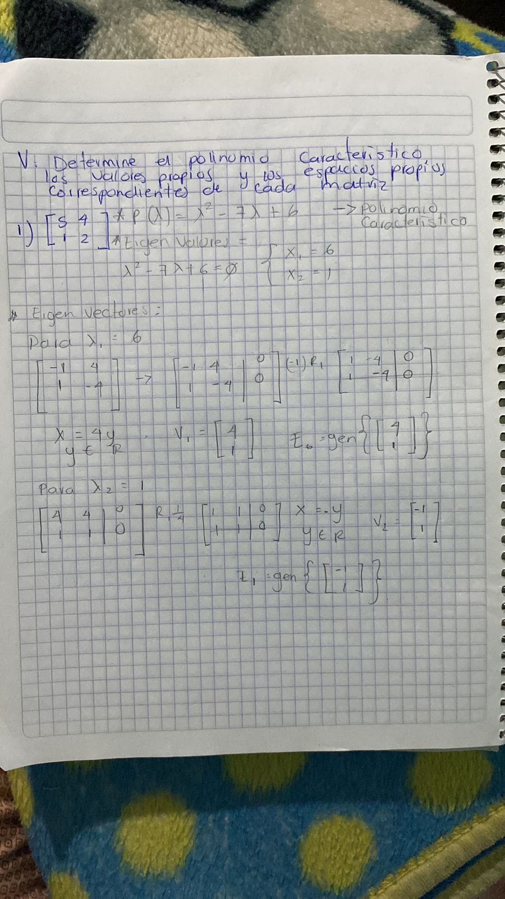

$$
\begin{align*}
    200 = x_1 + x_2\\
    x_1 = 70 + x_3\\
    x_2 + X_3 = 100+25\\
    x_4 + x_5 = 60
\end{align*}

\rightarrow

\left[
    \begin{array}{rrrrr|r}
        1&1&0&0&0&200\\
        1&0&-&-1&0&40\\
        0&1&1&0&-1&100\\
        0&0&0&1&1&60
    \end{array}
\right]

\overrightarrow{
    \begin{align*}
        R_2 \rightarrow R_2 - R_1
    \end{align*}
} \\

\left[
    \begin{array}{rrrrr|r}
        1&1&0&0&0&200\\
        0&-1&-1&-1&0&-160\\
        0&1&1&0&-1&100\\
        0&0&0&1&1&60
    \end{array}
\right]

\overrightarrow{
    \begin{align*}
        R_2 \leftrightarrow R_3
    \end{align*}
}

\left[
    \begin{array}{rrrrr|r}
        1&1&0&0&0&200\\
        0&1&1&0&-1&100\\
        0&-1&-1&-1&0&-160\\
        0&0&0&1&1&60
    \end{array}
\right]

\overrightarrow{
    \begin{align*}
        R_1 \rightarrow R_1 \rightarrow R_2\\
        R_3 \rightarrow R_3 + R_2
    \end{align*}
}  \\

\left[
    \begin{array}{rrrrr|r}
        1&0&-1&0&1&100\\
        0&1&1&0&-1&100\\
        0&0&0&-1&-1&-160\\
        0&0&0&1&1&60
    \end{array}
\right]

\overrightarrow{
    \begin{align*}
        R_3 \rightarrow -R_3
    \end{align*}
}

\left[
    \begin{array}{rrrrr|r}
        1&0&-1&0&1&100\\
        0&1&1&0&-1&100\\
        0&0&0&1&1&60\\
        0&0&0&1&1&60
    \end{array}
\right]

\overrightarrow{
    \begin{align*}
        R_4 \rightarrow R_4 - R_3
    \end{align*}
} \\

\left[
    \begin{array}{rrrrr|r}
        1&0&-1&0&1&100\\
        0&1&1&0&-1&100\\
        0&0&0&1&1&60\\
        0&0&0&0&0&0
    \end{array}
\right]
$$

$$
x_1 = 100 + x_3 - x_5\\
x_2 = 100 - 2x_3 + x_5\\
x_4 = 60 - x_5\\
x_3 = x_3
x_5 = x_5
$$

Considerando la ecuación de $x_1$, el valor mínimo de $x_1$ es de $100$.

##### 33. Use las leyes de Kirchhoff y la ley de Ohm para establecer un sistema de ecuaciones lineales que permita determinar las corrientes $I_1$, $I_2$, $I_3$ en la red eléctrica que se muestra en la siguiente figura.

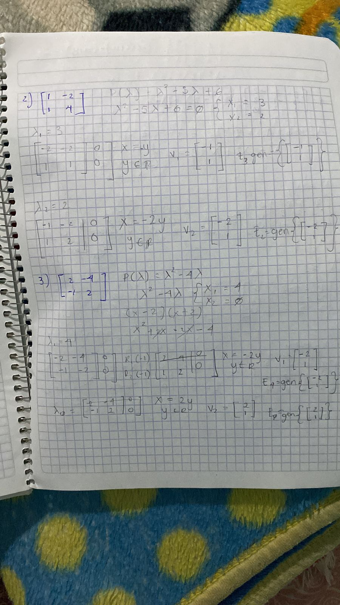

$$
N_{eq} = 2 [LVK] + 0 [DS] + 0 [CS] = 2
$$

$$
LVK_1 = I_1 + I_2 - 8 = 0 \rightarrow I_1 + I_2 = 8\\
LVK_2 = -I_2 - 4I_3 + 13 = 0 \rightarrow -I_2 - 4I_3 = -13\\
$$

Soluciones:

$$
I_1 = 8 - I_2\\
I_2 = 13 - 4I_3\\
I_3 \in \R
$$

##### 34. Considere la siguiente reacción química. Para cada uno de los dos reactivos de la izquierda y los cuatro productos de la derecha, construya un vector en ℝ5 que liste el número de átomos por molécula de plomo (Pb), nitrógeno (N), cromo (Cr), manganeso (Mn) y oxígeno (O). Escriba una ecuación vectorial, que los coeficientes desconocidos de la reacción deban satisfacer, y encuentre una solución que tenga sentido en el balance.

$$
PbN_6 + CrMn_2O_8 \rightarrow Pb_3O_4 + Cr_2O_3 + MnO_2 + NO
$$

Reactivos:

$$

\begin{align*}

    PbN = \begin{bmatrix}
        1&6&0&0&0
    \end{bmatrix} \\

    CrMnO = \begin{bmatrix}
        0&0&1&2&8
    \end{bmatrix} \\

    PbO = \begin{bmatrix}
        3&0&0&0&4
    \end{bmatrix} \\

    CrO = \begin{bmatrix}
        0&0&2&0&3
    \end{bmatrix} \\

    MnO = \begin{bmatrix}
        0&0&0&1&2
    \end{bmatrix} \\

    NO = \begin{bmatrix}
        0&1&0&0&1
    \end{bmatrix}

\end{align*}

\rightarrow

\left[
    \begin{array}{rrrrrr|r}
        1&0&-3&0&0&0&0\\
        6&0&0&0&0&-1&0\\
        0&1&0&-2&0&0&0\\
        0&2&0&0&-1&0&0\\
        0&8&-4&-3&-2&-1&0
    \end{array}
\right]

\overrightarrow{
    \begin{align*}
        R_2 \rightarrow R_2 - 6R_1
    \end{align*}
}

\\

\left[
    \begin{array}{rrrrrr|r}
        1&0&3&0&0&0&0\\
        0&0&18&0&0&-1&0\\
        0&1&0&-2&0&0&0\\
        0&2&0&0&-1&0&0\\
        0&8&-4&-3&-2&-1&0
    \end{array}
\right]

\overrightarrow{
    \begin{align*}
        R_3 \leftrightarrow R_2
    \end{align*}
}

\left[
    \begin{array}{rrrrrr|r}
        1&0&3&0&0&0&0\\
        0&1&0&-2&0&0&0\\
        0&0&18&0&0&-1&0\\
        0&2&0&0&-1&0&0\\
        0&8&-4&-3&-2&-1&0
    \end{array}
\right]

\overrightarrow{
    \begin{align*}
        R_4 \rightarrow R_4 - 2R_2\\
        R_5 \rightarrow R_5 - 8R-2
    \end{align*}
} \\

\left[
    \begin{array}{rrrrrr|r}
        1&0&3&0&0&0&0\\
        0&1&0&-2&0&0&0\\
        0&0&18&0&0&-1&0\\
        0&0&0&4&-1&0&0\\
        0&0&-4&-3&-2&-1&0
    \end{array}
\right]

\overrightarrow{
    \begin{align*}
        R_3 \rightarrow \frac{1}{18}R_3
    \end{align*}
}

\left[
    \begin{array}{rrrrrr|r}
        1&0&0&0&0&\frac{3}{18}&0\\
        0&1&0&-2&0&0&0\\
        0&0&1&0&0&-\frac{1}{18}&0\\
        0&0&0&4&-1&0&0\\
        0&0&0&13&-2&-\frac{11}{9}&0
    \end{array}
\right]

\overrightarrow{
    \begin{align*}
        R_4 \rightarrow \frac{1}{4}R_4
    \end{align*}
}
\\

\left[
    \begin{array}{rrrrrr|r}
        1&0&0&0&0&\frac{3}{18}&0\\
        0&1&0&-2&0&0&0\\
        0&0&1&0&0&-\frac{1}{18}&0\\
        0&0&0&1&-1&-\frac{1}{4}&0\\
        0&0&0&13&-2&-\frac{11}{9}&0
    \end{array}
\right]

\overrightarrow{
    \begin{align*}
        R_2 \rightarrow R_2 + 2R_4\\
        R_5 \rightarrow R_5 - 13R_4
    \end{align*}
}

\left[
    \begin{array}{rrrrrr|r}
        1&0&0&0&0&\frac{3}{18}&0\\
        0&1&0&-2&0&0&0\\
        0&0&1&0&0&-\frac{1}{18}&0\\
        0&0&0&1&-1&0&0\\
        0&0&0&0&-15&-\frac{11}{9}&0
    \end{array}
\right]

\overrightarrow{
    \begin{align*}
        R_5 \rightarrow -\frac{1}{15}R_5
    \end{align*}
} \\

\left[
    \begin{array}{rrrrrr|r}
        1&0&0&0&0&\frac{3}{18}&0\\
        0&1&0&0&-2&0&0\\
        0&0&1&0&0&-\frac{1}{18}&0\\
        0&0&0&1&-1&0&0\\
        0&0&0&0&1&-\frac{11}{135}&0
    \end{array}
\right]

\overrightarrow{
    \begin{align*}
        R_4 \rightarrow R_4 - R_5\\
        R_2 \rightarrow R_2 + 2R_5
    \end{align*}
}

\left[
    \begin{array}{rrrrrr|r}
        1&0&0&0&0&\frac{1}{6}&0\\
        0&1&0&0&0&\frac{22}{135}&0\\
        0&0&1&0&0&-\frac{1}{18}&0\\
        0&0&0&1&0&\frac{11}{135}&0\\
        0&0&0&0&1&-\frac{11}{135}&0
    \end{array}
\right]

\overrightarrow{
    \begin{align*}
        R_4 \rightarrow R_4 - R_5\\
        R_2 \rightarrow R_2 + 2R_5
    \end{align*}
} \\

\begin{align*}
    EC_1 = \frac{1}{6}EC_6
    EC_2 = \frac{22}{135}EC_6
    EC_3 = -\frac{1}{18}EC_6
    EC_4 = \frac{11}{135}EC_6
    EC_5 = \frac{11}{135}EC_6
\end{align*}

$$

### Examen Parcial

### Actividad 1.1 Matrices y sus operaciones

#### Determine los valores de $x,y,z$ tales que las matrices siguientes.

$$
\begin{bmatrix}
    1 & 0 & 1 \\
    0 & 2 & -3
\end{bmatrix}
=
\begin{bmatrix}
    x & 0 & 1 \\
    x + y & 2 & x+z
\end{bmatrix} \\

x = 1\\
\therefore x + y = 0 \rightarrow y = -1\\
\therefore x + z = -3 \rightarrow y = -4\\

$$

#### Determine el tipo de las siguientes matrices:

$$
\begin{bmatrix}
    1 & 1 \\ 1 & 0
\end{bmatrix}
\text{Esta matriz no es de ningún tipo}
$$

$$
\begin{bmatrix}
    1 & 0 \\ 1 & 0
\end{bmatrix}
\text{Esta matriz no es de ningún tipo}

$$

$$
\begin{bmatrix}
    1 & 1 \\ 1 & 1
\end{bmatrix}
\text{Esta matriz es diagonal y escalar}
$$

$$
\begin{bmatrix}
    1 & 1 \\ 0 & 0
\end{bmatrix}
\text{Esta matriz no es de ningún tipo}
$$

$$
\begin{bmatrix}
    0 & 1 \\ 1 & 0
\end{bmatrix}
\text{Esta matriz es diagonal y escalar}
$$

$$
\begin{bmatrix}
    1 & 0 \\ 0 & 2
\end{bmatrix}
\text{Esta matriz es diagonal}
$$

$$
\begin{bmatrix}
    3 & 0 \\ 0 & 3
\end{bmatrix}
\text{Esta matriz es diagonal y escalar}
$$

$$
\begin{bmatrix}
    0 & 1 \\ 1 & 1
\end{bmatrix}
\text{Esta matriz no es de ningún tipo}
$$

#### Calcule (si es posible) las siguientes operaciones, en caso de no se posible, explique el porque.

$$
\begin{bmatrix}
    1 & -1 \\ 0 & 1
\end{bmatrix}
+
\begin{bmatrix}
    0 & 1 \\ 1 & 2
\end{bmatrix}
=
\begin{bmatrix}
    1 & 0\\ 1& 3
\end{bmatrix}
$$

$$
-3 \begin{bmatrix}
    1 & 1 & -1 \\ 1 & 1 & -1
\end{bmatrix}
=
\begin{bmatrix}
    3 & 3 & -3 \\ 3 & 3 & -3
\end{bmatrix}
$$

$$
\begin{bmatrix}
    2 & 2 \\ -2& -2
\end{bmatrix}
+
\begin{bmatrix}
    0 \\ 0
\end{bmatrix}
=
\text{No es posible, porque las matrices tienen dimensiones diferentes}
$$

$$
\begin{bmatrix}
    -2 & 3 \\ 4 &-5 \\ -6 7
\end{bmatrix}
-
\begin{bmatrix}
    7 & -6 \\ -5 & 4 \\ 3 & -2
\end{bmatrix}
=
\begin{bmatrix}
    -9 & 9 \\ 9 & 9 \\9 & 9
\end{bmatrix}
$$

$$
-\begin{bmatrix}
    1 & -2
\end{bmatrix}
+
\begin{bmatrix}
    1 & 2 \\ 4 & 3
\end{bmatrix}
=
\text{No es posible, porque las matrices tienen dimensiones diferentes}
$$

$$
3 \begin{bmatrix}
    0 & 2 \\ -4 & -6
\end{bmatrix}
-4 \begin{bmatrix}
    3 & -5 \\ 7 & 0
\end{bmatrix}
=
\begin{bmatrix}
    -12 & 26 \\ -40 & -18
\end{bmatrix}
$$

#### Calcule si es posible

$$
\begin{bmatrix}
    3 \\ 4
\end{bmatrix}
\begin{bmatrix}
    1 & 2
\end{bmatrix}
=
\begin{bmatrix}
    3 & 6\\4 &8
\end{bmatrix}
$$

$$
\begin{bmatrix}
    1 & 2
\end{bmatrix}
\begin{bmatrix}
    3 \\ 4
\end{bmatrix}
= 11
$$

$$
\begin{bmatrix}
    1 & -2 \\ 4 & 0
\end{bmatrix}
\begin{bmatrix}
    1 & 2&3&4\\-2&-4&3&0
\end{bmatrix}
=
\begin{bmatrix}
    5&10&-3&4\\4&8&12&16
\end{bmatrix}
$$

$$
\begin{bmatrix}
    1 & 2&3&4\\-2&-4&3&0
\end{bmatrix}
\begin{bmatrix}
    1 & -2 \\ 4 & 0
\end{bmatrix}
=
\text{Imposible}
$$

$$
\begin{bmatrix}
    -3&0\\2&-5\\-7&4
\end{bmatrix}
\begin{bmatrix}
    1&0&1\\0&1&1
\end{bmatrix}
=
\begin{bmatrix}
    -3&0&-3\\2&-5&-3\\-7&4&-3
\end{bmatrix}
$$

### Actividad 1.2 Sistemas de ecuaciones lineales

#### Replantee el sistema lineal en forma canónica

$$
2x+4z+1=0\\
2z+2w-2=x\\
-2x-z+3w=-3\\
y+z+t=w+4
$$

$$
\begin{bmatrix}
    2& 0& 4& 0& 0\\
    -1 &0 &2 &2& 0\\
    -2 &0& -1& 3& 0\\
    0 &1 &1 &-1 &1\\
\end{bmatrix}

\\

\begin{bmatrix}
    x\\ y \\ z \\ w\\ t
\end{bmatrix}

$$

#### Sea la siguiente matriz: escriba un sistema cuya matriz aumentada sea M. Encuentre el sistema homogéneo asociado con el sistema. Aplique a M una operación elemental de renglon para que la matriz corresponda a un sistema en forma escalonado reducido por renglones.

$$
x -y + z -w + t -k = 1\\
-t+k=0\\
-2z+t = 0
$$

$$
M = \begin{bmatrix}
    1 & -1 & 1 & -5 &6 &-1 & 1\\
    0 & 0 & -2 & 0 & 2 & 0 & 2\\
    0 & 0 & 0 & 0 & -1 & 1 & 0\\
\end{bmatrix}
$$

#### Determine la solución general del sistema:

$$
t = k\\
z = t\\
x = y + 5w - 6z
$$

#### Calcule la solución general del sistema:

$$
z = t = k = \R = 3\\
y = \R = 4 \\
w = \R = 5
x = 4 + 5(5) - 6(3) = 11
$$

#### Determine los sistemas consistentes y calcula sus soluciones generales.

$$
x + y = 1\\
y + z = 1\\
z + w = 1\\
x + w = 1\\
$$

$$
x = 1 - y\\
y = 1 - z\\
z = 1 - w\\
w = 1 - x\\

x = 1 - (1 - (1 - (1 - x)))\\
x = \R
$$

### Actividad 1.3 Determinantes

#### Calcule el determinante de la siguiente matriz

$$
det(\begin{bmatrix}
    1 & 0 & -2\\
    3 & 3 & 2\\
    0 & -1 & 1
\end{bmatrix})
= ((3×1)−(−1×2)) + ((0×1)−(−1×−1)) + ((0×2)−(3×−2)) = 11
$$

#### Calcule el determinante de la siguiente matriz

$$
det(\begin{bmatrix}
    0 & 0 & 0 & a\\
    0 & 0& b &c\\
    0&d&e&f\\
    g&h&i&j
\end{bmatrix}) = a\times b\times d \times g
$$

## Segundo Parcial

### Guia del Parcial

#### Subespacios Vectoriales

1. Determine si los siguientes conjuntos son sub-espacios vectoriales:

a) $V = M_{22}; H = \{ A = \begin{pmatrix} 0 & a \\ -a & 0\end{pmatrix}, a \in R \}$

b) $V = M_{22}; H = \{A = \begin{pmatrix}a& b \\ -b &c \end{pmatrix},a,b,c\in R\}$

c) $V = P_4; H = \{ p \in P_4: P(0) = 0\}$

d) $V = R^3; H = \{ \begin{pmatrix}a\\b\\c\end{pmatrix}, x^2 + y^2 + z^2 - (vt)^2 = 1 \}$

#### Combinación Lineal

1. Dados los vectores $u = (2,1,4)$, $v = (1,-1,3)$ y $w = (3,2,5)$. Exprese los siguientes vectores como combinaciones lineales de $u$,$v$ y $w$.

a) $(5,5,9)$

$$
\left[\begin{matrix}2 & 1 & 3 & 5\\1 & -1 & 2 & 5\\4 & 3 & 5 & 9\end{matrix}\right]
\underrightarrow{ R_{3} \leftrightarrow R_{1} }
\left[\begin{matrix}4 & 3 & 5 & 9\\1 & -1 & 2 & 5\\2 & 1 & 3 & 5\end{matrix}\right]
\underrightarrow{ R_2 + (- \frac{1}{4})R_1 } \\
\left[\begin{matrix}4 & 3 & 5 & 9\\0 & - \frac{7}{4} & \frac{3}{4} & \frac{11}{4}\\2 & 1 & 3 & 5\end{matrix}\right]
\underrightarrow{ R_3 + (- \frac{1}{2})R_1 }
\left[\begin{matrix}4 & 3 & 5 & 9\\0 & - \frac{7}{4} & \frac{3}{4} & \frac{11}{4}\\0 & - \frac{1}{2} & \frac{1}{2} & \frac{1}{2}\end{matrix}\right]
\underrightarrow{ R_{2} \leftrightarrow R_{2} } \\
\left[\begin{matrix}4 & 3 & 5 & 9\\0 & - \frac{7}{4} & \frac{3}{4} & \frac{11}{4}\\0 & - \frac{1}{2} & \frac{1}{2} & \frac{1}{2}\end{matrix}\right]
\underrightarrow{ R_3 + (- \frac{2}{7})R_2 }
\left[\begin{matrix}4 & 3 & 5 & 9\\0 & - \frac{7}{4} & \frac{3}{4} & \frac{11}{4}\\0 & 0 & \frac{2}{7} & - \frac{2}{7}\end{matrix}\right]
\underrightarrow{ R_{3} \leftrightarrow R_{3} } \\
\left[\begin{matrix}4 & 3 & 5 & 9\\0 & - \frac{7}{4} & \frac{3}{4} & \frac{11}{4}\\0 & 0 & \frac{2}{7} & - \frac{2}{7}\end{matrix}\right]
\underrightarrow{ \frac{R_3}{\frac{2}{7}} }
\left[\begin{matrix}4 & 3 & 5 & 9\\0 & - \frac{7}{4} & \frac{3}{4} & \frac{11}{4}\\0 & 0 & 1 & -1\end{matrix}\right]
\underrightarrow{ R_2 + (- \frac{3}{4})R_3 } \\
\left[\begin{matrix}4 & 3 & 5 & 9\\0 & - \frac{7}{4} & 0 & \frac{7}{2}\\0 & 0 & 1 & -1\end{matrix}\right]
\underrightarrow{ R_1 + (-5)R_3 }
\left[\begin{matrix}4 & 3 & 0 & 14\\0 & - \frac{7}{4} & 0 & \frac{7}{2}\\0 & 0 & 1 & -1\end{matrix}\right]
\underrightarrow{ \frac{R_2}{- \frac{7}{4}} } \\
\left[\begin{matrix}4 & 3 & 0 & 14\\0 & 1 & 0 & -2\\0 & 0 & 1 & -1\end{matrix}\right]
\underrightarrow{ R_1 + (-3)R_2 }
\left[\begin{matrix}4 & 0 & 0 & 20\\0 & 1 & 0 & -2\\0 & 0 & 1 & -1\end{matrix}\right]
\underrightarrow{ \frac{R_1}{4} }
\left[\begin{matrix}1 & 0 & 0 & 5\\0 & 1 & 0 & -2\\0 & 0 & 1 & -1\end{matrix}\right]
$$

b) $(2,0,6)$

$$
\left[\begin{matrix}2 & 1 & 3 & 2\\1 & -1 & 2 & 0\\4 & 3 & 5 & 6\end{matrix}\right]
\underrightarrow{ R_{3} \leftrightarrow R_{1} }
\left[\begin{matrix}4 & 3 & 5 & 6\\1 & -1 & 2 & 0\\2 & 1 & 3 & 2\end{matrix}\right]
\underrightarrow{ R_2 + (- \frac{1}{4})R_1 }
\left[\begin{matrix}4 & 3 & 5 & 6\\0 & - \frac{7}{4} & \frac{3}{4} & - \frac{3}{2}\\2 & 1 & 3 & 2\end{matrix}\right]
\underrightarrow{ R_3 + (- \frac{1}{2})R_1 }
\\
\left[\begin{matrix}4 & 3 & 5 & 6\\0 & - \frac{7}{4} & \frac{3}{4} & - \frac{3}{2}\\0 & - \frac{1}{2} & \frac{1}{2} & -1\end{matrix}\right]
\underrightarrow{ R_{2} \leftrightarrow R_{2} }
\left[\begin{matrix}4 & 3 & 5 & 6\\0 & - \frac{7}{4} & \frac{3}{4} & - \frac{3}{2}\\0 & - \frac{1}{2} & \frac{1}{2} & -1\end{matrix}\right]
\underrightarrow{ R_3 + (- \frac{2}{7})R_2 }
\\
\left[\begin{matrix}4 & 3 & 5 & 6\\0 & - \frac{7}{4} & \frac{3}{4} & - \frac{3}{2}\\0 & 0 & \frac{2}{7} & - \frac{4}{7}\end{matrix}\right]
\underrightarrow{ R_{3} \leftrightarrow R_{3} }
\left[\begin{matrix}4 & 3 & 5 & 6\\0 & - \frac{7}{4} & \frac{3}{4} & - \frac{3}{2}\\0 & 0 & \frac{2}{7} & - \frac{4}{7}\end{matrix}\right]
\underrightarrow{ \frac{R_3}{\frac{2}{7}} }
\left[\begin{matrix}4 & 3 & 5 & 6\\0 & - \frac{7}{4} & \frac{3}{4} & - \frac{3}{2}\\0 & 0 & 1 & -2\end{matrix}\right]
\underrightarrow{ R_2 + (- \frac{3}{4})R_3 }
\left[\begin{matrix}4 & 3 & 5 & 6\\0 & - \frac{7}{4} & 0 & 0\\0 & 0 & 1 & -2\end{matrix}\right]
\underrightarrow{ R_1 + (-5)R_3 }
\\
\left[\begin{matrix}4 & 3 & 0 & 16\\0 & - \frac{7}{4} & 0 & 0\\0 & 0 & 1 & -2\end{matrix}\right]
\underrightarrow{ \frac{R_2}{- \frac{7}{4}} }
\left[\begin{matrix}4 & 3 & 0 & 16\\0 & 1 & 0 & 0\\0 & 0 & 1 & -2\end{matrix}\right]
\underrightarrow{ R_1 + (-3)R_2 }
\\
\left[\begin{matrix}4 & 0 & 0 & 16\\0 & 1 & 0 & 0\\0 & 0 & 1 & -2\end{matrix}\right]
\underrightarrow{ \frac{R_1}{4} }
\left[\begin{matrix}1 & 0 & 0 & 4\\0 & 1 & 0 & 0\\0 & 0 & 1 & -2\end{matrix}\right]
$$

c) $(2,2,3)$

$$
\left[\begin{matrix}2 & 1 & 3 & 2\\1 & -1 & 2 & 2\\4 & 3 & 5 & 3\end{matrix}\right]
\underrightarrow{ R_{3} \leftrightarrow R_{1} }
\left[\begin{matrix}4 & 3 & 5 & 3\\1 & -1 & 2 & 2\\2 & 1 & 3 & 2\end{matrix}\right]
\underrightarrow{ R_2 + (- \frac{1}{4})R_1 }
\left[\begin{matrix}4 & 3 & 5 & 3\\0 & - \frac{7}{4} & \frac{3}{4} & \frac{5}{4}\\2 & 1 & 3 & 2\end{matrix}\right]
\underrightarrow{ R_3 + (- \frac{1}{2})R_1 }
\\
\left[\begin{matrix}4 & 3 & 5 & 3\\0 & - \frac{7}{4} & \frac{3}{4} & \frac{5}{4}\\0 & - \frac{1}{2} & \frac{1}{2} & \frac{1}{2}\end{matrix}\right]
\underrightarrow{ R_{2} \leftrightarrow R_{2} }
\left[\begin{matrix}4 & 3 & 5 & 3\\0 & - \frac{7}{4} & \frac{3}{4} & \frac{5}{4}\\0 & - \frac{1}{2} & \frac{1}{2} & \frac{1}{2}\end{matrix}\right]
\underrightarrow{ R_3 + (- \frac{2}{7})R_2 }
\\
\left[\begin{matrix}4 & 3 & 5 & 3\\0 & - \frac{7}{4} & \frac{3}{4} & \frac{5}{4}\\0 & 0 & \frac{2}{7} & \frac{1}{7}\end{matrix}\right]
\underrightarrow{ R_{3} \leftrightarrow R_{3} }
\left[\begin{matrix}4 & 3 & 5 & 3\\0 & - \frac{7}{4} & \frac{3}{4} & \frac{5}{4}\\0 & 0 & \frac{2}{7} & \frac{1}{7}\end{matrix}\right]
\underrightarrow{ \frac{R_3}{\frac{2}{7}} }
\left[\begin{matrix}4 & 3 & 5 & 3\\0 & - \frac{7}{4} & \frac{3}{4} & \frac{5}{4}\\0 & 0 & 1 & \frac{1}{2}\end{matrix}\right]
\underrightarrow{ R_2 + (- \frac{3}{4})R_3 }
\left[\begin{matrix}4 & 3 & 5 & 3\\0 & - \frac{7}{4} & 0 & \frac{7}{8}\\0 & 0 & 1 & \frac{1}{2}\end{matrix}\right]
\underrightarrow{ R_1 + (-5)R_3 }
\\
\left[\begin{matrix}4 & 3 & 0 & \frac{1}{2}\\0 & - \frac{7}{4} & 0 & \frac{7}{8}\\0 & 0 & 1 & \frac{1}{2}\end{matrix}\right]
\underrightarrow{ \frac{R_2}{- \frac{7}{4}} }
\left[\begin{matrix}4 & 3 & 0 & \frac{1}{2}\\0 & 1 & 0 & - \frac{1}{2}\\0 & 0 & 1 & \frac{1}{2}\end{matrix}\right]
\underrightarrow{ R_1 + (-3)R_2 }
\\
\left[\begin{matrix}4 & 0 & 0 & 2\\0 & 1 & 0 & - \frac{1}{2}\\0 & 0 & 1 & \frac{1}{2}\end{matrix}\right]
\underrightarrow{ \frac{R_1}{4} }
\left[\begin{matrix}1 & 0 & 0 & \frac{1}{2}\\0 & 1 & 0 & - \frac{1}{2}\\0 & 0 & 1 & \frac{1}{2}\end{matrix}\right]
$$

d) $(-1,3,\frac{1}{2})$

$$
\left[\begin{matrix}2 & 1 & 3 & -1.0\\1 & -1 & 2 & 3.0\\4 & 3 & 5 & 0.5\end{matrix}\right]
\underrightarrow{ R_{3} \leftrightarrow R_{1} }
\left[\begin{matrix}4 & 3 & 5 & 0.5\\1 & -1 & 2 & 3.0\\2 & 1 & 3 & -1.0\end{matrix}\right]
\underrightarrow{ R_2 + (- \frac{1}{4})R_1 }
\left[\begin{matrix}4 & 3 & 5 & 0.5\\0 & - \frac{7}{4} & \frac{3}{4} & 2.875\\2 & 1 & 3 & -1.0\end{matrix}\right]
\underrightarrow{ R_3 + (- \frac{1}{2})R_1 }
\\
\left[\begin{matrix}4 & 3 & 5 & 0.5\\0 & - \frac{7}{4} & \frac{3}{4} & 2.875\\0 & - \frac{1}{2} & \frac{1}{2} & -1.25\end{matrix}\right]
\underrightarrow{ R_{2} \leftrightarrow R_{2} }
\left[\begin{matrix}4 & 3 & 5 & 0.5\\0 & - \frac{7}{4} & \frac{3}{4} & 2.875\\0 & - \frac{1}{2} & \frac{1}{2} & -1.25\end{matrix}\right]
\underrightarrow{ R_3 + (- \frac{2}{7})R_2 }
\\
\left[\begin{matrix}4 & 3 & 5 & 0.5\\0 & - \frac{7}{4} & \frac{3}{4} & 2.875\\0 & 0 & \frac{2}{7} & -2.07142857142857\end{matrix}\right]
\underrightarrow{ R_{3} \leftrightarrow R_{3} }
\left[\begin{matrix}4 & 3 & 5 & 0.5\\0 & - \frac{7}{4} & \frac{3}{4} & 2.875\\0 & 0 & \frac{2}{7} & -2.07142857142857\end{matrix}\right]
\underrightarrow{ \frac{R_3}{\frac{2}{7}} }
\left[\begin{matrix}4 & 3 & 5 & 0.5\\0 & - \frac{7}{4} & \frac{3}{4} & 2.875\\0 & 0 & 1 & -7.25\end{matrix}\right]
\underrightarrow{ R_2 + (- \frac{3}{4})R_3 }
\left[\begin{matrix}4 & 3 & 5 & 0.5\\0 & - \frac{7}{4} & 0 & 8.3125\\0 & 0 & 1 & -7.25\end{matrix}\right]
\underrightarrow{ R_1 + (-5)R_3 }
\\
\left[\begin{matrix}4 & 3 & 0 & 36.75\\0 & - \frac{7}{4} & 0 & 8.3125\\0 & 0 & 1 & -7.25\end{matrix}\right]
\underrightarrow{ \frac{R_2}{- \frac{7}{4}} }
\left[\begin{matrix}4 & 3 & 0 & 36.75\\0 & 1 & 0 & -4.75\\0 & 0 & 1 & -7.25\end{matrix}\right]
\underrightarrow{ R_1 + (-3)R_2 }
\\
\left[\begin{matrix}4 & 0 & 0 & 51.0\\0 & 1 & 0 & -4.75\\0 & 0 & 1 & -7.25\end{matrix}\right]
\underrightarrow{ \frac{R_1}{4} }
\left[\begin{matrix}1 & 0 & 0 & 12.75\\0 & 1 & 0 & -4.75\\0 & 0 & 1 & -7.25\end{matrix}\right]
$$

2. Si $p_1 = 2 + x + 4x^2$, $p_2 = 1 - x + 3x^2$ y $p_3 = 3+2x+5x^2$. Exprese los siguientes polinomios como una combinación de $p_1$, $p_2$ y $p_3$.

a) $9x+5-5x^2$

$$
\left[\begin{matrix}4 & 3 & 5 & -5\\1 & -1 & 2 & 9\\2 & 1 & 3 & 5\end{matrix}\right]
\underrightarrow{ R_{1} \leftrightarrow R_{1} }
\left[\begin{matrix}4 & 3 & 5 & -5\\1 & -1 & 2 & 9\\2 & 1 & 3 & 5\end{matrix}\right]
\underrightarrow{ R_2 + (- \frac{1}{4})R_1 }
\left[\begin{matrix}4 & 3 & 5 & -5\\0 & - \frac{7}{4} & \frac{3}{4} & \frac{41}{4}\\2 & 1 & 3 & 5\end{matrix}\right]
\underrightarrow{ R_3 + (- \frac{1}{2})R_1 }
\\
\left[\begin{matrix}4 & 3 & 5 & -5\\0 & - \frac{7}{4} & \frac{3}{4} & \frac{41}{4}\\0 & - \frac{1}{2} & \frac{1}{2} & \frac{15}{2}\end{matrix}\right]
\underrightarrow{ R_{2} \leftrightarrow R_{2} }
\left[\begin{matrix}4 & 3 & 5 & -5\\0 & - \frac{7}{4} & \frac{3}{4} & \frac{41}{4}\\0 & - \frac{1}{2} & \frac{1}{2} & \frac{15}{2}\end{matrix}\right]
\underrightarrow{ R_3 + (- \frac{2}{7})R_2 }
\\
\left[\begin{matrix}4 & 3 & 5 & -5\\0 & - \frac{7}{4} & \frac{3}{4} & \frac{41}{4}\\0 & 0 & \frac{2}{7} & \frac{32}{7}\end{matrix}\right]
\underrightarrow{ R_{3} \leftrightarrow R_{3} }
\left[\begin{matrix}4 & 3 & 5 & -5\\0 & - \frac{7}{4} & \frac{3}{4} & \frac{41}{4}\\0 & 0 & \frac{2}{7} & \frac{32}{7}\end{matrix}\right]
\underrightarrow{ \frac{R_3}{\frac{2}{7}} }
\left[\begin{matrix}4 & 3 & 5 & -5\\0 & - \frac{7}{4} & \frac{3}{4} & \frac{41}{4}\\0 & 0 & 1 & 16\end{matrix}\right]
\underrightarrow{ R_2 + (- \frac{3}{4})R_3 }
\left[\begin{matrix}4 & 3 & 5 & -5\\0 & - \frac{7}{4} & 0 & - \frac{7}{4}\\0 & 0 & 1 & 16\end{matrix}\right]
\underrightarrow{ R_1 + (-5)R_3 }
\\
\left[\begin{matrix}4 & 3 & 0 & -85\\0 & - \frac{7}{4} & 0 & - \frac{7}{4}\\0 & 0 & 1 & 16\end{matrix}\right]
\underrightarrow{ \frac{R_2}{- \frac{7}{4}} }
\left[\begin{matrix}4 & 3 & 0 & -85\\0 & 1 & 0 & 1\\0 & 0 & 1 & 16\end{matrix}\right]
\underrightarrow{ R_1 + (-3)R_2 }
\\
\left[\begin{matrix}4 & 0 & 0 & -88\\0 & 1 & 0 & 1\\0 & 0 & 1 & 16\end{matrix}\right]
\underrightarrow{ \frac{R_1}{4} }
\left[\begin{matrix}1 & 0 & 0 & -22\\0 & 1 & 0 & 1\\0 & 0 & 1 & 16\end{matrix}\right]
$$

b) $2+6x^2$

$$
\left[\begin{matrix}4 & 3 & 5 & 6\\1 & -1 & 2 & 0\\2 & 1 & 3 & 2\end{matrix}\right]
\underrightarrow{ R_{1} \leftrightarrow R_{1} }
\left[\begin{matrix}4 & 3 & 5 & 6\\1 & -1 & 2 & 0\\2 & 1 & 3 & 2\end{matrix}\right]
\underrightarrow{ R_2 + (- \frac{1}{4})R_1 }
\left[\begin{matrix}4 & 3 & 5 & 6\\0 & - \frac{7}{4} & \frac{3}{4} & - \frac{3}{2}\\2 & 1 & 3 & 2\end{matrix}\right]
\underrightarrow{ R_3 + (- \frac{1}{2})R_1 }
\\
\left[\begin{matrix}4 & 3 & 5 & 6\\0 & - \frac{7}{4} & \frac{3}{4} & - \frac{3}{2}\\0 & - \frac{1}{2} & \frac{1}{2} & -1\end{matrix}\right]
\underrightarrow{ R_{2} \leftrightarrow R_{2} }
\left[\begin{matrix}4 & 3 & 5 & 6\\0 & - \frac{7}{4} & \frac{3}{4} & - \frac{3}{2}\\0 & - \frac{1}{2} & \frac{1}{2} & -1\end{matrix}\right]
\underrightarrow{ R_3 + (- \frac{2}{7})R_2 }
\\
\left[\begin{matrix}4 & 3 & 5 & 6\\0 & - \frac{7}{4} & \frac{3}{4} & - \frac{3}{2}\\0 & 0 & \frac{2}{7} & - \frac{4}{7}\end{matrix}\right]
\underrightarrow{ R_{3} \leftrightarrow R_{3} }
\left[\begin{matrix}4 & 3 & 5 & 6\\0 & - \frac{7}{4} & \frac{3}{4} & - \frac{3}{2}\\0 & 0 & \frac{2}{7} & - \frac{4}{7}\end{matrix}\right]
\underrightarrow{ \frac{R_3}{\frac{2}{7}} }
\left[\begin{matrix}4 & 3 & 5 & 6\\0 & - \frac{7}{4} & \frac{3}{4} & - \frac{3}{2}\\0 & 0 & 1 & -2\end{matrix}\right]
\underrightarrow{ R_2 + (- \frac{3}{4})R_3 }
\left[\begin{matrix}4 & 3 & 5 & 6\\0 & - \frac{7}{4} & 0 & 0\\0 & 0 & 1 & -2\end{matrix}\right]
\underrightarrow{ R_1 + (-5)R_3 }
\\
\left[\begin{matrix}4 & 3 & 0 & 16\\0 & - \frac{7}{4} & 0 & 0\\0 & 0 & 1 & -2\end{matrix}\right]
\underrightarrow{ \frac{R_2}{- \frac{7}{4}} }
\left[\begin{matrix}4 & 3 & 0 & 16\\0 & 1 & 0 & 0\\0 & 0 & 1 & -2\end{matrix}\right]
\underrightarrow{ R_1 + (-3)R_2 }
\\
\left[\begin{matrix}4 & 0 & 0 & 16\\0 & 1 & 0 & 0\\0 & 0 & 1 & -2\end{matrix}\right]
\underrightarrow{ \frac{R_1}{4} }
\left[\begin{matrix}1 & 0 & 0 & 4\\0 & 1 & 0 & 0\\0 & 0 & 1 & -2\end{matrix}\right]
$$

c) $3-2^{-1}x^2 + x$

$$
\left[\begin{matrix}4 & 3 & 5 & -0.5\\1 & -1 & 2 & 1.0\\2 & 1 & 3 & 3.0\end{matrix}\right]
\underrightarrow{ R_{1} \leftrightarrow R_{1} }
\left[\begin{matrix}4 & 3 & 5 & -0.5\\1 & -1 & 2 & 1.0\\2 & 1 & 3 & 3.0\end{matrix}\right]
\underrightarrow{ R_2 + (- \frac{1}{4})R_1 }
\left[\begin{matrix}4 & 3 & 5 & -0.5\\0 & - \frac{7}{4} & \frac{3}{4} & 1.125\\2 & 1 & 3 & 3.0\end{matrix}\right]
\underrightarrow{ R_3 + (- \frac{1}{2})R_1 }
\\
\left[\begin{matrix}4 & 3 & 5 & -0.5\\0 & - \frac{7}{4} & \frac{3}{4} & 1.125\\0 & - \frac{1}{2} & \frac{1}{2} & 3.25\end{matrix}\right]
\underrightarrow{ R_{2} \leftrightarrow R_{2} }
\left[\begin{matrix}4 & 3 & 5 & -0.5\\0 & - \frac{7}{4} & \frac{3}{4} & 1.125\\0 & - \frac{1}{2} & \frac{1}{2} & 3.25\end{matrix}\right]
\underrightarrow{ R_3 + (- \frac{2}{7})R_2 }
\\
\left[\begin{matrix}4 & 3 & 5 & -0.5\\0 & - \frac{7}{4} & \frac{3}{4} & 1.125\\0 & 0 & \frac{2}{7} & 2.92857142857143\end{matrix}\right]
\underrightarrow{ R_{3} \leftrightarrow R_{3} }
\left[\begin{matrix}4 & 3 & 5 & -0.5\\0 & - \frac{7}{4} & \frac{3}{4} & 1.125\\0 & 0 & \frac{2}{7} & 2.92857142857143\end{matrix}\right]
\underrightarrow{ \frac{R_3}{\frac{2}{7}} }
\left[\begin{matrix}4 & 3 & 5 & -0.5\\0 & - \frac{7}{4} & \frac{3}{4} & 1.125\\0 & 0 & 1 & 10.25\end{matrix}\right]
\underrightarrow{ R_2 + (- \frac{3}{4})R_3 }
\left[\begin{matrix}4 & 3 & 5 & -0.5\\0 & - \frac{7}{4} & 0 & -6.5625\\0 & 0 & 1 & 10.25\end{matrix}\right]
\underrightarrow{ R_1 + (-5)R_3 }
\\
\left[\begin{matrix}4 & 3 & 0 & -51.75\\0 & - \frac{7}{4} & 0 & -6.5625\\0 & 0 & 1 & 10.25\end{matrix}\right]
\underrightarrow{ \frac{R_2}{- \frac{7}{4}} }
\left[\begin{matrix}4 & 3 & 0 & -51.75\\0 & 1 & 0 & 3.75\\0 & 0 & 1 & 10.25\end{matrix}\right]
\underrightarrow{ R_1 + (-3)R_2 }
\\
\left[\begin{matrix}4 & 0 & 0 & -63.0\\0 & 1 & 0 & 3.75\\0 & 0 & 1 & 10.25\end{matrix}\right]
\underrightarrow{ \frac{R_1}{4} }
\left[\begin{matrix}1 & 0 & 0 & -15.75\\0 & 1 & 0 & 3.75\\0 & 0 & 1 & 10.25\end{matrix}\right]
$$

d) $7x-2x^2+1$

$$
\left[\begin{matrix}4 & 3 & 5 & -2\\1 & -1 & 2 & 7\\2 & 1 & 3 & 1\end{matrix}\right]
\underrightarrow{ R_{1} \leftrightarrow R_{1} }
\left[\begin{matrix}4 & 3 & 5 & -2\\1 & -1 & 2 & 7\\2 & 1 & 3 & 1\end{matrix}\right]
\underrightarrow{ R_2 + (- \frac{1}{4})R_1 }
\left[\begin{matrix}4 & 3 & 5 & -2\\0 & - \frac{7}{4} & \frac{3}{4} & \frac{15}{2}\\2 & 1 & 3 & 1\end{matrix}\right]
\underrightarrow{ R_3 + (- \frac{1}{2})R_1 }
\\
\left[\begin{matrix}4 & 3 & 5 & -2\\0 & - \frac{7}{4} & \frac{3}{4} & \frac{15}{2}\\0 & - \frac{1}{2} & \frac{1}{2} & 2\end{matrix}\right]
\underrightarrow{ R_{2} \leftrightarrow R_{2} }
\left[\begin{matrix}4 & 3 & 5 & -2\\0 & - \frac{7}{4} & \frac{3}{4} & \frac{15}{2}\\0 & - \frac{1}{2} & \frac{1}{2} & 2\end{matrix}\right]
\underrightarrow{ R_3 + (- \frac{2}{7})R_2 }
\\
\left[\begin{matrix}4 & 3 & 5 & -2\\0 & - \frac{7}{4} & \frac{3}{4} & \frac{15}{2}\\0 & 0 & \frac{2}{7} & - \frac{1}{7}\end{matrix}\right]
\underrightarrow{ R_{3} \leftrightarrow R_{3} }
\left[\begin{matrix}4 & 3 & 5 & -2\\0 & - \frac{7}{4} & \frac{3}{4} & \frac{15}{2}\\0 & 0 & \frac{2}{7} & - \frac{1}{7}\end{matrix}\right]
\underrightarrow{ \frac{R_3}{\frac{2}{7}} }
\left[\begin{matrix}4 & 3 & 5 & -2\\0 & - \frac{7}{4} & \frac{3}{4} & \frac{15}{2}\\0 & 0 & 1 & - \frac{1}{2}\end{matrix}\right]
\underrightarrow{ R_2 + (- \frac{3}{4})R_3 }
\left[\begin{matrix}4 & 3 & 5 & -2\\0 & - \frac{7}{4} & 0 & \frac{63}{8}\\0 & 0 & 1 & - \frac{1}{2}\end{matrix}\right]
\underrightarrow{ R_1 + (-5)R_3 }
\\
\left[\begin{matrix}4 & 3 & 0 & \frac{1}{2}\\0 & - \frac{7}{4} & 0 & \frac{63}{8}\\0 & 0 & 1 & - \frac{1}{2}\end{matrix}\right]
\underrightarrow{ \frac{R_2}{- \frac{7}{4}} }
\left[\begin{matrix}4 & 3 & 0 & \frac{1}{2}\\0 & 1 & 0 & - \frac{9}{2}\\0 & 0 & 1 & - \frac{1}{2}\end{matrix}\right]
\underrightarrow{ R_1 + (-3)R_2 }
\\
\left[\begin{matrix}4 & 0 & 0 & 14\\0 & 1 & 0 & - \frac{9}{2}\\0 & 0 & 1 & - \frac{1}{2}\end{matrix}\right]
\underrightarrow{ \frac{R_1}{4} }
\left[\begin{matrix}1 & 0 & 0 & \frac{7}{2}\\0 & 1 & 0 & - \frac{9}{2}\\0 & 0 & 1 & - \frac{1}{2}\end{matrix}\right]
$$

3. Escriba a $B$ como una combinación lineal del conjunto de vectores A.

a) $B = \begin{pmatrix} -1 \\ -2 \\ 4\end{pmatrix}, A = \{\begin{pmatrix}-2 \\ -1 \\ -5\end{pmatrix}, \begin{pmatrix}4 \\ -1 \\ -2\end{pmatrix}, \begin{pmatrix}3 \\ 1 \\ -3\end{pmatrix}\}$

$$
\left[\begin{matrix}-2 & 4 & 3 & -1\\-1 & -1 & 1 & -2\\-5 & -2 & -3 & 4\end{matrix}\right]
\underrightarrow{ R_{3} \leftrightarrow R_{1} }
\left[\begin{matrix}-5 & -2 & -3 & 4\\-1 & -1 & 1 & -2\\-2 & 4 & 3 & -1\end{matrix}\right]
\underrightarrow{ R_2 + (- \frac{1}{5})R_1 }
\left[\begin{matrix}-5 & -2 & -3 & 4\\0 & - \frac{3}{5} & \frac{8}{5} & - \frac{14}{5}\\-2 & 4 & 3 & -1\end{matrix}\right]
\underrightarrow{ R_3 + (- \frac{2}{5})R_1 }
\\
\left[\begin{matrix}-5 & -2 & -3 & 4\\0 & - \frac{3}{5} & \frac{8}{5} & - \frac{14}{5}\\0 & \frac{24}{5} & \frac{21}{5} & - \frac{13}{5}\end{matrix}\right]
\underrightarrow{ R_{3} \leftrightarrow R_{2} }
\left[\begin{matrix}-5 & -2 & -3 & 4\\0 & \frac{24}{5} & \frac{21}{5} & - \frac{13}{5}\\0 & - \frac{3}{5} & \frac{8}{5} & - \frac{14}{5}\end{matrix}\right]
\underrightarrow{ R_3 + (\frac{1}{8})R_2 }
\\
\left[\begin{matrix}-5 & -2 & -3 & 4\\0 & \frac{24}{5} & \frac{21}{5} & - \frac{13}{5}\\0 & 0 & \frac{17}{8} & - \frac{25}{8}\end{matrix}\right]
\underrightarrow{ R_{3} \leftrightarrow R_{3} }
\left[\begin{matrix}-5 & -2 & -3 & 4\\0 & \frac{24}{5} & \frac{21}{5} & - \frac{13}{5}\\0 & 0 & \frac{17}{8} & - \frac{25}{8}\end{matrix}\right]
\underrightarrow{ \frac{R_3}{\frac{17}{8}} }
\left[\begin{matrix}-5 & -2 & -3 & 4\\0 & \frac{24}{5} & \frac{21}{5} & - \frac{13}{5}\\0 & 0 & 1 & - \frac{25}{17}\end{matrix}\right]
\underrightarrow{ R_2 + (- \frac{21}{5})R_3 }
\left[\begin{matrix}-5 & -2 & -3 & 4\\0 & \frac{24}{5} & 0 & \frac{304}{85}\\0 & 0 & 1 & - \frac{25}{17}\end{matrix}\right]
\underrightarrow{ R_1 + (3)R_3 }
\\
\left[\begin{matrix}-5 & -2 & 0 & - \frac{7}{17}\\0 & \frac{24}{5} & 0 & \frac{304}{85}\\0 & 0 & 1 & - \frac{25}{17}\end{matrix}\right]
\underrightarrow{ \frac{R_2}{\frac{24}{5}} }
\left[\begin{matrix}-5 & -2 & 0 & - \frac{7}{17}\\0 & 1 & 0 & \frac{38}{51}\\0 & 0 & 1 & - \frac{25}{17}\end{matrix}\right]
\underrightarrow{ R_1 + (2)R_2 }
\\
\left[\begin{matrix}-5 & 0 & 0 & \frac{55}{51}\\0 & 1 & 0 & \frac{38}{51}\\0 & 0 & 1 & - \frac{25}{17}\end{matrix}\right]
\underrightarrow{ \frac{R_1}{-5} }
\left[\begin{matrix}1 & 0 & 0 & - \frac{11}{51}\\0 & 1 & 0 & \frac{38}{51}\\0 & 0 & 1 & - \frac{25}{17}\end{matrix}\right]
$$

b) $B = -x^2+2x, A = \{x^2-1, x^2+1, x^2-x-1, x^2+5x\}$:

$$
\begin{bmatrix} 1 & 1 &1 &1 & -1 \\ 0 & 0& -1 & 5 & 2 \\ -1 & 1 &-1 & -1 & 0 \end{bmatrix} \underrightarrow{R_3 \rightarrow R_1 + R_3} \begin{bmatrix}1 & 1&1&1&-1\\0&0&-1&5&2\\0&2&0&0&-1\end{bmatrix} \underrightarrow{R_2 \leftrightarrow R_3}  \\ \begin{bmatrix}1&0&1&1&-\frac{1}{2} \\ 0 & 1&0&0&-\frac{1}{2} \\ 0 & 0&-1&5&2\end{bmatrix} \underrightarrow{-R_3} \begin{bmatrix}1&0&1&1&-\frac{1}{2}\\0&1&0&0&-\frac{1}{2}\\0&0&1&5&-2\end{bmatrix} \rightarrow{R_1 \rightarrow -R_3 + R_1} \\ \begin{bmatrix}1&0&0&6&\frac{3}{2} \\ 0&1&0&0&-\frac{1}{2}\\0&0&1&5&-2\end{bmatrix} \therefore c_1 =  \frac{3}{2}, c_2 = -\frac{1}{2}, c_3 = -2, c_4 = 0
$$

#### Vectores Linealmente Independientes y Dependientes

1. Determine los valores de $k$ para que el conjunto $H = \{\begin{pmatrix}k \\ -2 \\3 \end{pmatrix}, \begin{pmatrix}2 \\ -2k \\ -1\end{pmatrix}, \begin{pmatrix}k \\ 0 \\3\end{pmatrix}\}$ sea lineal-mente independiente.

$$
A = \begin{bmatrix}k&2&k\\-2&-2k&0\\3&-1&3\end{bmatrix}
$$

$$
|A| \rightarrow -6k^2+2k-(-6k^2-12) \rightarrow6k^2+2k+6k^2-12\rightarrow 2k+12 \therefore K = -6
$$

2. Sea $V$ el espacio vectorial de todas las funciones con valore real definidas sobre la recta real completa. ¿Cuáles de los siguientes conjuntos de vectores en $V$ son lineal-mente dependientes?

a) $\{2,4\sin^2{x},\cos^2{x}\}$ Nos da un sistema incosistente, por lo tanto es linealmente dependiente.

b) $\{x, \cos{x}\}$

$$
\begin{bmatrix}x & \cos{x} & 0  \\ 1 & -\sin{x} & 0\end{bmatrix} \underrightarrow{R_1 \leftrightarrow R_2} \begin{bmatrix}1 & -\sin{x} & 0 \\ x & \cos{x} & 0\end{bmatrix} \underrightarrow{-xR_1 + R_2} \begin{bmatrix}1&\sin{x}&0 \\ 0 & \cos{x} +x\sin{x}&0\end{bmatrix}\ \underrightarrow{\frac{1}{\cos{x} + x\sin{x}}}R_2 \\ \begin{bmatrix}1 & -\sin{x} & 0\\ 0&1&0\end{bmatrix} \underrightarrow{\sin{x}R_2 + R_1} \begin{bmatrix}1&0&0\\0&1&0\end{bmatrix} \therefore C_1 = C_2 = 0 \therefore \text{ Solución consistente, por lo tanto es linealmente independiente.}
$$

c) $\{1,\sin{x},\sin{2x}\}$

$$
\begin{bmatrix}0\\0\\0\end{bmatrix} \rightarrow \begin{bmatrix}1\\\sin{x}\\\sin{2x}\end{bmatrix} \therefore \begin{bmatrix}1&\sin{x}&\sin{2x} &0\\ 0 & \cos{x} & 2\cos{2x} & 0 \\ 0 & -\sin{x} & -4\sin{2x}&0\end{bmatrix} \underrightarrow{\frac{1}{\cos{x}}R_2} \begin{bmatrix}1 & \sin{x} & \sin{2x} & 0 \\ 0&1&2\frac{\cos{2x}}{\cos{x}}&0\\0&-\sin{x}&-4\sin{2x}\end{bmatrix} \underrightarrow{-\sin{x}R_2 + R_1 \\ \sin{x}R-2 + R_3} \\ \dots \\ \begin{bmatrix}1&0&0&0\\0&1&0&0\\0&0&1&0\end{bmatrix} \therefore \text{Solución consistente donde } c_1 = c_2 = c_3 = 0 \text{ Por lo tanto es linealmente independiente}
$$

d) $\{\cos{2x}, \sin^2{x}, \cos^2{x}\}$ El sistema es linealmente independiente por ser un sistema consistente con soluciones infinitas.

3. Para que los valores de $k$, las siguientes matrices son linealmente independientes de $M_
  {22}$ $\begin{bmatrix}1 & 0\\ 1 & k\end{bmatrix}, \begin{bmatrix}-1 & 0 \\ k & 1\end{bmatrix}, \begin{bmatrix}2 & 0 \\ 1 & 3\end{bmatrix}$

$$
\begin{bmatrix}1&-1&2&a\\0&0&0&b\\1&k&1&c\\k&0&3&d\end{bmatrix} \therefore \text{}
$$

4. Construya un conjunto de vectores $H = \{v_1, v_2, v_3\} \in R^3$ tal que sean linealmente independientes y $v_1^TV_2 = v_2^Tv_3 = 0$.

$$
V_1 = \begin{bmatrix}1\\0\\0\end{bmatrix} , V_2 = \begin{bmatrix}0\\1\\0\end{bmatrix}, V_3 = \begin{bmatrix}0\\0\\1\end{bmatrix}
$$

$$
A = \begin{bmatrix}1&0&0\\0&1&0\\0&0&1\end{bmatrix} \therefore |A| = 0
$$

$$
V_1^T V_2 = \begin{bmatrix}1&0&0\end{bmatrix} \begin{bmatrix}0\\1\\0\end{bmatrix} = 0 \\ V_2^TV_3 = \begin{bmatrix}0&1&0\end{bmatrix} \begin{bmatrix}0\\0\\1\end{bmatrix} = 0 \\ \therefore \\ V_1^TV_2 = V_2^TV_1 = 0
$$

5. Sea $H = \{v_1, v_2, v_3\} \in R^3$. Demuestre que si $det(H) = det( [v_1, v_2, v_3] ) = 0$, entonces $H$ es lineal-mente independiente.

#### Bases y Cambios de Base

1. Determine una base para el espacio de funciones que satisface: $\frac{dy}{dx}-2y=0$.

2. Considera las bases $B = \{u_1,u_2\}$ y $B' = \{u'_1,u'_2\}$ para R^2, donde: $u_1 = \begin{pmatrix}2\\2\end{pmatrix}, u_2 = \begin{pmatrix}4\\-1\end{pmatrix}, u'_1 = \begin{pmatrix}1\\3\end{pmatrix}, u'_2 = \begin{pmatrix}-1\\-1\end{pmatrix}$

a) Calcula la matriz de transición de $B'$ hacia $B$.

$$
\left[\begin{matrix}2 & 4 & 1 & -1\\2 & -1 & 3 & -1\end{matrix}\right]
\underrightarrow{ R_{1} \leftrightarrow R_{1} }
\left[\begin{matrix}2 & 4 & 1 & -1\\2 & -1 & 3 & -1\end{matrix}\right]
\underrightarrow{ R_2 + (-1)R_1 }
\left[\begin{matrix}2 & 4 & 1 & -1\\0 & -5 & 2 & 0\end{matrix}\right]
\underrightarrow{ R_{2} \leftrightarrow R_{2} }
\left[\begin{matrix}2 & 4 & 1 & -1\\0 & -5 & 2 & 0\end{matrix}\right]
\underrightarrow{ \frac{R_2}{-5} }
\left[\begin{matrix}2 & 4 & 1 & -1\\0 & 1 & - \frac{2}{5} & 0\end{matrix}\right]
\underrightarrow{ R_1 + (-4)R_2 }
\\
\left[\begin{matrix}2 & 0 & \frac{13}{5} & -1\\0 & 1 & - \frac{2}{5} & 0\end{matrix}\right]
\underrightarrow{ \frac{R_1}{2} }
\left[\begin{matrix}1 & 0 & \frac{13}{10} & - \frac{1}{2}\\0 & 1 & - \frac{2}{5} & 0\end{matrix}\right]
$$

b) Calcula la matriz de transición de $B$ hacia $B'$.

$$
\left[\begin{matrix}1 & -1 & 2 & 4\\3 & -1 & 2 & -1\end{matrix}\right]
\underrightarrow{ R_{2} \leftrightarrow R_{1} }
\left[\begin{matrix}3 & -1 & 2 & -1\\1 & -1 & 2 & 4\end{matrix}\right]
\underrightarrow{ R_2 + (- \frac{1}{3})R_1 }
\left[\begin{matrix}3 & -1 & 2 & -1\\0 & - \frac{2}{3} & \frac{4}{3} & \frac{13}{3}\end{matrix}\right]
\underrightarrow{ R_{2} \leftrightarrow R_{2} }
\left[\begin{matrix}3 & -1 & 2 & -1\\0 & - \frac{2}{3} & \frac{4}{3} & \frac{13}{3}\end{matrix}\right]
\underrightarrow{ \frac{R_2}{- \frac{2}{3}} }
\left[\begin{matrix}3 & -1 & 2 & -1\\0 & 1 & -2 & - \frac{13}{2}\end{matrix}\right]
\underrightarrow{ R_1 + (1)R_2 }
\\
\left[\begin{matrix}3 & 0 & 0 & - \frac{15}{2}\\0 & 1 & -2 & - \frac{13}{2}\end{matrix}\right]
\underrightarrow{ \frac{R_1}{3} }
\left[\begin{matrix}1 & 0 & 0 & - \frac{5}{2}\\0 & 1 & -2 & - \frac{13}{2}\end{matrix}\right]
$$

c) Dado el vector $w = \begin{pmatrix}3\\-5\end{pmatrix}$, calcula $[w]_B$ y $[w]_{B'}$.

$$
[W]_B =
\left[\begin{matrix}2 & 4 & 3\\2 & -1 & -5\end{matrix}\right]
\underrightarrow{ R_{1} \leftrightarrow R_{1} }
\left[\begin{matrix}2 & 4 & 3\\2 & -1 & -5\end{matrix}\right]
\underrightarrow{ R_2 + (-1)R_1 }
\left[\begin{matrix}2 & 4 & 3\\0 & -5 & -8\end{matrix}\right]
\underrightarrow{ R_{2} \leftrightarrow R_{2} }
\left[\begin{matrix}2 & 4 & 3\\0 & -5 & -8\end{matrix}\right]
\underrightarrow{ \frac{R_2}{-5} }
\left[\begin{matrix}2 & 4 & 3\\0 & 1 & \frac{8}{5}\end{matrix}\right]
\underrightarrow{ R_1 + (-4)R_2 }
\\
\left[\begin{matrix}2 & 0 & - \frac{17}{5}\\0 & 1 & \frac{8}{5}\end{matrix}\right]
\underrightarrow{ \frac{R_1}{2} }
\left[\begin{matrix}1 & 0 & - \frac{17}{10}\\0 & 1 & \frac{8}{5}\end{matrix}\right]
$$

$$
[W]_{B'} = \left[\begin{matrix}1 & -1 & 3\\3 & -1 & -5\end{matrix}\right]
\underrightarrow{ R_{2} \leftrightarrow R_{1} }
\left[\begin{matrix}3 & -1 & -5\\1 & -1 & 3\end{matrix}\right]
\underrightarrow{ R_2 + (- \frac{1}{3})R_1 }
\left[\begin{matrix}3 & -1 & -5\\0 & - \frac{2}{3} & \frac{14}{3}\end{matrix}\right]
\underrightarrow{ R_{2} \leftrightarrow R_{2} }
\left[\begin{matrix}3 & -1 & -5\\0 & - \frac{2}{3} & \frac{14}{3}\end{matrix}\right]
\underrightarrow{ \frac{R_2}{- \frac{2}{3}} }
\left[\begin{matrix}3 & -1 & -5\\0 & 1 & -7\end{matrix}\right]
\underrightarrow{ R_1 + (1)R_2 }
\\
\left[\begin{matrix}3 & 0 & -12\\0 & 1 & -7\end{matrix}\right]
\underrightarrow{ \frac{R_1}{3} }
\left[\begin{matrix}1 & 0 & -4\\0 & 1 & -7\end{matrix}\right]
$$

3. Sean los polinomios $p_1 = x^2 + x - 2$, $p_2 = 3x^2-x$, realiza los siguientes ejercicios:

a) $p_3 = 2p_1 - p_2$

$$
2x^2 + 2x - 4 - 3x^2 - x = -x^2+3x-4
$$

b) El conjunto $\{p_1,p_2,p_3\}$, ¿forman una base? Justifica.

$$
A = \begin{bmatrix}1 & 1 & -2 \\ 3&-1&0\\-1&3&-4\end{bmatrix} \therefore |A| = 0 \therefore \text{ No es base y es linealmente dependiente}
$$

4. Dado el siguiente sistema de ecuaciones lineales homogéneo: $$\begin{align*}-x+3y+z = 0 \\ 2x+2y-z=0\\3x-y-2z=0\end{align*}$$ Determina la base(si es que existe) del conjunto solución del problema.

$$
\begin{bmatrix}-1&3&1&0\\2&2&-1&0\\3&-1&-2&0\end{bmatrix} \underrightarrow{-R1}\begin{bmatrix}1&-3&1&0\\2&2&-1&0\\3&-1&-2&0\end{bmatrix} \underrightarrow{-2R_1 + R_2 \\ -3R_1 + R_3} \\ \begin{bmatrix}1&-3&-1&0\\0&8&1&0\\0&8&1&0\end{bmatrix} \underrightarrow{\frac{1}{8}R_2}\begin{bmatrix}1&-3&-1&0\\0&1&\frac{1}{8}&0\\0&8&1&0\end{bmatrix}\underrightarrow{3R_2 + R_1 \\ -8R_2 +R_3} \\\begin{bmatrix}1 &0&-\frac{5}{6}&0\\0&1&\frac{1}{8}&0\\0&0&0&0\end{bmatrix} \therefore x = \frac{5}{8}z, y = -\frac{1}{8}z, z\in R
$$

$$
z\begin{bmatrix}\frac{5}{8} \\ -\frac{5}{8} \\1\end{bmatrix} = S \\ dim(S) =1
$$

5. Dados los vectores y bases siguientes: $$V = \begin{pmatrix}-1\\3\end{pmatrix}, Z = \left\{ \begin{bmatrix}-1\\-3\end{bmatrix}, \begin{bmatrix}1\\0\end{bmatrix} \right\}, W = \left\{ \begin{bmatrix}1\\-1\end{bmatrix}, \begin{bmatrix}0\\1\end{bmatrix} \right\}$$

a) Calcula $[V]_W$.

$$
\left[\begin{matrix}1 & 0 & -1\\-1 & 1 & 3\end{matrix}\right]
\underrightarrow{ R_{1} \leftrightarrow R_{1} }
\left[\begin{matrix}1 & 0 & -1\\-1 & 1 & 3\end{matrix}\right]
\underrightarrow{ R_2 + (1)R_1 }
\left[\begin{matrix}1 & 0 & -1\\0 & 1 & 2\end{matrix}\right]
\underrightarrow{ R_{2} \leftrightarrow R_{2} }
\left[\begin{matrix}1 & 0 & -1\\0 & 1 & 2\end{matrix}\right]
\underrightarrow{ \frac{R_2}{1} }
\left[\begin{matrix}1 & 0 & -1\\0 & 1 & 2\end{matrix}\right]
\underrightarrow{ R_1 + (0)R_2 }
\\
\left[\begin{matrix}1 & 0 & -1\\0 & 1 & 2\end{matrix}\right]
\underrightarrow{ \frac{R_1}{1} }
\left[\begin{matrix}1 & 0 & -1\\0 & 1 & 2\end{matrix}\right]
$$

b) Calcula la matriz de transición de $W$ hacia $Z$.

$$
\left[\begin{matrix}-1 & 1 & 1 & 0\\-3 & 0 & -1 & 1\end{matrix}\right]
\underrightarrow{ R_{2} \leftrightarrow R_{1} }
\left[\begin{matrix}-3 & 0 & -1 & 1\\-1 & 1 & 1 & 0\end{matrix}\right]
\underrightarrow{ R_2 + (- \frac{1}{3})R_1 }
\left[\begin{matrix}-3 & 0 & -1 & 1\\0 & 1 & \frac{4}{3} & - \frac{1}{3}\end{matrix}\right]
\underrightarrow{ R_{2} \leftrightarrow R_{2} }
\left[\begin{matrix}-3 & 0 & -1 & 1\\0 & 1 & \frac{4}{3} & - \frac{1}{3}\end{matrix}\right]
\underrightarrow{ \frac{R_2}{1} }
\left[\begin{matrix}-3 & 0 & -1 & 1\\0 & 1 & \frac{4}{3} & - \frac{1}{3}\end{matrix}\right]
\underrightarrow{ R_1 + (0)R_2 }
\\
\left[\begin{matrix}-3 & 0 & -1 & 1\\0 & 1 & \frac{4}{3} & - \frac{1}{3}\end{matrix}\right]
\underrightarrow{ \frac{R_1}{-3} }
\left[\begin{matrix}1 & 0 & \frac{1}{3} & - \frac{1}{3}\\0 & 1 & \frac{4}{3} & - \frac{1}{3}\end{matrix}\right]
$$

c) Calcula $[V]_Z$ utilizando la matriz de transición del inciso anterior.

$$
\left[\begin{matrix}\frac{1}{3} & - \frac{1}{3}\\\frac{4}{3} & - \frac{1}{3}\end{matrix}\right] \left[\begin{matrix}-1 \\ 3\end{matrix}\right] = \left[\begin{matrix}-\frac{2}{3} \\ \frac{1}{3}\end{matrix}\right]
$$

6. Dado el siguiente conjunto de vectores: $(\frac{1}{2},-7,0), (-\frac{1}{3},0,2),(0,-7,\frac{1}{5})$.

a) Determine si el conjunto genera a $R^3$.

$$
  \begin{bmatrix}\frac{1}{3} & -\frac{1}{3} & 0 & a\\ -7 & 0&-7&b\\0&2&\frac{1}{5}&c\end{bmatrix} \underrightarrow{2R_1} \begin{bmatrix}1 & -\frac{2}{3} & 0 & 2a \\ -7 &0&-7&b\\0&2&\frac{1}{5}&c\end{bmatrix} \underrightarrow{7R1 + R_2} \\\begin{bmatrix}1&-\frac{2}{3} & 0&2a\\0&-\frac{14}{3}&-7&14a+b\\0&2&\frac{1}{5}&c\end{bmatrix} \underrightarrow{-\frac{3}{14}R_2} \begin{bmatrix}1&-\frac{2}{3}&0&2a\\0&1&\frac{2}{3}&-3a-\frac{3}{14}b\\0&2&\frac{1}{5}&c\end{bmatrix} \underrightarrow{\frac{2}{3}R_2 + R1 \\-2R_2 + R_3}\\\begin{bmatrix}1&0&1&-2a-\frac{1}{7}b\\0&1&\frac{3}{2}&-3a-\frac{3}{14}b\\0&0&-\frac{14}{5}&6a+\frac{3}{7}b-2c\end{bmatrix} \underrightarrow{-\frac{5}{14}R_3} \begin{bmatrix}1&0&1&-2a-\frac{1}{7}b\\0&1&\frac{3}{2}&-3a-\frac{3}{4}bb\\0&0&1&6a+\frac{3}{7}b-c\end{bmatrix} \underrightarrow{-R_3 + R_1 \\ - \frac{3}{2}R_3 + R_2} \begin{bmatrix}1&0&0&8a-\frac{4}{7}b +2c\\0&1&0&12a-\frac{6}{7}b+3c\\0&0&1&6s+\frac{3}{7}b-2c\end{bmatrix} \\ \therefore \text{Si es consistente, genera } R^3
$$

b) Genere un espacio vectorial de 3 elementos usando el conjunto de vectores.
c) Con los vectores, construya un sistema de ecuaciones lineales homogéneo y determine la base de las soluciones del sistema.

$$
\begin{bmatrix}0\\0\\0\end{bmatrix} = C_1\begin{bmatrix}\frac{1}{2} \\ -7 \\ 0\end{bmatrix} + C_2\begin{bmatrix}-\frac{1}{3}\\0\\2\end{bmatrix} + C_3\begin{bmatrix}0\\-7\\\frac{1}{5}\end{bmatrix}
$$

$$
\left[\begin{matrix}0.5 & -0.333333333333333 & 0 & 0\\-7.0 & 0 & -7.0 & 0\\0 & 2.0 & 0.2 & 0\end{matrix}\right]
\underrightarrow{ R_{2} \leftrightarrow R_{1} }
\left[\begin{matrix}-7.0 & 0 & -7.0 & 0\\0.5 & -0.333333333333333 & 0 & 0\\0 & 2.0 & 0.2 & 0\end{matrix}\right]
\underrightarrow{ R_2 + (0.0714285714285714)R_1 }
\left[\begin{matrix}-7.0 & 0 & -7.0 & 0\\0 & -0.333333333333333 & -0.5 & 0\\0 & 2.0 & 0.2 & 0\end{matrix}\right]
\underrightarrow{ R_3 + (0)R_1 }
\\
\left[\begin{matrix}-7.0 & 0 & -7.0 & 0\\0 & -0.333333333333333 & -0.5 & 0\\0 & 2.0 & 0.2 & 0\end{matrix}\right]
\underrightarrow{ R_{3} \leftrightarrow R_{2} }
\left[\begin{matrix}-7.0 & 0 & -7.0 & 0\\0 & 2.0 & 0.2 & 0\\0 & -0.333333333333333 & -0.5 & 0\end{matrix}\right]
\underrightarrow{ R_3 + (0.166666666666667)R_2 }
\\
\left[\begin{matrix}-7.0 & 0 & -7.0 & 0\\0 & 2.0 & 0.2 & 0\\0 & 0 & -0.466666666666667 & 0\end{matrix}\right]
\underrightarrow{ R_{3} \leftrightarrow R_{3} }
\left[\begin{matrix}-7.0 & 0 & -7.0 & 0\\0 & 2.0 & 0.2 & 0\\0 & 0 & -0.466666666666667 & 0\end{matrix}\right]
\underrightarrow{ \frac{R_3}{-0.466666666666667} }
\left[\begin{matrix}-7.0 & 0 & -7.0 & 0\\0 & 2.0 & 0.2 & 0\\0 & 0 & 1.0 & 0\end{matrix}\right]
\underrightarrow{ R_2 + (-0.2)R_3 }
\left[\begin{matrix}-7.0 & 0 & -7.0 & 0\\0 & 2.0 & 0 & 0\\0 & 0 & 1.0 & 0\end{matrix}\right]
\underrightarrow{ R_1 + (7.0)R_3 }
\\
\left[\begin{matrix}-7.0 & 0 & 0 & 0\\0 & 2.0 & 0 & 0\\0 & 0 & 1.0 & 0\end{matrix}\right]
\underrightarrow{ \frac{R_2}{2.0} }
\left[\begin{matrix}-7.0 & 0 & 0 & 0\\0 & 1.0 & 0 & 0\\0 & 0 & 1.0 & 0\end{matrix}\right]
\underrightarrow{ R_1 + (0)R_2 }
\\
\left[\begin{matrix}-7.0 & 0 & 0 & 0\\0 & 1.0 & 0 & 0\\0 & 0 & 1.0 & 0\end{matrix}\right]
\underrightarrow{ \frac{R_1}{-7.0} }
\left[\begin{matrix}1.0 & 0 & 0 & 0\\0 & 1.0 & 0 & 0\\0 & 0 & 1.0 & 0\end{matrix}\right]
$$

$$
 \therefore \\
 C_1 = C_2 = C_3 = 0
$$

Sistema consistente, que genera a $R^3$

7. Sea $V = \begin{pmatrix}-1\\5\end{pmatrix}$ y $[V]_W = \begin{pmatrix}-2\\7\end{pmatrix}$ determine la base $W$, sabiendo que $W = \left\{ \begin{pmatrix}x\\2y\end{pmatrix}, \begin{pmatrix}-y\\-3x\end{pmatrix} \right\}$

8. Sea $[V]_S = \begin{pmatrix}-\frac{1}{2}\\2\end{pmatrix}$ y $[V]_W = \begin{pmatrix}-3\\7\end{pmatrix}$, sabiendo que $W = \left\{ \begin{pmatrix}3\\y\end{pmatrix}, \begin{pmatrix}x\\5\end{pmatrix} \right\}$ y $S = \left\{ \begin{pmatrix}1\\0\end{pmatrix}, \begin{pmatrix}0\\1\end{pmatrix} \right\}$, determine:
   a) $W$
   b) Matriz de transición de la base $S$ hacia $W$
   c) Matriz de transición de la base $W$ hacia $S$.

9. Calcular las coordenadas de $V = \begin{pmatrix} -2 \\ 3 \\ 3 \end{pmatrix}$ en términos de base $H = \left\{ \begin{pmatrix} 1 \\ -2 \\3 \end{pmatrix}, \begin{pmatrix}2 \\ -2 \\ -1 \end{pmatrix}, \begin{pmatrix}1\\1\\4\end{pmatrix} \right\}$. Calcule $||V||$ y $||V_H||$. ¿Porué $||V|| \ne ||V_H||$?

#### Rango y Nulidad de una matriz

1. Determine el valor de $k$ para que la matriz $M$ tenga $V=2$

$$
M = \begin{bmatrix}1&-1&1&4\\3&-1&3k&1\\5&-5&7&9\end{bmatrix} \therefore |M| \rightarrow k = \frac{5}{3}
$$

$$
M = \begin{bmatrix}1&-2&1&4\\3&-1&5&1\\5&-5&7&9\end{bmatrix} \underrightarrow{2R_2 + R_1 \\ -5R_2 + R_3} \begin{bmatrix}1&0&\frac{9}{5}&-\frac{2}{5}\\0&1&\frac{2}{5} & -\frac{11}{5} \\ 0&0&0&0\end{bmatrix} \\ \therefore \\ x = -\frac{9}{5}z + \frac{2}{5}w \\ y = -\frac{2}{5}z + \frac{11}{5}w \\ z \in R \\ w \in R \\ \therefore \\ z\begin{bmatrix}-\frac{9}{5} \\ -\frac{2}{5}\\1\\0\end{bmatrix}, w = \begin{bmatrix}\frac{2}{5}\\\frac{4}{5}\\0\\1\end{bmatrix} : V = 2
$$

2.  Encuentre todos los valores posibles del rango de la matriz $A$ y $P(A)$, si $k$ es una variable.

$$
A = \begin{bmatrix}1&2&k\\-2&4k&2\\k&-2&1\end{bmatrix}, |A| \rightarrow k = \begin{cases}-1\\2\end{cases}
$$

K = -1

$$
\begin{bmatrix}1&2&-1\\-2&-4&2\\-1&-2&1\end{bmatrix} \underrightarrow{2R_1 + R-2 \\ R_1 + R_2} \begin{bmatrix}1&2&-1\\0&0&0\\0&0&0\end{bmatrix} \\ \therefore \\ x = -2y + z \\ y \in R \\ z \in R\\ \therefore \\ \begin{bmatrix}x\\y\\z\end{bmatrix} = \begin{bmatrix}-2y+z\\y\\z\end{bmatrix} \therefore y\begin{bmatrix}-2\\1\\0\end{bmatrix}, z\begin{bmatrix}1\\0\\1\end{bmatrix}\\V(A)= 2, P(A) = 1
$$

K = 2

$$
\begin{bmatrix}1&2&2\\-2&8&2\\2&-2&1\end{bmatrix} \underrightarrow{2R_1 + R_2 \\ -2R_1 + R_3} \begin{bmatrix}1&2&2\\0&12&8\\0&-6&-3\end{bmatrix} \underrightarrow{ \frac{1}{12}R_2 } \\ \begin{bmatrix}1&2&2\\0&1&\frac{2}{3}\\0&-6&-3\end{bmatrix} \underrightarrow{ -2R_2 + R_1 \\ 6R_2+R_3 } \begin{bmatrix}1&0&\frac{2}{3}\\0&0&\frac{2}{3}\\0&0&1\end{bmatrix} \underrightarrow{-\frac{2}{3}R_3 + R_1 \\ - \frac{2}{3}R_3 + R_2} \\ \begin{bmatrix}1&0&1\\0&1&\frac{1}{2}\\0&0&1\end{bmatrix} \\ \therefore \\ x = 2 \\ y = -\frac{1}{2}z \\ z = 0 \\ \therefore \\ \begin{bmatrix}x\\y\\z\end{bmatrix} = \begin{bmatrix}-2\\-\frac{1}{2}z \\0\end{bmatrix} = z\begin{bmatrix}-1\\-\frac{1}{2}\\0\end{bmatrix}
$$

### Examen Parcial

#### Todos los polinomios de 3er grado como maximo, con numeros enteros como coeficientes, no son un subespacio de $V = P_3$

Falso. Esto se puede comprobar si usamos $u + v$ y $cu$

$$
u + v = 10x^3 + 4x^2 + 15x + 13 \therefore \text{Si cumple con la condición}\\
cu = \frac{1}{4} (3x^3 + 4x^2 + x + 10) = \frac{3}{4}x^3 + x^2 + \frac{5}{2} \therefore \text{No cumple con la condición}
$$

### $\begin{bmatrix}3 \\ 5\end{bmatrix}$ esta en el espacio generado por $\{\begin{bmatrix}1 \\ 1\end{bmatrix} , \begin{bmatrix}2 \\ 4\end{bmatrix}\}$

Al obtener la combinación lineal del espacio, obtenemos que $C_1 = 1$ y $C_2 = 1$, por ende es verdadero.

#### Los polinomios $\{3,2x,-x^2\}$ son linealmente dependientes

Al obtener el determinante de la matriz formada por los elementos dados, obtenemos que este tiene un valor de 6, y al ser diferente de 0, son linealmente independientes.

#### Cualesquiera 3 vectores en $R^3$ forman una base para $R^3$

Verdadero, la condición de $r=m$ se cumple pero no garantiza que cada determinante formado sea diferente a 0, haciéndola linealmente independiente.

#### Una base en un espacio vectorial es unica.

Falso, Un espacio vectorial puede tener muchas bases diferentes. Una base de un espacio vectorial es simplemente un conjunto de vectores que son linealmente independientes y que abarcan el espacio vectorial. Hay infinitas formas de elegir este conjunto de vectores, por lo que hay infinitas bases posibles para un espacio vectorial dado. Sin embargo, todas las bases de un espacio vectorial particular tendrán el mismo número de elementos, que es la dimensión del espacio vectorial.

#### La matriz de transición de la base $\{\begin{bmatrix}1 \\ 0\end{bmatrix}, \begin{bmatrix}0 \\ 1\end{bmatrix}\}$ a la base $\{ \begin{bmatrix}1 \\ 1\end{bmatrix}, \begin{bmatrix}3 \\ 4\end{bmatrix} \}$ es $\begin{bmatrix}4&0\\3 \\ 1&1\end{bmatrix}$

Falso, esto se debe a que la base vieja es la matriz de identidad, por lo cual para encontrar la matriz de transición, se debe de calcular la inversa de la base nueva. Obteniendo:

$$
\begin{bmatrix}
    1 & 3 \\ 1 & 4
\end{bmatrix}^{-1}
=
\begin{bmatrix}
    4 & -3 \\ -1&1
\end{bmatrix}
$$

#### Si $[X]_B = \begin{bmatrix}3 \\ 2\end{bmatrix}$ y $B=\{ \begin{bmatrix}1 \\ 1\end{bmatrix}, \begin{bmatrix}2 \\ 4\end{bmatrix} \}$ entonces $x = \begin{bmatrix}7 \\ 11\end{bmatrix}$

Verdadero, este se comprueba obteniendo la compinación lineal de la base y el vector. Obteniendo el valor propuesto.

### Actividad 2.1 Subespacios y combinación lineal

#### Todos los polinomios de grado 3 como maximo y numeros enteros como coeficientes es un subespacio de P3

Sí, el conjunto de todos los polinomios de grado 3 como máximo con coeficientes enteros es un subespacio del espacio de polinomios P3.

#### Es $(4,2,6)$ una combinación lineal de $u = (1, -1, 3)$ y $v = (2,4,0)$

Si, el resolver la ecuación, obtenemos que $C_1 = 2$ y $C_2 = 1$

#### Exprese la siguiente combinación lineal $u = (2 , 1, 4)$, $v = (1,-1,3)$ y $w = (3,2,5)$

$$
\begin{bmatrix}
    2 & 1 & 3 \\ 1 & -1 & 2 \\ 4 & 3 & 5
\end{bmatrix}^{-1}
\begin{bmatrix}
    2 \\ 2 \\ 3
\end{bmatrix}
=
\begin{bmatrix}
    \frac{1}{2} \\ -\frac{1}{2} \\\frac{1}{2}
\end{bmatrix} \\
\therefore C_1 = C_3 = \frac{1}{2}, C_2 = -\frac{1}{2}
$$

#### Exprese la siguiente combinación lineal: $P_1 = 2 + x + 4x^2$, $P_2 = 1 - x + 3x^2$ y $P_3 = 3 + 2x + 5x^2$, dando $2 + 6x^2$

$$
\begin{align*}
2a + b + 3c &= 2 \\
a - b + 2c &= 0 \\
4a + 3b + 5c &= 6
\end{align*}
$$

Resolviendo este sistema, encontramos que a=1, b=−1 y c=1. Por lo tanto, 2+6x2 puede ser escrito como una combinación lineal de P1​, P2​ y P3​, es decir, 2+6x2=P1​−P2​+P3​.

### Actividad 2.2 Dependencia e independencia lineal y espacio generado

#### Determine el espacio generado por $u = (1, 1, -1)$ y $v = (2 ,3, 5)$.

$au+bv$ Donde $a$ y $b$ son escalares. En otras palabras, el espacio generado por $u$ y $v$ es el conjunto de todos los vectores que pueden obtenerse sumando múltiplos de $u$ y $v$. Por lo tanto consiste en todos los vectores de la forma $(a+2b,a+3b,−a+5b)$.

#### Determina si el vector es linealmente dependiente, en caso de serlo, exprese un vector como combinación lineal de los demás.

$$
\{ (1,-2,3,-1), (-2,4,-6,2)\}
$$

Se puede hacer la multiplicación manualmente, siendo $C_1 = -2$, obteniendo $(-2,4,-6,2)$

$$
\{ t^2 + 1, t - 2, t + 3 \}
$$

Estos no son linealmente dependientes, ya que la combinación de los vectores $t -2$ y $t+3$ va a resultar en un vector cuyo valor exponente de $t$ va a requerir un 1, siendo totalmente diferente e imposible de obtener a base de $t^2 + 1$

### Actividad 2.3 Bases y dimensión

#### Explique por qué los siguientes conjuntos no pueden ser bases de los espacios vectoriales indicados.

${(3,-2), (6,-4)}$ para $R^2$: Los vectores son linealmente dependientes (el segundo es el doble del primero), por lo que no pueden formar una base para $R^2$, que requiere 2 vectores linealmente independientes.

${(1,3), (4,1), (1,1)}$ para $R^2$: Hay 3 vectores en $R^2$, que es de dimensión 2. Por lo tanto, estos vectores son linealmente dependientes y no pueden formar una base.

${(0,0), (1,3)}$ para $R^2$: El vector $(0,0)$ es el vector cero, que no puede ser parte de una base ya que no contribuye a la generación del espacio.

${(1,0,1), (2,-1,3), (-4,2,-6)}$ para $R^3$: Los vectores son linealmente dependientes (el tercer vector es el doble del segundo vector restado del primer vector), por lo que no pueden formar una base para $R^3$, que requiere 3 vectores linealmente independientes.

${(1,1,1), (2,1,3), (5,0,0), (-1,-2,4)}$ para $R^3$: Hay 4 vectores en $R^3$, que es de dimensión 3. Por lo tanto, estos vectores son linealmente dependientes y no pueden formar una base.

${(1,4), (3,1,2), (2,4,5)}$ para $R^3$: Los vectores no están en $R^3$ ya que no tienen tres componentes.

${(4,3,2), (-1,0,5), (2,7,1)}$ para $R^4$: Solo hay 3 vectores en $R^4$, que es de dimensión 4. Se requieren 4 vectores para formar una base en $R^4$.

#### Demuestre que el subespacio de $R^3$ generado por los vectores ${(-1,2,1), (2,-1,0), (1,4,3)}$ es un subespacio de dos dimensiones de $R^3$. Proporciona una base para este subespacio.

Observamos que el tercer vector (1,4,3) es igual a la suma del primer vector (−1,2,1) y el segundo vector (2,−1,0). Por lo tanto, estos vectores son linealmente dependientes.
Dado que uno de los vectores puede ser escrito como una combinación lineal de los otros dos, el conjunto de vectores (−1,2,1),(2,−1,0),(1,4,3) no puede formar una base para R3

#### Determina una base para el siguiente subespacio de $R^4$, asi como indicar la dimensión de cada subespacio: (a,b,a+b,a-b)

Al ser linealmente independientes, la base es la misma a los vectores proporcionados: ${ (1,0,1,1),(0,1,1,−1)}$, siendo la dimensión de 2.

## Tercer Parcial

### Guia del Parcial

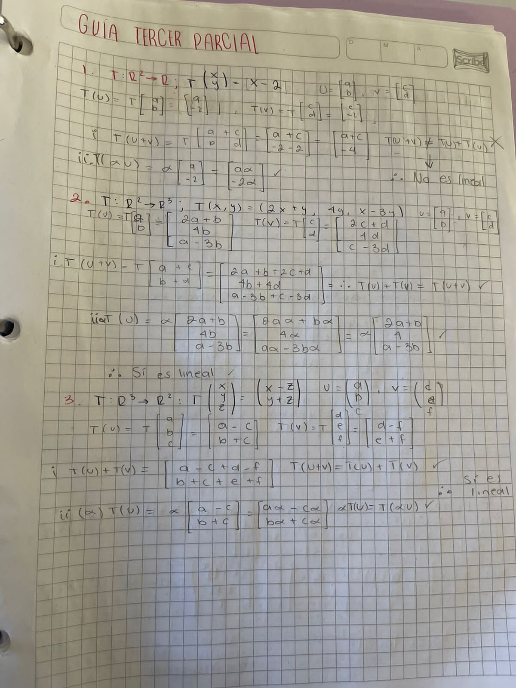

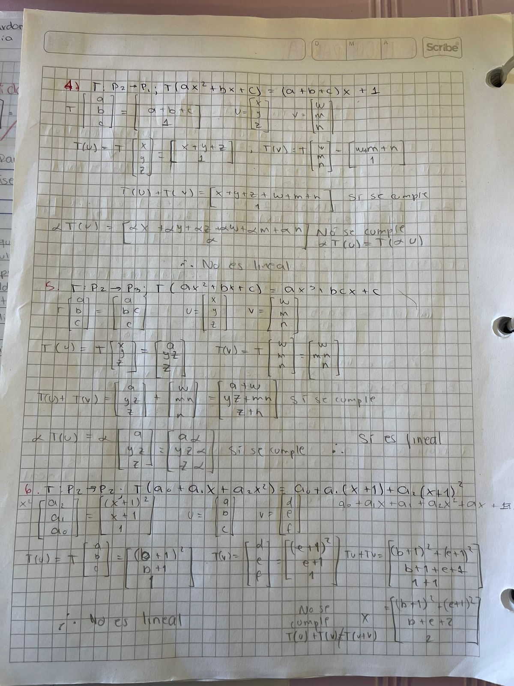

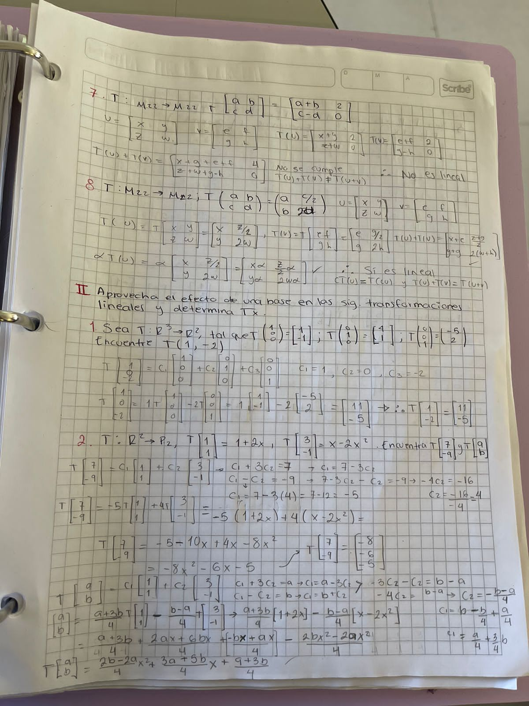

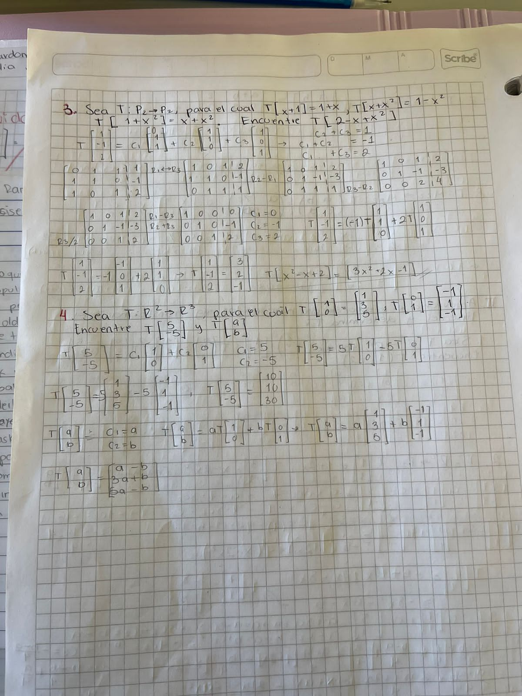

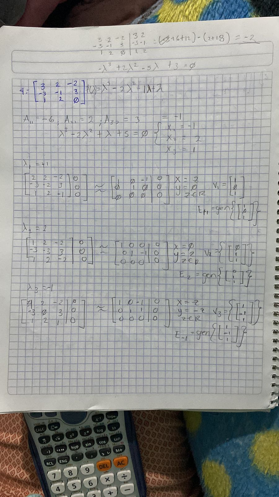

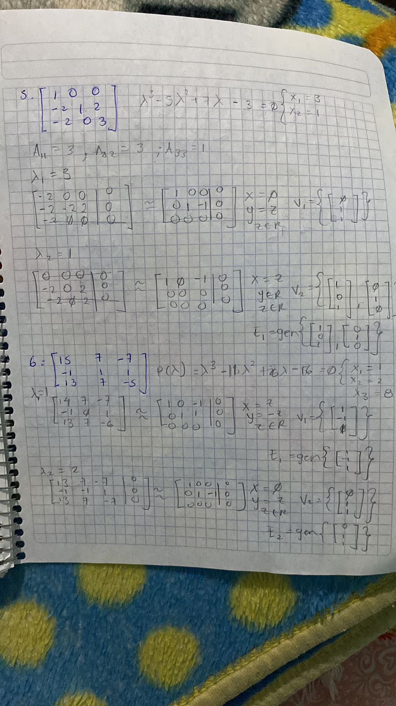

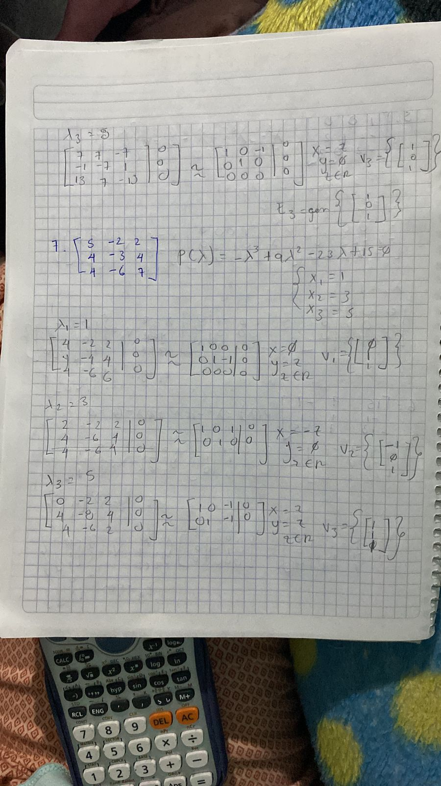

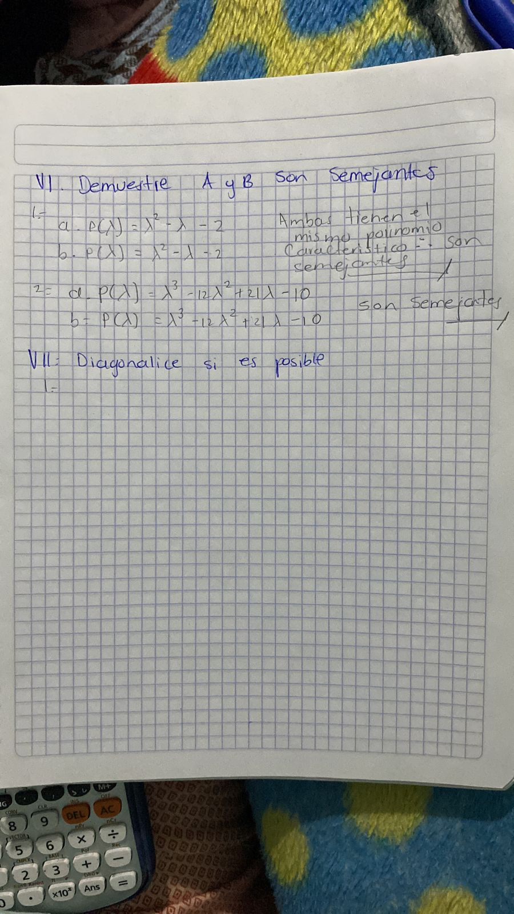

### Examen Parcial

#### Sea $T:R^2 \rightarrow P_2$ tal que $T\begin{bmatrix} 1 \\ 1 \end{bmatrix} = 1 + 2x$ y $T\begin{bmatrix} 1 \\ 2 \end{bmatrix} = x - 2x^2$

##### Encuentre $T\begin{bmatrix} a \\ b \end{bmatrix}$

$$
\begin{bmatrix}
    1 & 1 & a \\ 1 & 2 & b
\end{bmatrix}
\rightarrow
\begin{bmatrix}
    1 & 0 & 2a-b \\ 0 & 1 & b-a
\end{bmatrix}
\therefore
\begin{cases}
    C_1 = 2a - b \\
    C_2 = b - a
\end{cases} \\
\therefore \\
T\begin{bmatrix} a \\ b \end{bmatrix} = (2a-b)\begin{bmatrix}0 \\ 2 \\ 1\end{bmatrix} + (b-a)  \begin{bmatrix}-2\\1\\0\end{bmatrix} = \begin{bmatrix}2b-2a\\3a-b\\2a-b\end{bmatrix}
$$

##### Use el resultado anterior para encontrar $A_T$ relativa a la base $B = \{\begin{bmatrix}1 \\ -1\end{bmatrix}, \begin{bmatrix}1 \\3\end{bmatrix}\}$

$$
T[B] = \{ \begin{bmatrix}4 \\ 4 \\ 3\end{bmatrix} , \begin{bmatrix}-2\\3\\1\end{bmatrix}\} \therefore A_T = \begin{bmatrix}4 & -2 \\ 4 &3\\3&1\end{bmatrix}
$$

##### Use $A_T$ para calcular $T\begin{bmatrix}-2\\3\end{bmatrix}$

$$
T\begin{bmatrix}
    -2 \\3
\end{bmatrix} = A_T \begin{bmatrix}
    -2 \\ 3
\end{bmatrix} = \begin{bmatrix}
    -14 \\ 1 \\ -3
\end{bmatrix}
$$

##### Encuentre el núcleo, imagen, rango y nuladidad de la transformación.

#### Determine si la matriz $A = \begin{bmatrix}7 & 2 \\ -4 & 1\end{bmatrix}$ es diagnosable. De ser así, encuentre una matriz $C$ tal que $AC = CB$

$$
p(\lambda) = \lambda^2 - tr(A)\lambda + det(A) = \lambda^2 - 8\lambda + 15
\\
\lambda^2 - 8\lambda + 15 = 0 \therefore \begin{cases}
    \lambda_1 = 5 \\
    \lambda_2 = 3
\end{cases} \therefore C = \begin{bmatrix}5 & 0 \\ 0 & 3\end{bmatrix}
$$

Para $\lambda = 5$

$$
A - 5I = \begin{bmatrix}
    2 & 2 \\ -4 & -2
\end{bmatrix}
\therefore \begin{cases}
    x = -y \\
    y \in \R
\end{cases} \rightarrow \begin{cases}
    x = -1 \\
    y = 1
\end{cases}
$$

Para $\lambda = 3$
$$
A - 3I = \begin{bmatrix}
    4 & 2 \\ -4 & -2
\end{bmatrix}  \therefore \begin{cases}
    x = -\frac{1}{2}y \\
    y \in \R
\end{cases} \rightarrow \begin{cases}
    x = -1\\
    y = 2
\end{cases}
$$

$$
\therefore B = \begin{bmatrix}
    -1 & -1 \\ 1 & 2
\end{bmatrix}
$$

#### Gráfica la desigualdad

$$
x \ge 0\\
y \ge 0\\
2x+4y\ge 8\\
2x+y \ge 6
$$

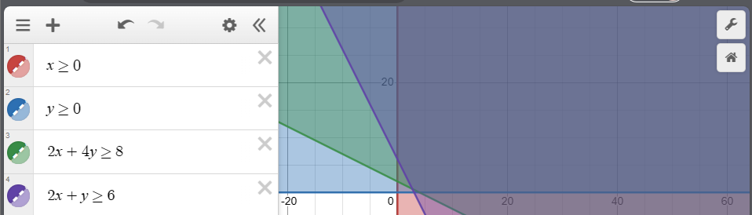

### Actividad 3.1 Programación lineal

#### Un fabricante de esquís los elabora de dos tipos: de descenso o de traviesa. Utilice la siguiente tabla para determinar cuántos esquís de cada clase debe de producir para alcanzar la máxima ganancia. ¿Cuánto es la máxima ganancia? ¿Cuál sería la ganancia máxima si el tiempo de manufactura disponible máximo se aumenta a 48 horas?

| | Descenso | Campo Traviesa | Tiempo disponible máximo |
| --- | --- | --- | --- |
| Tiempo de manufactura por esquí | 2 horas | 1 hora | 40 horas |
| Tiempo de acabados por esquí | 1 hora | 1 hora | 32 horas |
| Ganancia por esquí | $70 | $50 | |

$$
x = \text{Esquí de Descanso}\\
y = \text{Esquí de Traviesa}\\

\text{Función Objetivo} = f(x,y) = 70x + 50y\\
\text{Restricciones} = \begin{cases}
    2x + y \le 40\\
    x + y \le 32
\end{cases} \rightarrow \begin{cases} y = 0: x = 20, x = 0: y = 40\\y = 0: x = 32, x = 0: y = 32 \end{cases} \\
40 - 2x = 32 - x \rightarrow x = 8\\
\text{Puntos} = [(0,32), (0,40), (8,24), (20,0), (32,0)]\\
f(\text{Puntos}) = [1600, 2000, 1760, 1400, 2240]
$$

#### Una pequeña granja de illinois dispone de 100 ares para cultivar maíz y soya. En la siguiente tabla se muestran el costo de cultivo por acre, el costo de mano de obra por acre y la ganancia esperada por acre. En la columna derecha se muestra la cantidad de dinero disponible para cada uno de esos gastos. Encuentre el número de acres que se deben plantar de cada cultivo con el fin de maximizar la ganancia.

| | Soya | Maíz | Dinero disponible |
| --- | --- | --- | --- |
| Costo de cultivo por acre | $40 | $ 60 | $1800 |
| Costo de mano de obra por acre | $60 | $60 | $2400 | 
| Ganancia esperada por acre | $200 | $250 | |

$$
x = \text{Soya}\\
y = \text{Maíz}\\

\text{Función Objetivo} = f(x,y) = 200x + 250y\\
\text{Restricciones} = \begin{cases}
    40x + 60y \le 1800\\
    60x + 60y \le 2400
\end{cases} \rightarrow \begin{cases} y = 0: x = 30, x = 0: y = 45\\y = 0: x = 40, x = 0: y = 40 \end{cases} \\
30 - \frac{40}{60}x = 40 - x \rightarrow x = 30\\
\text{Puntos} = [(0,30), (0,40), (30,10), (40,0), (45,0)]\\
f(\text{Puntos}) = [7500, 10000, 8500, 8000, 9000   ]
$$

### Actividad 3.2 Transformaciones lineales I

#### Determina si $T\begin{bmatrix}a \\b \end{bmatrix} = \begin{bmatrix}a & b \\ 0 & 2\end{bmatrix}$ es lineal.

No lo es debido a que cualquier suma de $\begin{bmatrix}
    a & b \\ 0 & 2
\end{bmatrix}$ independientemente de los valores de $a$ y $b$ dará una matriz $\begin{bmatrix}
  x & y \\ 0 & 4  
\end{bmatrix}$

#### Sea $T:P_2 \rightarrow P_1$ la transformación lineal tal que $\begin{cases}T(1 + x + x^2) = -1 + 3x \\T(1 + x - x^2) = -3 + 2x \\T(1 - x + x^2) = 1 + 2x\end{cases}$.  Determine $T(a + bx + cx^2)$ y $T(-25 + 15x - 10x^2)$

Tenemos que obtener la combinación lineal de los argumentos de las funciones dadas con los argumentos de la función a calcular, obteniendo

$$
\begin{bmatrix}
C_1\\C_2\\C_3
\end{bmatrix}
=
\begin{bmatrix}
    a - b + c \\
    b - a + c \\
    a + b + c
\end{bmatrix} \\ \therefore \\
T(a + bx + cx^2) = (a - b + c)(-1 + 3x) + (b-a+c)(-3+2x) + (a+b+c)(1+2x) \\
T(-25 + 15x - 10x^2) = -130x-60
$$

### Actividad 3.4 Eigenvalores y eigenvectores

#### Determina el polinomio característico de $\begin{bmatrix}1 & 2 & 1 \\ 0 & 1 & 2 \\ -1 & 2 & 1\end{bmatrix}$ 

$$
p(A) = \lambda^3 - tr(A)\lambda^2  + (A_{11} + A_{22} + A_{33})\lambda - det(A) = \lambda^3 - 3\lambda^2 + 3\lambda +6
$$

#### Determina el polinomio característico de $\begin{bmatrix}4&2\\3&3\end{bmatrix}$

$$
p(A) = \lambda^2 - tr(A)\lambda + det(A) = \lambda^2 - 7\lambda + 6
$$

#### Determina el polinomio característico, los valores propios y los valores propios de cada matriz de $\begin{bmatrix}2 & -2 & 3\\0&3&-2\\0&-1&2\end{bmatrix}$

$$
p(A) = \lambda^3 - tr(A)\lambda^2  + (A_{11} + A_{22} + A_{33})\lambda - det(A) =  - \lambda^3 + 7\lambda^2 - 14\lambda + 8 \\
\begin{cases}
\lambda_1 = 4\\
\lambda_2 = 2\\
\lambda_3 = 1\\
\end{cases}
$$

#### Determina la base para el espacio propio de $\begin{bmatrix}4&2&0&0\\3&3&0&0\\0&0&2&5\\0&0&0&2\end{bmatrix}$ dado $\lambda = 2$

## Comentarios
