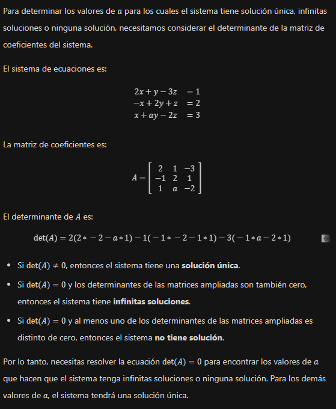

# Matematicas III

## Reducción de matrices y sistemas de ecuaciones lineales

1. Sea $A = \begin{bmatrix}
    2 & -4 & -6 & 8 \\
    0 & 0 & 5 & 10 \\
    3 & -3 & -3 & 0\\
    -2 & 4 & 2 & -4
\end{bmatrix}$:

     1. Reduzca la matriz $A$ a su forma escalonada.
     2. Calcule $|A|$ con las propiedades de los determinantes, considerando las operaciones elementales que se usaron en el inciso anterior.

2. En los siguientes ejercicios, determine los valores del parámetro $s$ para los cuales el sistema tiene solución única:

    1. $$\begin{align*} 6sx_1 + 4x_2 = 5\\ 9x_1 + 2sx_2 = -2 \end{align*}$$

    $$\begin{align*} 6sx_1 + 4x_2 = 5\\ 9x_1 + 2sx_2 = -2  \end{align*} \rightarrow A = \begin{bmatrix} 6s & 4 \\ 9 & 2s \end{bmatrix} \\ \therefore \\ |A| = (6s\times 2s)-49 = 12s^2-36 \\ \therefore \\ s \ne \pm \sqrt{3} \because |A| \ne 0$$ 2. $$\begin{align*}3xs_1 - 5x_2 = 3 \\9x_1 + 5sx_2 = 2\end{align*}$$

    $$\begin{align*}3xs_1 - 5x_2 = 3 \\9x_1 + 5sx_2 = 2\end{align*} \rightarrow A = \begin{bmatrix}3s & -5 \\ 9 & 5s\end{bmatrix} \\ \therefore \\ |A| = (3s \times 5s)-(9\times -5) = 15s^2+45 \\ \therefore \\ s \ne \pm \sqrt{3} \because |A| \ne 0$$

3. Calcular el valor de 𝑘 para que el sistema de ecuaciones tenga soluciones infinitas: $\begin{aligned} (k+2)x+2ky-z =1\\ x-2y+kz=-k\\y+z=k\end{aligned} $

    $$
    \begin{align*}
        (k+2)x+2ky-z =1\\
        x-2y+kz=-k\\
        y+z=k
    \end{align*} \rightarrow
    A = \begin{bmatrix}
        k+2 & 2k & -1\\
        1 & -2 & k\\
        0 & 1 & 1
    \end{bmatrix} \\ \therefore \\
    \begin{align*}|A| &= -k^2-6k-5
    \end{align*} \therefore -k^2-6k-5 \ne 0 \\
    \therefore \\
    k \ne -1, -5
    $$

4. Sea el sistema $\begin{aligned}2x+y-3z=1\\ -x+2y+z=2\\ x+ay-2z=3 \end{aligned}$ Compruebe si CHATGPT determina los valores correctos para $a$ de manera que el sistema:

    $$\begin{aligned}
        2x+y-3z=1\\
        -x+2y+z=2\\
        x+ay-2z=3
    \end{aligned} \rightarrow A =
    \begin{bmatrix}
        2 & 1 & -3\\
        -1 & 2 & 1\\
        1 & a & -2
    \end{bmatrix} \therefore |A| = a-3
    $$

    1. Tenga solución única: $a \ne 3$  
    2. No tenga solución: $a = 3$
    3. Tenga soluciones infinitas: $a = 3$
    4. Adjunte captura de pantalla de la respuesta de CHATGPT: 

5. Para qué valor de $a$ el sistema $S_1$ se resuelve por Cramer. Resuelva dicho sistema por este método. $$S_1 = \begin{cases}2x-3y+z-aw=2 \\x-z=1\\x+2y-z=0\\x-y+z-w=-1\end{cases}$$

    $$
    \begin{aligned}
        2x-3y+z-aw=2 \\
        x-z=1\\
        x+2y-z=0\\
        x-y+z-w=-1
    \end{aligned} \rightarrow
    A = \begin{bmatrix}
        2 & -3 & 1 & -a\\
        1 & 0 & -1 & 0\\
        1 & 2 & -1 & 0\\
        1 & -1 & 1 & -1
    \end{bmatrix} \therefore |A| = -5a-6
    $$
    Cramer: $a = \frac{|A_{a \leftrightarrow c}|}{|A|}$
    $$
    A = \begin{bmatrix}
        2 & -3 & 1 & -2\\
        1 & 0 & -1 & 1\\
        1 & 2 & -1 & 0\\
        1 & -1 & 1 & -1
    \end{bmatrix} \\ \therefore \\ |A_{a \leftrightarrow c}| = 7 \therefore A_a = \frac{7}{-5a-6} \therefore a \ne -\frac{6}{5}
    $$

6.  Considere el sistema $\begin{aligned} x_1+6x_2+3x_3=4 \\ -x_1+x_2=-3 \\ 2x_1 + x_3 = 5 \end{aligned}$

    $$
    \begin{aligned} x_1+6x_2+3x_3=4 \\ -x_1+x_2=-3 \\ 2x_1 + x_3 = 5 \end{aligned} \rightarrow 
    \begin{bmatrix}
        1 & 6 & 3\\
        -1 & 1 & 0\\
        2 & 0 & 1
    \end{bmatrix}^{-1}\begin{bmatrix}
        4\\-3\\5
    \end{bmatrix}
    $$

    1. Encuentre la matriz inversa de la matriz de coeficientes del sistema.
    $$
    \left[
        \begin{array}{ccc|ccc}
            1 & 6 & 3&1&0&0\\
            -1 & 1 & 0&0&1&0\\
            2 & 0 & 1&0&0&1
        \end{array}
    \right] \rightarrow ... \rightarrow \begin{bmatrix}
        1&-6&-3\\1&-5&-3\\-2&12&7
    \end{bmatrix}
    $$
    2. Utilizando la matriz inversa del inciso anterior, resuelva el sistema.
    $$
    \begin{bmatrix}
        1&-6&-3\\1&-5&-3\\-2&12&7
    \end{bmatrix} \begin{bmatrix}
        4\\-3\\5
    \end{bmatrix} = \begin{bmatrix}
        7\\4\\-9
    \end{bmatrix} \begin{cases}
        x_1 = 7\\x_2 = 4\\x_3 = -9
    \end{cases}
    $$
    3. Revise qué significa un sistema de ecuaciones planteado en forma vectorial.
    > Es una representación alternativa a un sistema de ecuaciones que utiliza vectores para expresar las ecuaciones.

## Aplicaciones

1. Suponga que se administra un negocio de venta de productos electrónicos. La tienda vende tres tipos de productos: teléfonos móviles (A), tabletas (B) y laptops (C). La información sobre las ventas y los ingresos se presenta de la siguiente manera:

   - Por cada teléfono móvil vendido, la tienda obtiene $300 de beneficio.
   - Por cada tableta vendida, la tienda obtiene $500 de beneficio.
   - Por cada laptop vendida, la tienda obtiene $800 de beneficio.
   - Durante un mes, se vendieron un total de 100 dispositivos y se obtuvo un beneficio total de $45,000.
   - Además, se sabe que las ventas de teléfonos móviles superaron a las tabletas en 10 unidades, y las ventas de laptops fueron el doble de las tabletas.

   1. Escriba un sistema de tres ecuaciones lineales con tres incógnitas que represente la información proporcionada.
   2. Plantee el sistema completo de ecuaciones lineales y resuélvelo para determinar cuántos teléfonos móviles, tabletas y laptops se vendieron en ese mes.

2. Una compañía fabricó tres tipos de muebles: sillas, mecedoras y sofás. Para la fabricación de cada uno de estos tipos necesitó ciertas unidades de madera, plástico y aluminio, tal como se indica en la tabla siguiente. La compañía tenía en existencia 400 unidades de madera, 600 unidades de plástico y 1500 unidades de aluminio. Si la compañía utilizó todas sus existencias, ¿cuántas sillas, mecedoras y sofás fabricó?
